# Setup :id=setup

Tonight we will learn the basics of applying styles to a website using **C**ascading **S**tyle **S**heets (**CSS**).

Follow the instructions on this page to prepare your workspace.

> [!TIP]
> Open [Slack](http://kcwit.slack.com/) to the **#codingandcocktails** channel. It's a great way to stay in touch with your Coding & Cocktails friends and to ask questions during and after the session. We'll also post updates and tips in Slack if we run in to any stumbling blocks tonight. 
> 
> If you haven't signed up for our Slack, yet, please follow [this link](https://join.slack.com/t/kcwit/shared_invite/zt-3rhkf2k3r-sDUuOdcNK5Pd1XnJ6AwONQ) to sign up.

> [!WARNING]
> We will use a cloud development environment called **GitHub Codespaces**. In order to use Codespaces, you will need a GitHub account. Codespaces **only** works with Chrome, so it is important that you use Google Chrome for today. If you use a different browser, things will not behave as this tutorial expects.

> Navigate to [**GitHub**](https://github.com) to create a personal account or log in. Feel free to ask your mentor for help! When complete and logged in to GitHub, return here to continue the instructions.

# Create Intro to CSS Codespace

We will use GitHub Codespaces for our workshop. GitHub Codespaces is a cloud development environment which means you have an access to your code even if you are not on your own laptop.

1. Navigate to [**GitHub**](https://github.com/login) and log in with your GitHub account.

    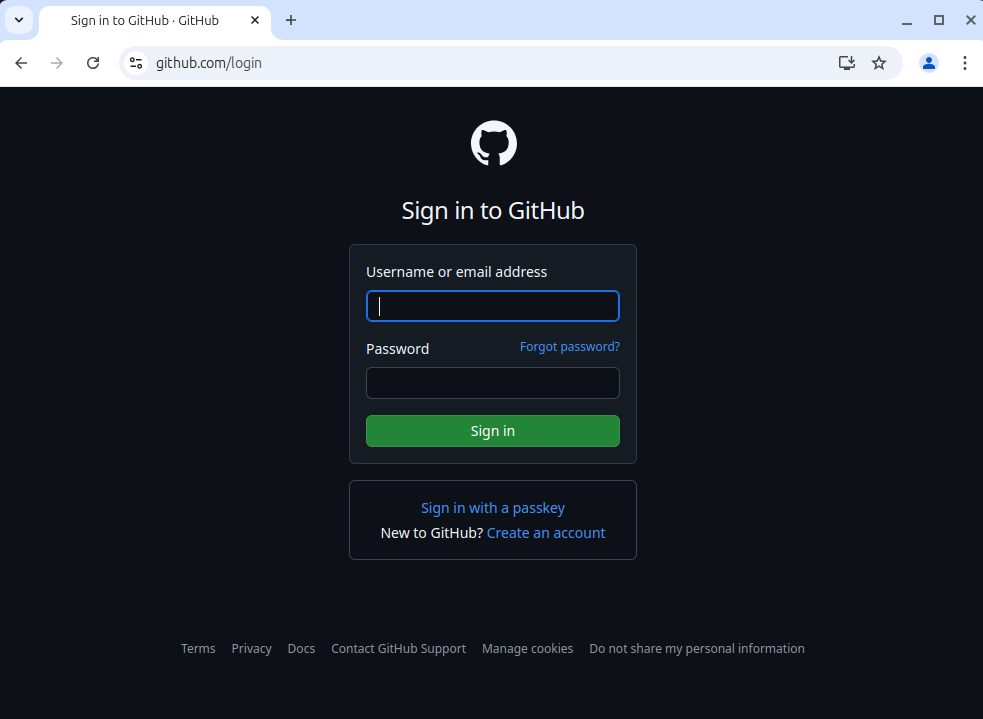

2. Once you're signed in, click on the following link to [**the starter code repo**](https://github.com/KansasCityWomeninTechnology/Coding-and-Cocktails-Intro-to-CSS) and click the "Use this template" button in the upper right-hand corner of the screen.

    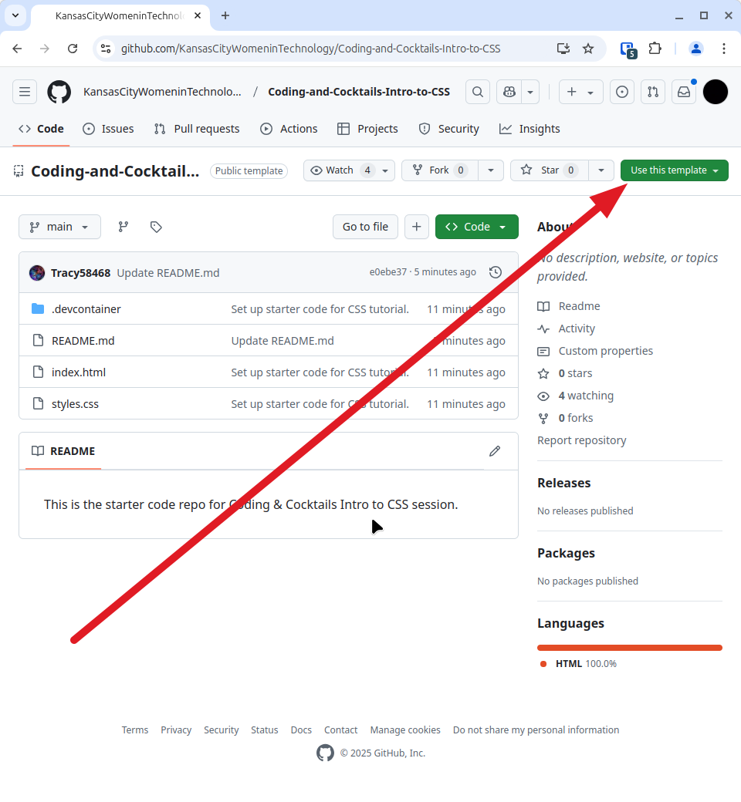

3. Next, select the "Open in a codespace" option.

    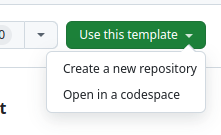

> [!WARNING]
> Codespaces will take a ***long*** time to open. At times, it may seem stuck. Please ask a mentor if you are concerned about how it's behaving as it starts up. So long as you see this in the lower right-hand corner, you should be ok.
>
>   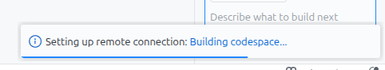
> 
> Once it finishes loading, click the "X" in the "Build with Agent" panel on the right. (On Mac, you may need to click the "Toggle secondary sidebar" icon or use the Option-Command-B keyboard combo.)
>
>   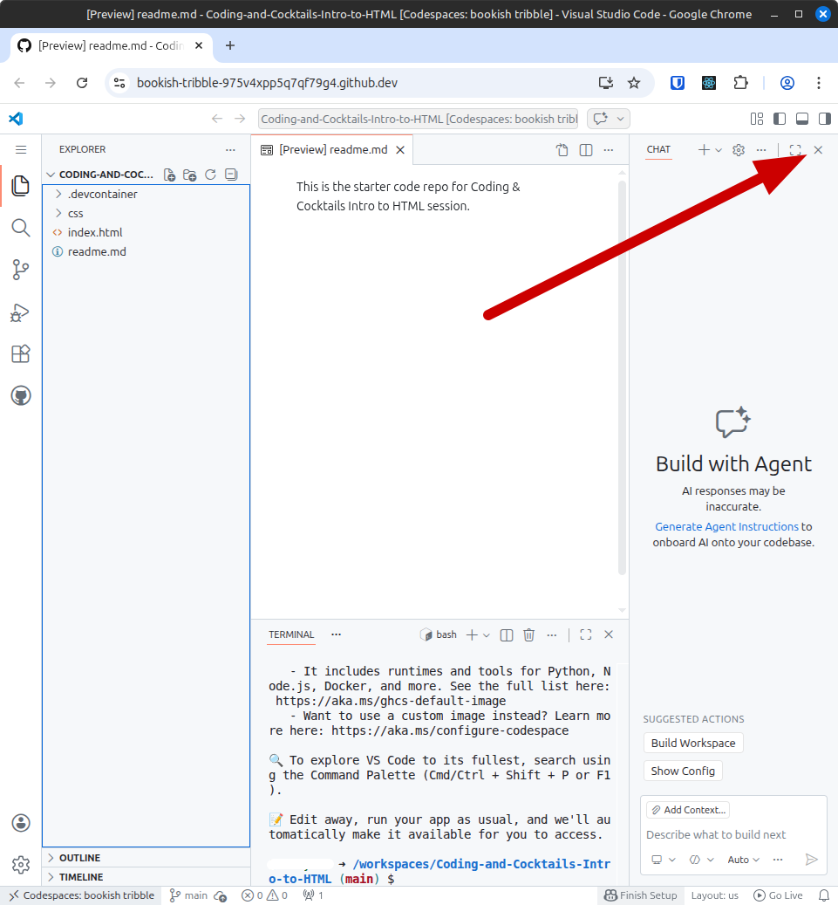

4. Now you are ready to write some code! The Codespace page is split into 3 different sections. On the far left is the project's file structure. The top right section is where you will write your code. The bottom right section is where you will find the terminal.

5. Click Go Live in the lower right-hand corner of the screen. This will open a preview of your web page in a new tab. After you've taken a look at what we're starting with, return to the Codespace tab.

    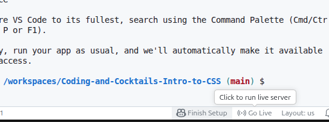

    You may see some notifications in the lower right-hand corner of the screen when you get back to the Codespace tab. You can dismiss these by clicking the "x".

    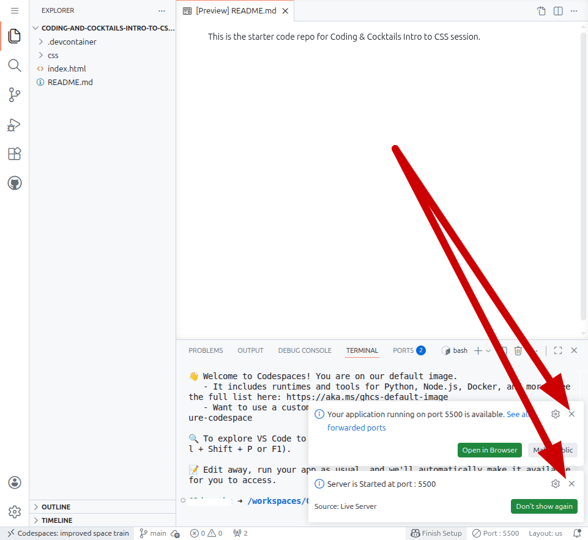

> [!TIP]
> View the worksheet and your IDE in split screen.
>
> If you want to open the browser view in a new window, right click on the tab (control click on a Mac) and select "Move tab to new window." Then you can put the browser view of your web page on half of your screen and the IDE on the other half.
>
> 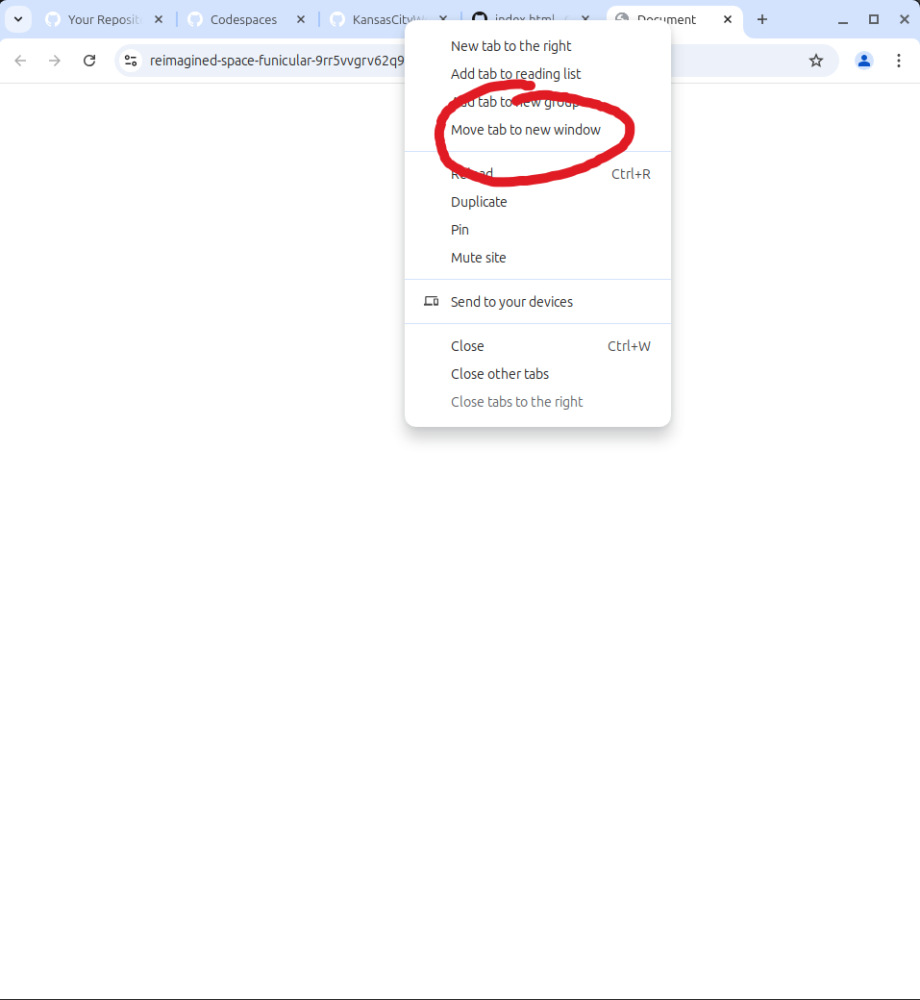
>
> 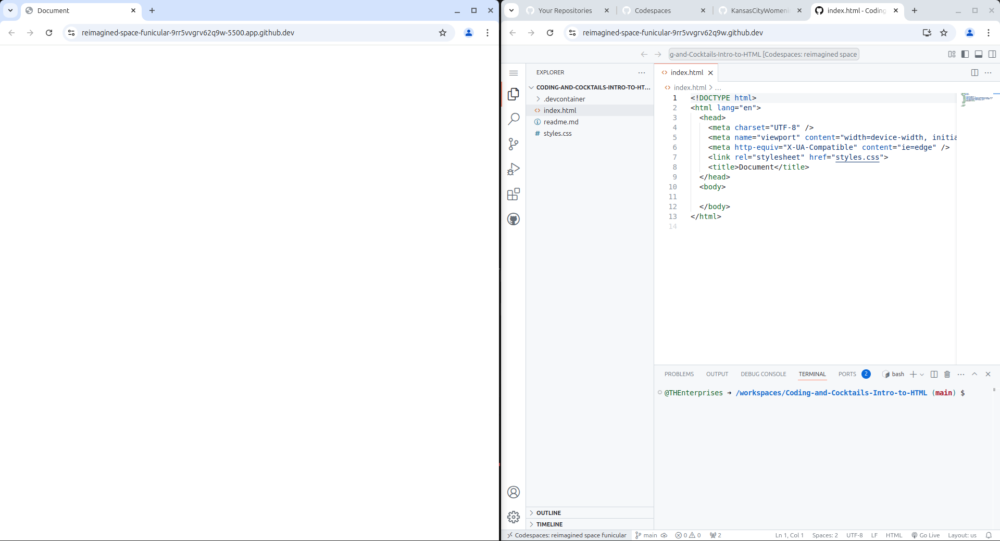
>
> If you have any questions, feel free to ask. Mentors are happy to help!

> [!TIP] If you accidentally close the browser tab that is displaying your page, go back down to where you saw "Go Live." There will be a "Port 5500" in its place. Click that to discard the live session. "Go Live" will reappear and you can click on it to create a new live session.
>
> 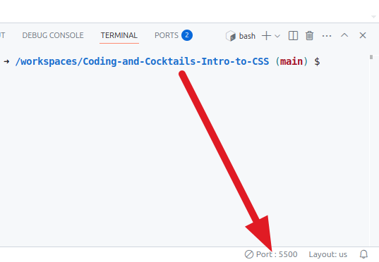

> [!TIP]
> Did you know you can collapse the table of contents for worksheets?
>
> Click on the hamburger menu (:fas fa-bars:) at the top of the page to toggle the table of contents.
>
> 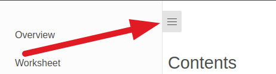

> [!TIP]
> Did you know you can perform common tasks such as copy and paste?
>
> When working without a mouse, keyboard shortcuts will be faster than a trackpad. Open the [handy dandy keyboard shortcut reference in a new tab](/css/references/ ":target=_blank") so you can refer to it easily!
