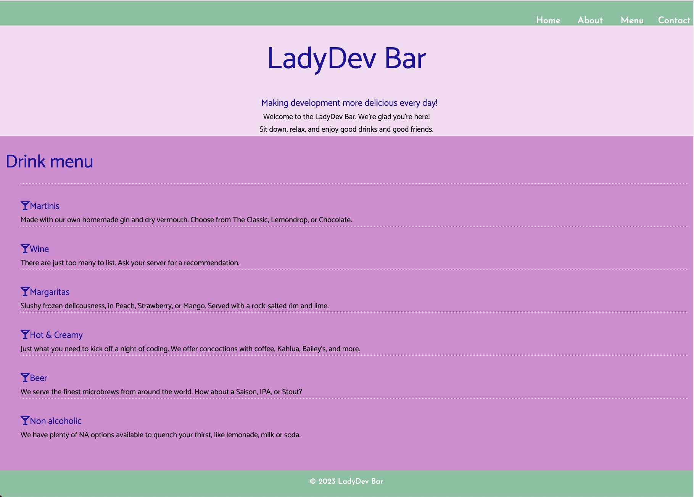
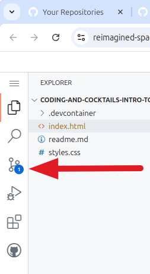
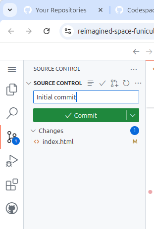
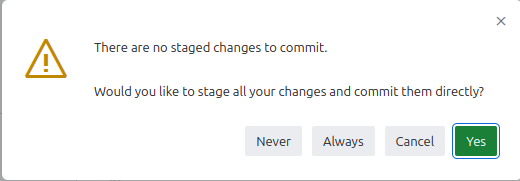
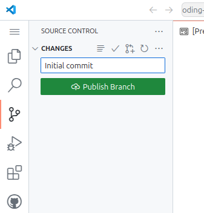
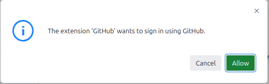
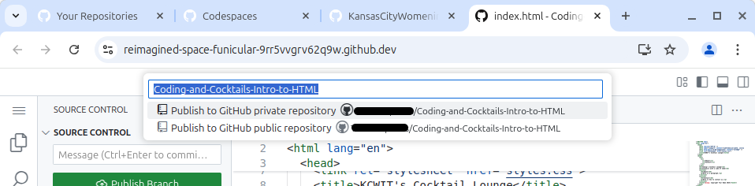
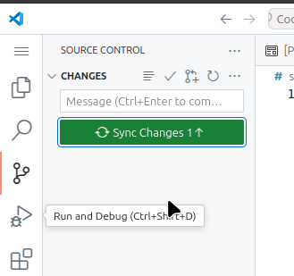
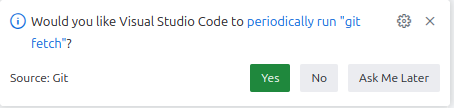
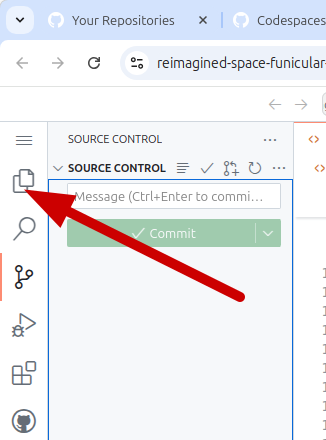

# CSS Basics

**C**ascading **S**tyle **S**heets (**CSS**) is used to decorate your website with visual appeal and invites the user to connect with your website's personality. Tonight we'll apply CSS to the "LadyDev Bar" web page.

The example below shows one way your page could look. Use it as a guide, but please experiment! Feel free to change colors, fonts, or layout to make the site your own.



> [!WARNING]
> Before starting the worksheet, please take a moment to review the [**Setup instructions**](../01-setup/?id=setup) to ensure you have all the tools and workspace setup you need for today's work.

# Prepare the project for our code

> [!TIP]Make sure auto save is enabled in your Codespace! Click on the hamburger menu in the upper left-hand corner of your Codespace and hover over "**File**." Make sure that "**Auto Save**" has a checkmark to the left of it. If there is no checkmark, click "**Auto Save**" and a checkmark should appear.

Let's take a look at the **_index.html_** file. You should see the following code in that file.

   index.html

   ```html
   <!DOCTYPE html>
   <html lang="en">
     <head>
       <meta charset="UTF-8" />
       <meta name="viewport" content="width=device-width, initial-scale=1" />
       <title>LadyDev Bar</title>
       <script
         src="https://kit.fontawesome.com/eeb19414a4.js"
         crossorigin="anonymous"
       ></script>
     </head>
     <body>
       <nav class="navbar">
         <ul>
           <li><a href="#">Home</a></li>
           <li><a href="#about">About</a></li>
           <li><a href="#menu">Menu</a></li>
           <li><a href="#contact">Contact</a></li>
         </ul>
       </nav>
       <section id="about" class="hero">
         <div class="hero-text">
           <h1>LadyDev Bar</h1>
           <h2>Making development more delicious every day!</h2>
           <p>Welcome to the LadyDev Bar. We're glad you're here!</p>
           <p>Sit down, relax, and enjoy good drinks and good friends.</p>
         </div>
       </section>
       <main class="grid-container">
         <section id="menu" class="drinks">
           <h2>Drink menu</h2>
           <ul>
             <li class="item">
               <h3 class="beverage">Martinis</h3>
               <p>
                 Made with our own homemade gin and dry vermouth. Choose from
                 The Classic, Lemondrop, or Chocolate.
               </p>
             </li>
             <li class="item">
               <h3 class="beverage">Wine</h3>
               <p>
                 There are just too many to list. Ask your server for a
                 recommendation.
               </p>
             </li>
             <li class="item">
               <h3 class="beverage">Margaritas</h3>
               <p>
                 Slushy frozen deliciousness, in Peach, Strawberry, or Mango.
                 Served with a rock-salted rim and lime.
               </p>
             </li>
             <li class="item">
               <h3 class="beverage">Hot &amp; Creamy</h3>
               <p>
                 Just what you need to kick off a night of coding. We offer
                 concoctions with coffee, Kahlua, Bailey's, and more.
               </p>
             </li>
             <li class="item">
               <h3 class="beverage">Beer</h3>
               <p>
                 We serve the finest microbrews from around the world. How about
                 a Saison, IPA, or Stout?
               </p>
             </li>
             <li class="item">
               <h3 class="beverage">Non alcoholic</h3>
               <p>
                 We have plenty of NA options available to quench your thirst,
                 like lemonade, milk or soda.
               </p>
             </li>
           </ul>
         </section>
       </main>
       <footer id="contact">
         <p>&copy; 2023 LadyDev Bar</p>
       </footer>
     </body>
   </html>
   ```

> [!TIP]
> Need a refresher on HTML? Check out the [HTML session worksheet](../../html/).

# Prepare the styles.css :id=prepare-stylesheet

1. We need a stylesheet file where we will put all our styles. The starter code already contains a **_styles.css_** file inside the css folder. Let's see what's in there.

2. As you can see, it's empty, and ready for us to start styling!

# Link the style sheet into HTML :id=link-stylesheet

Now we will link our CSS file to the HTML file by putting it inside the `<head>` tag.

We do this so that the browser knows where to find the styling for the page. The **_index.html_** file contains the content of the web page (anything you want displayed on the page, including text, images, tables, etc.), and the **_styles.css_** file contains the code that tells the browser _how_ that content should be displayed. The World Wide Web Consortium (W3C) [recommends](https://www.w3schools.com/CSS/css_howto.asp) that the link to an external stylesheet (_styles.css_) should appear in the `<head>` section because that is where any links to external stylesheets are usually found. This is the most common way to add CSS to a web page.

It's also a lot easier to separate content from styling if you put the link to the stylesheet in the `<head>` section.

1. Open **_index.html_**. In the HTML `<head>` section (between the opening `<head>` and closing `</head>`), find the HTML tags for `title` and `script`. Place your cursor after the closing `script` tag, press `Enter`, and link your stylesheet by adding

   index.html

   ```html
   <link rel="stylesheet" href="./css/styles.css" />
   ```

   The `<head>` section of your HTML should look like this:

   index.html

   ```html
   <head>
     <meta charset="UTF-8" />
     <meta name="viewport" content="width=device-width, initial-scale=1" />
     <title>LadyDev Bar</title>
     <script
       src="https://kit.fontawesome.com/eeb19414a4.js"
       crossorigin="anonymous"
     ></script>
     <link rel="stylesheet" href="./css/styles.css" />
   </head>
   ```

1. Now we want to preview the **_index.html_** file in Chrome. To see what your code looks like in a browser, click on the "**Go Live**" button at the bottom of the page towards the right. This will open a new tab in your browser. Whenever you make a code change, you will see the change in the browser view as well.

2. **Take a look at your page** in Chrome and notice the current styling. The page doesn't look good yet but we've got our initial setup for our project done.

# Committing our work

We want to make sure all our hard work is saved, so let's review how to commit to our repo.

Look at the left side of your editor. You will see the "**Explorer**" icon (where your files are listed) and the "**Source Control**" icon (where you save versions of your work). You can hover over the icons to display their names.

1. Commit your code to a repository in your GitHub account by clicking on the "**Source Control**" icon along the left side of the explorer in your IDE. (Remember that "IDE" stands for "integrated development environment.") Source control is how we manage the versions of our work as we continue to make changes. It's the equivalent of "saving" your work in a program like Microsoft Word.

   

2. Next, type a message in the text box above the green "**Commit**" button. Generally, you'll want to type something that has meaning, like "Linked CSS file" or another description of what work you before committing. This will let you see what changes you made at any point without digging back into the code to figure out what changed. It's also a professional habit that will help you and your teammates track the history of the project.
      
   

3. Next, click "**Yes**" in the box that says there are no staged changes to commit.

   

4. Now, click the "**Publish Branch**" button.

   
   
5. Click "**Allow**" on the box that says it wants to sign in to your GitHub account. 
   
   
   
6. Choose the GitHub account you want to use (the same one you used to create the Codespace). Click "**Publish Branch**" a second time and select the "**public**" repository name.

   

   > [!TIP]The next time you commit, **type a message in the box above the "Commit" button**, click "**Commit**," then "**Sync changes**."
   >
   > 
   
   > [!TIP]You can click "**No**" on the tile at the bottom right corner of the screen that asks if you want to periodically run git fetch.
   >
   >  

7. Now you can click the "**Explorer**" icon along the left side of the explorer in your IDE. The "Explorer" is where your files live.

   

8. Now let's get to the fun part - styling!

# Checkpoint

Compare your project folder against the answer key for your work.

> [!CODECHECK]
>
> Compare your folder setup with our [**answer key**](https://github.com/KansasCityWomeninTechnology/CSSCompilerPractice/tree/2023-checkpoint-1-css-basics).
