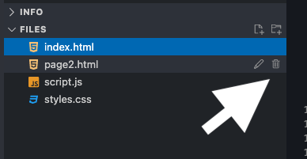
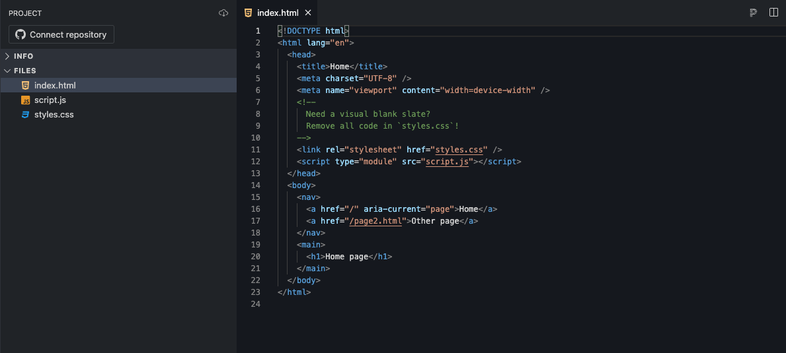
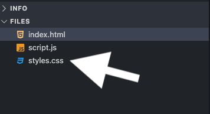

# CSS Basics

**C**ascading **S**tyle **S**heets (**CSS**) decorates your website with visual appeal and invites the user to connect with your website's personality. Tonight we'll apply CSS to the "LadyDev Bar" web page. If you follow our instructions your page will end up looking like the example below but feel free to add in some of your own creativity if you feel comfortable!


> [!WARNING]
> Before starting the worksheet, please take a moment to review the [Setup instructions](../setup/?id=setup) to ensure you have all the tools and workspace setup you need for today's work.

# Prepare the project for our code

StackBlitz creates some files and codes for us when we create a new project. Let's checkout out what StackBlitz gave us and prepare the project for our code.

1. We need only one _html_ file. Let's delete _page2.html_ file by clicking the trash icon.



2. Now let's move on to _index.html_. We will add our code here so let's clear this file and leave it empty.



> [!TIP]Don't forget to save the files. If you have a white circle next to file name, it means you have changes that haven't saved yet. You can either click **Save** button on the top left or use shortcut `cmd` + `s` for Mac or `ctrl` + `s` for Windows.
>
> 

# Prepare the HTML file

1. Copy and paste the following HTML code into your _index.html_ file.

   index.html

   ```html
   <!DOCTYPE html>
   <html lang="en">
     <head>
       <meta charset="UTF-8" />
       <meta name="viewport" content="width=device-width, initial-scale=1" />
       <title>LadyDev Bar</title>
       <script
         src="https://kit.fontawesome.com/eeb19414a4.js"
         crossorigin="anonymous"
       ></script>
     </head>
     <body>
       <nav class="navbar">
         <ul>
           <li><a href="#">Home</a></li>
           <li><a href="#about">About</a></li>
           <li><a href="#menu">Menu</a></li>
           <li><a href="#contact">Contact</a></li>
         </ul>
       </nav>
       <section id="about" class="hero">
         <div class="hero-text">
           <h1>LadyDev Bar</h1>
           <h2>Making development more delicious every day!</h2>
           <p>Welcome to the LadyDev Bar. We're glad you're here!</p>
           <p>Sit down, relax, and enjoy good drinks and good friends.</p>
         </div>
       </section>
       <main class="grid-container">
         <section id="menu" class="drinks">
           <h2>Drink menu</h2>
           <ul>
             <li class="item">
               <h3 class="beverage">Martinis</h3>
               <p>
                 Made with our own homemade gin and dry vermouth. Choose from
                 The Classic, Lemondrop, or Chocolate.
               </p>
             </li>
             <li class="item">
               <h3 class="beverage">Wine</h3>
               <p>
                 There are just too many to list. Ask your server for a
                 recommendation.
               </p>
             </li>
             <li class="item">
               <h3 class="beverage">Margaritas</h3>
               <p>
                 Slushy frozen delicousness, in Peach, Strawberry, or Mango.
                 Served with a rock-salted rim and lime.
               </p>
             </li>
             <li class="item">
               <h3 class="beverage">Hot &amp; Creamy</h3>
               <p>
                 Just what you need to kick off a night of coding. We offer
                 concoctions with coffee, Kahlua, Bailey's, and more.
               </p>
             </li>
             <li class="item">
               <h3 class="beverage">Beer</h3>
               <p>
                 We serve the finest microbrews from around the world. How about
                 a Saison, IPA, or Stout?
               </p>
             </li>
             <li class="item">
               <h3 class="beverage">Non alcoholic</h3>
               <p>
                 We have plenty of NA options available to quench your thirst,
                 like lemonade, milk or soda.
               </p>
             </li>
           </ul>
         </section>
       </main>
       <footer id="contact">
         <p>&copy; 2023 LadyDev Bar</p>
       </footer>
     </body>
   </html>
   ```

> [!TIP]
> Don't forget to save the file!

> [!TIP]
> Need a refresher on HTML? Check out the [HTML session worksheet](../../html/).

# Prepare the styles.css :id=prepare-stylesheet

1. We need a stylesheet file where we will put all our styles. StackBlitz already created it for us when we started our project. Look for _styles.css_ file. Let's see what's in the _styles.css_ file.

> 

2. We already have some code in _styles.css_ but we want our own styles. Let's clear this file and leave it empty.

# Link the style sheet into HTML :id=link-stylesheet

1. In StackBlitz, open _index.html_. In the HTML `<head>` section (between the opening `<head>` and closing `</head>`), find the HTML tags for `title` and `script`. Place your cursor after the closing `script` tag, press `Enter`, and link your stylesheet by adding

   index.html

   ```html
   <link rel="stylesheet" href="styles.css" />
   ```

   The `<head>` section of your HTML should look like this:

   index.html

   ```html
   <head>
     <meta charset="UTF-8" />
     <meta name="viewport" content="width=device-width, initial-scale=1" />
     <title>LadyDev Bar</title>
     <script
       src="https://kit.fontawesome.com/eeb19414a4.js"
       crossorigin="anonymous"
     ></script>
     <link rel="stylesheet" href="styles.css" />
   </head>
   ```

1. Save your file.

1. Now we want to preview the _index.html_ file in Chrome. You can preview in StackBlitz, but don't forget you can also open your website in a new tab by clicking `Open in New Tab` button on top right!

1. Take a look at your app in Google Chrome and notice the current styling. The page doesn't look good yet but we've got our initial setup for our project done. Now let's get to the fun part - styling!

# Checkpoint

Compare your project folder against the answer key for your work.

> [!CODECHECK]
>
> Compare your folder setup with our [answer key](https://github.com/KansasCityWomeninTechnology/CSSCompilerPractice/tree/2023-checkpoint-1-css-basics).
