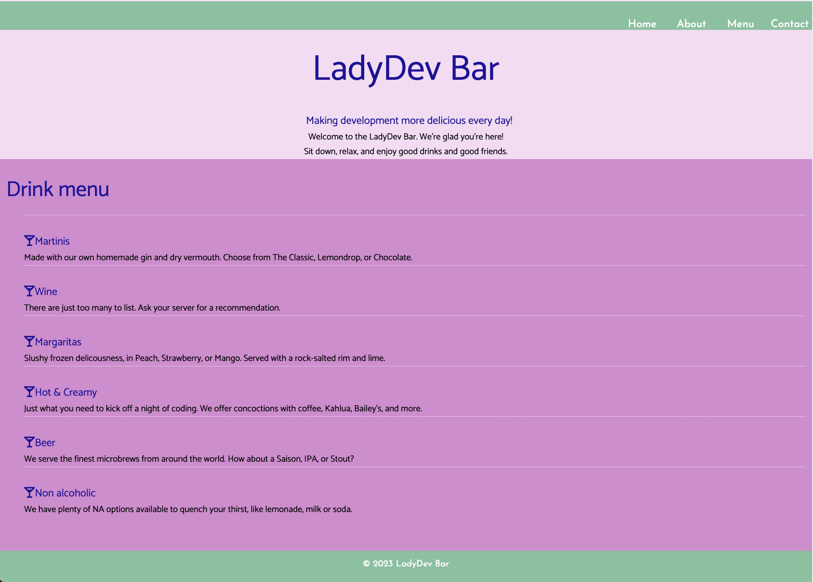
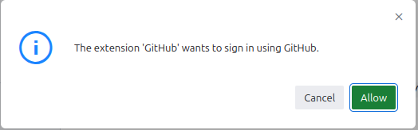
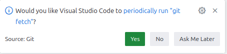

# CSS Basics

**C**ascading **S**tyle **S**heets (**CSS**) decorates your website with visual appeal and invites the user to connect with your website's personality. Tonight we'll apply CSS to the "LadyDev Bar" web page. If you follow our instructions your page will end up looking like the example below but feel free to add in some of your own creativity if you feel comfortable!



> [!WARNING]
> Before starting the worksheet, please take a moment to review the [Setup instructions](../setup/?id=setup) to ensure you have all the tools and workspace setup you need for today's work.

# Prepare the project for our code

> [!TIP]Make sure auto save is enabled in your Codespace! Click on the hamburger menu in the upper left-nad corner of your Codespace and hover over "File." You should see "Auto Save" in the list that appears. There should be a checkmark to the left of "Auto Save." If there is no checkmark, click "Auto Save."

Let's take a look at the _index.html_ file. You should see the following code in that file.

   index.html

   ```html
   <!DOCTYPE html>
   <html lang="en">
     <head>
       <meta charset="UTF-8" />
       <meta name="viewport" content="width=device-width, initial-scale=1" />
       <title>LadyDev Bar</title>
       <script
         src="https://kit.fontawesome.com/eeb19414a4.js"
         crossorigin="anonymous"
       ></script>
     </head>
     <body>
       <nav class="navbar">
         <ul>
           <li><a href="#">Home</a></li>
           <li><a href="#about">About</a></li>
           <li><a href="#menu">Menu</a></li>
           <li><a href="#contact">Contact</a></li>
         </ul>
       </nav>
       <section id="about" class="hero">
         <div class="hero-text">
           <h1>LadyDev Bar</h1>
           <h2>Making development more delicious every day!</h2>
           <p>Welcome to the LadyDev Bar. We're glad you're here!</p>
           <p>Sit down, relax, and enjoy good drinks and good friends.</p>
         </div>
       </section>
       <main class="grid-container">
         <section id="menu" class="drinks">
           <h2>Drink menu</h2>
           <ul>
             <li class="item">
               <h3 class="beverage">Martinis</h3>
               <p>
                 Made with our own homemade gin and dry vermouth. Choose from
                 The Classic, Lemondrop, or Chocolate.
               </p>
             </li>
             <li class="item">
               <h3 class="beverage">Wine</h3>
               <p>
                 There are just too many to list. Ask your server for a
                 recommendation.
               </p>
             </li>
             <li class="item">
               <h3 class="beverage">Margaritas</h3>
               <p>
                 Slushy frozen delicousness, in Peach, Strawberry, or Mango.
                 Served with a rock-salted rim and lime.
               </p>
             </li>
             <li class="item">
               <h3 class="beverage">Hot &amp; Creamy</h3>
               <p>
                 Just what you need to kick off a night of coding. We offer
                 concoctions with coffee, Kahlua, Bailey's, and more.
               </p>
             </li>
             <li class="item">
               <h3 class="beverage">Beer</h3>
               <p>
                 We serve the finest microbrews from around the world. How about
                 a Saison, IPA, or Stout?
               </p>
             </li>
             <li class="item">
               <h3 class="beverage">Non alcoholic</h3>
               <p>
                 We have plenty of NA options available to quench your thirst,
                 like lemonade, milk or soda.
               </p>
             </li>
           </ul>
         </section>
       </main>
       <footer id="contact">
         <p>&copy; 2023 LadyDev Bar</p>
       </footer>
     </body>
   </html>
   ```

> [!TIP]
> Need a refresher on HTML? Check out the [HTML session worksheet](../../html/).

# Prepare the styles.css :id=prepare-stylesheet

1. We need a stylesheet file where we will put all our styles. The starter code already contains a _styles.css_ file. Let's see what's in there.

2. As you can see, it's empty, and ready for us to start styling!

# Link the style sheet into HTML :id=link-stylesheet

1. Open _index.html_. In the HTML `<head>` section (between the opening `<head>` and closing `</head>`), find the HTML tags for `title` and `script`. Place your cursor after the closing `script` tag, press `Enter`, and link your stylesheet by adding

   index.html

   ```html
   <link rel="stylesheet" href="styles.css" />
   ```

   The `<head>` section of your HTML should look like this:

   index.html

   ```html
   <head>
     <meta charset="UTF-8" />
     <meta name="viewport" content="width=device-width, initial-scale=1" />
     <title>LadyDev Bar</title>
     <script
       src="https://kit.fontawesome.com/eeb19414a4.js"
       crossorigin="anonymous"
     ></script>
     <link rel="stylesheet" href="styles.css" />
   </head>
   ```

2. Now we want to preview the _index.html_ file in Chrome. To see what your code looks like in a browser, click on the "Go Live" button at the bottom of the page towards the right. This will pop a new tab into your browser. Whenever you make a code change, you will see the change in the browser view as well.

3. Take a look at your app in Google Chrome and notice the current styling. The page doesn't look good yet but we've got our initial setup for our project done.

# Committing our work

We want to make sure all our hard work is saved, so let's review how to commit to our repo.

1. Commit your code to a repository in your GitHub account by clicking on the "Source Control" icon along the left side of the explorer in your IDE.


2. Next, type a message in the text box above the green "Publish Branch" button, 
      
  
   
  then click the button. Click "Allow" on the box that says it wants to sign in to your GitHub account. 
   
  
   
3. Choose the GitHub account you want to use (the same one you used to create the Codespace). Click "Publish Branch" a second time and select the "public" repository name.

  

4. Now click "Commit," then "Sync changes."

  

  
   
5. Next, click "Yes" in the box that says there are no staged changes to commit.

  

  > [!TIP]You can click "No" on the tile at the bottom right corner of the screen that asks if you want to periodically run git fetch.
  >
  >  

6. Now you can click the "Explorer" icon along the left side of the explorer in your IDE.

  

7. Now let's get to the fun part - styling!

# Checkpoint

Compare your project folder against the answer key for your work.

> [!CODECHECK]
>
> Compare your folder setup with our [answer key](https://github.com/KansasCityWomeninTechnology/CSSCompilerPractice/tree/2023-checkpoint-1-css-basics).
