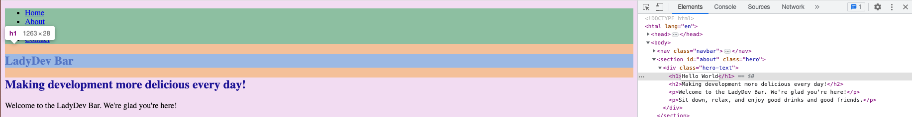

# Adding styles

Let's add some styling to the HTML!

# Add text color

1. We'll start applying colors to the main `h1` header first. In _styles.css_ in VS Code, declare a style for `h1` tag. Use the `color` property and substitute the hex color you selected for the title like this

   styles.css

   ```css
   h1 {
     color: #637056;
   }
   ```

   > [!TIP]
   > Feel free to choose different color if you'd like. You can always zoom in to have a closer look.
   > Check out [keyboard shortcut](/css/references/) for `Zoom in` and `Zoom out` shortcuts.

1. Save your file and view in Chrome. Do you see the color of your header change?

1. Repeat to create styles targeting `h2` right after your `h1` style and apply the same color.

   > [!INFO]
   > Notice the color applies to all `h2` elements, including the "Drink menu" text. This is an example of how styles **cascade**.
   >
   > We might need to override the style for a specific element later, but we want to build a strong foundation to build upon.

1. Save your file and view your page in Chrome.

   > [!TIP]
   > Save your _styles.css_ file and view your app often so you can see the changes as we go along. The worksheet will call out specific places to save and view the web page to illustrate a concept, but feel free to save and view your page as often as you want. It helps to see the changes as your write your CSS.

# Add background color

1. Select a background color for the entire page and add it to the top of _styles.css_ by using the HTML `body` selector and `background-color` property.

   styles.css

   ```css
   body {
     background-color: #f9f7f7;
   }
   ```

   > [!INFO]
   > The `body` is the parent element for the website so setting a style here applies to every element within **unless** it's overridden.
   >
   > Organize your CSS by setting "global" styles that apply to all elements at the top of the file and target styles for specific elements after global styles. Declare styles for specific elements in vertical order as it appears in the HTML to make it easy to find later

## Drink menu

1. Select a background color for the "Drink menu" section.

1. Note the HTML element for "Drink menu" in the _index.html_.

   > [!TIP]
   > You can search for and find "Drink menu" in the _index.html_ in VS Code. In the toolbar, select **Edit** :fas fa-long-arrow-alt-right: **Find in Files** or click on the magnifying glass on the left toolbar (where you installed Extensions). You can also use a [keyboard shortcut](/css/references/).

1. Since "Drink menu" section is further down the file, we'll add the style at the bottom of the _styles.css_. "Drink menu" is in a `section` element, let's create a style for the `section` selector and set the `background-color`.

1. Uh oh! We set the background color for all `section` elements, including about sections. That's not what we wanted so let's fix it. The HTML element for "Drink menu" also has a `class` attribute named `drinks`. Change the selector from `section` to `.drinks`.

   > [!INFO]
   > When applying CSS rules to `class` attributes, prepend a `.` to the selector.

   > [!INFO]
   > This is an example of overriding a global style. The background color for the entire page is one color, but we defined a different color for part of the view.
   >
   > Using the element's `class` allows us to target only the elements with the `class` name, in this case just the "Drink menu" section, instead of all elements of the same type.

   > [!HINT]
   >
   > styles.css
   >
   > ```css
   > .drinks {
   >   background-color: #dbe2ef;
   > }
   > ```

## Navigation and footer

1. To help make the navigation and footer area pop, select a background color to use. Look at the _index.html_ file to identify the selectors for the navigation and footer sections. Since these are global styles, declare the styles near the top of _styles.css_ file.

   > [!HINT]
   >
   > The colors may be different depending on your color choice.
   > Declare a style for `nav` after the style for `body` and add `background-color: #364F6B;`.
   >
   > Declare a style for `footer` and add `background-color: #364F6B;`.

# Grouping selectors

1. We have the same color defined for 2 header selectors, `h1` and `h2`. We can combine the selectors into a selector list. Delete the style for `h2`.

1. Combine the `h1` and `h2` selectors by separating them with a comma like this

   styles.css

   ```css
   h1,
   h2 {
     color: #637056;
   }
   ```

   > [!INFO]
   > Define a style for more than 1 selector by comma separating the selector list.

   Save and refresh your page. Do you see your default color applied?

1. Let's go ahead and set the text color for all headers. Add `h3` to the style. Save and refresh your page to see the color applied to all the headers on the page.

1. There's one other place where we have the same style defined for 2 different selectors- `nav` and `footer`. Let's combine the styles.
   > [!HINT]
   > Delete the style for `footer` and change the selector for `nav` style to `nav, footer`.

# State based selector

1. Select a color that displays when your mouse hovers over the drink menu list items.

1. After the styles for the `.drinks`, create a style for `li` elements. Add the `background-color` property. The background color for all `li` elements changed. Hrm....

1. We want the background to show on hover, so we can use the **Pseudo Class** `:hover`. Change the selector to `li:hover`.

1. Save your file and view in Chrome. What happens when you hover over the list items in the drink menu?


1. But we don't want all the `li` tags to hover. Just the ones in the drink menu. We could add a `class` or we can target only the `li` elements in `main` by changing the selector to `main li:hover`.

   > [!INFO]
   > You are using the **Descendant combinator**. A combinator is a special selector. The descendant combinator contains 2 or more selectors with a space between each selector. The first selector is an ancestor of the second in the HTML. Selectors can be HTML elements or classes. So in this case, you are saying
   >
   > _"For all HTML `main` elements that has a descendant `li`, add a color when hovering."_
   >
   > Read more about the [Descendant combinator](https://developer.mozilla.org/en-US/docs/Web/CSS/Descendant_combinator).

# Inspect HTML in Chrome

You'll often find yourself needing to look at how your page renders in the browser to troubleshoot issues so let's give that a try.

1. In Chrome, right-click on your `<h1>` element and select **Inspect**. This will open up your Chrome Developer Tools (DevTools) to the **Elements** tab and highlight the element in the HTML.

   > [!TIP]
   > Chrome DevTools has a lot of features. We'll use DevTools in upcoming sessions to help us dig deeper into our code.

1. Notice you can see all your tags that you've added to the page and how they nest inside each other. It should look something like this:
   

1. Notice as you mouse over elements in the DevTools that they highlight in the rendered view above.

   

1. You can also click the arrows to the left of your `<main>` elements to expand them and see the elements inside them.

In addition to viewing elements, you can make and preview changes here before making them in your code.

1.  In the **Elements** section of the DevTools, double click on the text inside your `<h1>` tag. This should make it editable. Change it to "Hello World" and then press `Enter`

    

1.  Your `<h1>` text should now display "Hello World" on your rendered page.

    

    > [!WARNING]
    > This only lasts until you refresh the page! If you want to make a lasting change you need to make the change to the code in your IDE.

1.  Refresh your page to see your text return to what you have in your code. You can either keep your DevTools open or close them with the small x in the upper right corner of the DevTools.

    > [!INFO]
    > Element inspection comes in handy when you're trying to style your page too!
