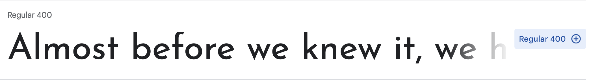

# Add spacing

1. We don't want the bullets for any lists. Remove the bullets for all `ul` by creating a global style and setting the `list-style-type` property to "none". Your code should look like this.

   styles.css

   ```css
   ul {
     list-style-type: none;
   }
   ```

   Save your file and view in Chrome. The webpage is starting to look better.

   > [!INFO]
   > Learn more about styling lists using [MDN list styling reference](https://developer.mozilla.org/en-US/docs/Learn/CSS/Styling_text/Styling_lists).

1. We want to add extra space between each list item in the "Drinks menu" section by setting the `padding-top` property to "40px" on the list items. Create a style targeting `li` with parent `class="drinks"`.

   > [!HINT]
   > We want to declare a style for the selector `li` with parent selector `.drinks`. We can use the Descendant combinator.
   >
   > Declare a style for `.drinks li` at the bottom of the file and add `padding-top: 40px;`.

1. Let's also add a right and left margin to each list item in the "Drinks menu" section. Set the values to 15px; Can you guess the property names of the right and left margins?

   > [!HINT]
   >
   > ```css
   > .drinks li {
   >   margin-right: 15px;
   >   margin-left: 15px;
   > }
   > ```

1. Save your file and view in Chrome. You now have plenty of spacing between each drink menu item.

# Add normalization

Many browsers have their own pre-settings such as margins, paddings and font styling. Normalizing evens out the difference between browsers by resetting the browser default stylings so your website can be consistent no matter what browswer you are using.

1. Add the following to the top of _styles.css_.

   styles.css

   ```css
   html,
   body,
   div,
   h1,
   h2,
   h3,
   h4,
   h5,
   h6,
   p,
   a,
   img,
   li,
   aside,
   footer,
   nav,
   section {
     margin: 0;
     padding: 0;
     border: 0;
     font-size: 100%;
     font: inherit;
   }
   ```

   The webpage now uses 100% of the width of the browser tab.

# Apply fonts

1. Navigate to [Google Fonts](https://fonts.google.com/) and find a font to use for headers.

1. Click the font of your choice.

1. Click `Select this style` next to the style you want



1. Find a font to use for body text and select the font using the steps outlined above.

1. On the side bar, click on **@IMPORT** and copy the `@import` statement under `Use on the web` section.


1. Paste the `@import` statement at the top of your _styles.css_ file, before the normalizing styles.

1. In the style declared for the `body`, add font for body text using the CSS rules specified by Google. In the example above, Google specified `font-family: 'Catamaran', sans-serif;`.

   > [!INFO]
   > If you select a font with 2 word in the name you'll need to wrap the font name in quotation marks.

1. Add the font family for header text to the style you declared for all headers using Google's supplied CSS rule. Add the font to other styles if you want to override any other text, such as the text in the `nav` and `footer`.

   > [!EXTRACREDIT]
   > Often you'll want to provide backup fonts for the page to fall back on in case it can't load the chosen font. A common fallback for sans-serif fonts might include Arial, Helvetica, sans-serif. For serif fonts it might include "Times New Roman", Times, serif as backups.
   >
   > You can see the fallback fonts in action if you remove the "@import" statement for the fonts in your _styles.css_ file, save your file, and view the page. Notice how the font changes.

   > [!INFO]
   > Learn more by reading [MDN documentation on font family](https://developer.mozilla.org/en-US/docs/Web/CSS/font-family).

## Apply font size

1. We always want to start with defining styles for global elements. In this case, we'll target `p` elements. Set the `font-size` to `1.25em`.

   > [!INFO]
   > Why use `em` instead of `px` for font size? `em` is a calculated font size based off of the parent's font value. Read more about the different ways to set font size in "Possible approaches" section of [MDN documentation on font size](https://developer.mozilla.org/en-US/docs/Web/CSS/font-size).

# Apply styling for each area

Our "LadyDev Bar" looks better but not quiet there yet. Let's keep on applying styles!

## About section

1.  Center align the about section by using the `text-align` property. Set `text-align: center;` to the styles for `id="about"`.

    > [!INFO]
    > When applying CSS rules to `id` attributes, prepend a `#` to the selector.

    > [!HINT]
    >
    > ```css
    > #about {
    >   text-align: center;
    > }
    > ```

1.  Let's increase the size of the text for the header in about section starting with the `h1` tag. We want to only target the `h1` element with `hero-text` class. Set the font size of `h1` to "5em" by adding `font-size: 5em;`.

1.  The `h1` text and the `p` text on the about section look good, but the `h2` text looks small. Set the font size of the `h2` text only in the hero title to 1.5em.

## Drink Menu

1. Increase the size of the `h2` elements in the drinks menu to 3em.

1. Each drink title needs to be a little larger. In _index.html_, we see the drink titles are `h3` elements. They also have a `class="beverage"` assigned to it. We can create a style for `h3` with the `class="beverage"` by using the selector `h3.beverage`. Set the font size to 1.5em. Also let's change the font color to white for better visibility

   > [!EXTRACREDIT]
   > Notice there's no space between the element `h3` and the class `.beverage` in the selector.
   >
   > When there are no spaces between individual elements of selector, it means both individual elements apply. In this case, we're saying
   >
   > _"For `h3` elements that also have the class attribute `beverage`, apply the style."_
   >
   > There is more than one way to target the drink title's styles. What are some other ways using what you've learned about **Descendant** and **Child** combinators? Feel free to talk it through with your mentor!

1. We want to add extra space at the bottom of the "Drinks menu" section by setting the `padding-bottom` property to "60px". Add the styling to `class="drinks"`

1. Let's add some spacing and color to the element `h2`. Add `30px` for `padding-top`, `15px` for `margin-left` and change the font color to white

1. We need some spacing between each list item. Add `40px padding-top`, `15px margin-right`, `15px margin-left`

1. Why don't we change `hover` styling to border instead of background color. Add white solid border with 2px width.

   > [!HINT]
   >
   > ```css
   > main li:hover {
   >   border: 2px solid white;
   > }
   > ```

1. Borders between each list item might help to distinguish each menu. Let's add a 1px width white dotted border above each list item

   > [!HINT]
   >
   > ```css
   > .drinks li {
   >   border-top: 1px dotted white;
   > }
   > ```

## Navigation

Let's add some styling to the `nav` element

1. The navigation text should be right aligned. In the `nav` style, add `text-align: right;`.

1. The navigation text in the hyperlink doesn't stand out enough. Let's make the navigation text larger by adding `font-size: 1.5em;`

1. Also set `padding` to `15px` to add some space

We still have default styling for the hyperlink such as underline. Let's style `a` tag in `nav` element.

1. Remove the hyperlink underline using `text-decoration: none;`.

1. Change the text color to `white` and also set top and bottom padding to `6px` and left and right padding to `20px`.

   styles.css

   ```css
   nav a {
     padding: 6px 20px;
     color: white;
     text-decoration: none;
   }
   ```

   > [!INFO]
   > You can shorten the code by using **shorthand property**.
   > The property order is _top_, _right_, _bottom_, _left_.
   > If you have three properties, the order is _top_, _left and right_, and _bottom_.
   > If you have two proterties, the order is _top and bottom_, _left and right_ So in this case, you are saying
   >
   > _"Set top and bottom padding to 6px and left and right padding to 20px"_
   >
   > Read more about the [Margin and padding properties](https://developer.mozilla.org/en-US/docs/Web/CSS/Shorthand_properties#margin_and_padding_properties).

1. Let's position each list item to be next to each other instead of stacked over each other. Add `display: inline` to list item inside of the `nav` element

## Footer

1. In the footer, the copyright text needs to be a contrasting color and centered. Also set the `height` to `50px`.

   > [!HINT]
   >
   > ```css
   > footer {
   >   height: 50px;
   >   color: white;
   >   text-align: center;
   > }
   > ```

# Add icon

Let's add an icon in front of each drink menu

1. Head to [FontAwesome icons](https://fontawesome.com/icons) and search for `drink` icon.

1. Click the icon of your selection.


1. At the bottom of the _styles.css_, add `content` property with the code for the icon you selected to `beverage` class. Don't forget to add `before` so the icon gets added before the each drink item

   styles.css

   ```css
   .beverage::before {
     font: var(--fa-font-solid);
     content: "\f57b";
   }
   ```

# Checkpoint

Compare your _styles.css_ against the answer key for your work. It might look a little different depending on the color palette you chose.

> [!CODECHECK]
>
> Compare your _styles.css_ file with our [answer key](https://github.com/KansasCityWomeninTechnology/CSSCompilerPractice/blob/2022-checkpoint-2/css/styles.css).

1. Save your file and view your page in Chrome. 

1. Share your success by posting a screenshot to Slack!


