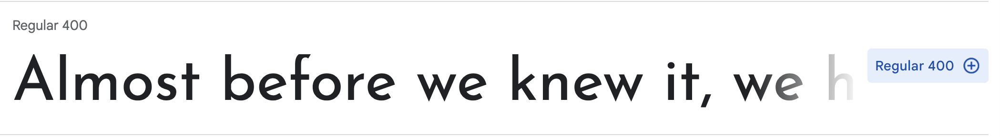
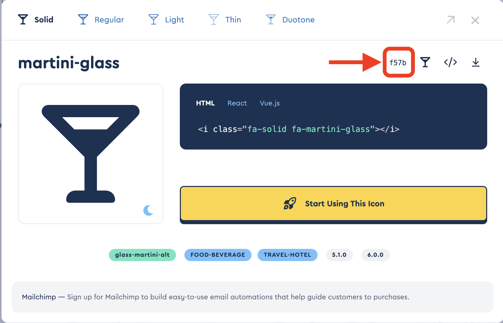

# Apply text styling for each area

Our "LadyDev Bar" looks better but not quite there yet. Let's keep on applying styles!

## About section

1.  Center align the about section by using the `text-align` property. Set `text-align: center;` to the styles for `class="hero"`.

    > [!HINT]
    >
    > styles.css
    >
    > ```css
    > .hero {
    >   text-align: center;
    > }
    > ```

1.  Let's increase the size of the text for the header in about section starting with the `h1` tag. We want to only target the `h1` element with `hero-text` class. Set the font size of `h1` to "5em" by adding `font-size: 5em;`.

1.  The `h1` text and the `p` text on the about section look good, but the `h2` text looks small. Set the font size of the `h2` text only in the hero title to "1.5em".

## Drink Menu

1. Increase the size of the `h2` elements in the drinks menu to 3em.

1. Each drink title needs to be a little larger. In _index.html_, we see the drink titles are `h3` elements. They also have a `class="beverage"` assigned to it. We can create a style for `h3` with the `class="beverage"` by using the selector `h3.beverage`. Set the font size to 1.5em.

   > [!EXTRACREDIT]
   > Notice there's no space between the element `h3` and the class `.beverage` in the selector.
   >
   > When there are no spaces between individual elements of selector, it means both individual elements apply. In this case, we're saying
   >
   > _"For `h3` elements that also have the class attribute `beverage`, apply the style."_
   >
   > There is more than one way to target the drink title's styles. What are some other ways using what you've learned about **Descendant** and **Child** combinators? Feel free to talk it through with your mentor!

1. We want to add extra space at the bottom of the "Drinks menu" section by setting the `padding-bottom` property to "60px". Add the styling to `class="drinks"`

1. Let's add some spacing and color to the element `h2` globally. Add `30px` for `padding-top`, `15px` for `margin-left`.

1. We need some spacing between each list item. Add `40px padding-top`, `15px margin-right`, `15px margin-left`

1. Why don't we change `hover` styling to border instead of background color. Add white solid border with 2px width.

   > [!HINT]
   >
   > styles.css
   >
   > ```css
   > main li:hover {
   >   border: 2px solid white;
   > }
   > ```

1. Borders between each list item might help to distinguish each menu. Let's add a 1px width white dotted border above each list item

   > [!HINT]
   >
   > styles.css
   >
   > ```css
   > .drinks li {
   >   border-top: 1px dotted white;
   > }
   > ```

# Apply fonts

1. Navigate to [Google Fonts](https://fonts.google.com/) and find a font to use for headers.

1. Click the font of your choice.

1. Click "Get font" (blue bubble at the bottom right corner of the page).

1. Click "Get embed code."

1. Click "change styles" and deselect everything, then select `Regular 400`.
   > [!TIP] Depends on the styles of font you pick, the button might say something different such as `Thin 100`



1. Find a font to use for body text and select the font using the steps outlined above.

1. Click on the **@IMPORT** radio button and copy the `@import` statement under `Use on the web` section.


1. Paste the `@import` statement at the top of your _styles.css_ file, before the normalizing styles.

   > [!INFO] We don't need the `<style></style>` tag around the `@import` statement

1. In the style declared for the `body`, add font for body text using the CSS rules specified by Google. In the example above, Google specified `font-family: 'Catamaran', sans-serif;`.

   > [!INFO]
   > If you select a font with 2 words in the name you'll need to wrap the font name in quotation marks.

1. Add the font family for header text to the style you declared for all headers using Google's supplied CSS rule. Add the font to other styles if you want to override any other text, such as the text in the `nav` and `footer`.

   > [!EXTRACREDIT]
   > Often you'll want to provide backup fonts for the page to fall back on in case it can't load the chosen font. A common fallback for sans-serif fonts might include Arial, Helvetica, sans-serif. For serif fonts it might include "Times New Roman", Times, serif as backups.
   >
   > You can see the fallback fonts in action if you remove the "@import" statement for the fonts in your _styles.css_ file, save your file, and view the page. Notice how the font changes.

   > [!INFO]
   > Learn more by reading [MDN documentation on font family](https://developer.mozilla.org/en-US/docs/Web/CSS/font-family).

## Apply font size

1. We always want to start with defining styles for global elements. In this case, we'll target `p` elements. Set the `font-size` to `1.25em`.

   > [!INFO]
   > Why use `em` instead of `px` for font size? `em` is a calculated font size based off of the parent's font value. Read more about the different ways to set font size in "Possible approaches" section of [MDN documentation on font size](https://developer.mozilla.org/en-US/docs/Web/CSS/font-size).

# Add icon

Let's add an icon in front of each drink menu

1. Head to [FontAwesome icons](https://fontawesome.com/icons) and search for `drink` icon.

1. Click the icon of your selection.



1. At the bottom of the _styles.css_, add `content` property with the code for the icon you selected to `beverage` class. Don't forget to add `before` so the icon gets added before the each drink item

   styles.css

   ```css
   .beverage::before {
     font: var(--fa-font-solid);
     content: "\f57b";
   }
   ```

# Checkpoint

Compare your _styles.css_ against the answer key for your work. It might look a little different depending on the color palette you chose.

> [!CODECHECK]
>
> Compare your _styles.css_ file with our [answer key](https://github.com/KansasCityWomeninTechnology/CSSCompilerPractice/blob/2023-checkpoint-4/styles.css).

Share your success by posting a screenshot to Slack!


