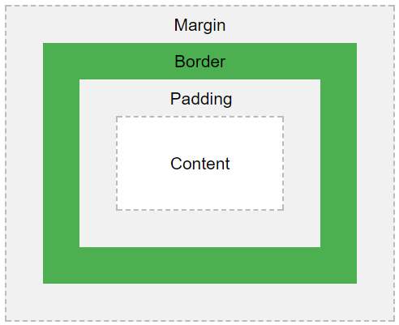

# CSS Cheat Sheet

This cheat sheet shares some commonly used CSS properties. 

For official information on properties visit the Mozilla Developer Network pages here: [bit.ly/MDNDOC](http://bit.ly/MDNDOC)

You can always Google what you want to do as well and you'll often get results from Stack Overflow or W3Schools.  Both are good sources for figuring things out.  Try searching Google for "CSS margin" to get a better understanding of the margin property.

| Property | Description | Value | Example |
| --- | --- | --- | --- |
| margin | Adds spacing around an element outside the border (refer to the box model diagram to the left) | Any pixel number value | `p { margin: 10px; } p { margin: 0 auto; }` |
| padding | Add spacing between the element content and the element border (refer to the box model diagram above) | Any pixel number value | `p { padding: 10px 0 15px 20px }` |
| border | Specifies the border styling | Width: any pixel number value | `p { border: 2px solid blue; }` |
| color | Sets the font color | Hex color values or color names | `p { color: #ffffff; }` |
| text-align | Aligns text according to value | left | `p { text-align: center; }` |
| text-decoration | Add decoration to text | none | `a { text-decoration: none; }` |
| font-family | Set the font family (or typeface) of the text | Any font name | `p { font-family: Neuton, "Times New Roman", Times, serif; }` |
| font-size | Set the size of the text | Numeric value in px, em, or rem | `h1 { font-size: 4em; }` |
| font-style | Sets the text style | normal | `h4{ font-style: italic; }` |
| font-weight | Set the weight of the text | normal |` h3 { font-weight: bold }` |
| background-color | Sets the color of the selected elements background | Any hex color value or color name | `body { background-color: #ffffff; }` |
| background-image | Set the background of the element to the image supplied | Image url | `.hero { background-image: url(‘images/image.png’); }` |
| background-repeat | Specifies whether a background image repeats | repeat | `body { background-repeat: no-repeat; }`|
| background-position | Sets the starting position of a background image | center center | `.hero { background-position: right center; }` |
| list-style-type | Determines the bullet style on the list | circle | `ul { list-style-type: none; }` |
| float | Specifies whether an element should float. | right | `img { float: left; }` |
| clear | Does not allow floating to the specified side of an element | right | `.footer { clear: both; }` |