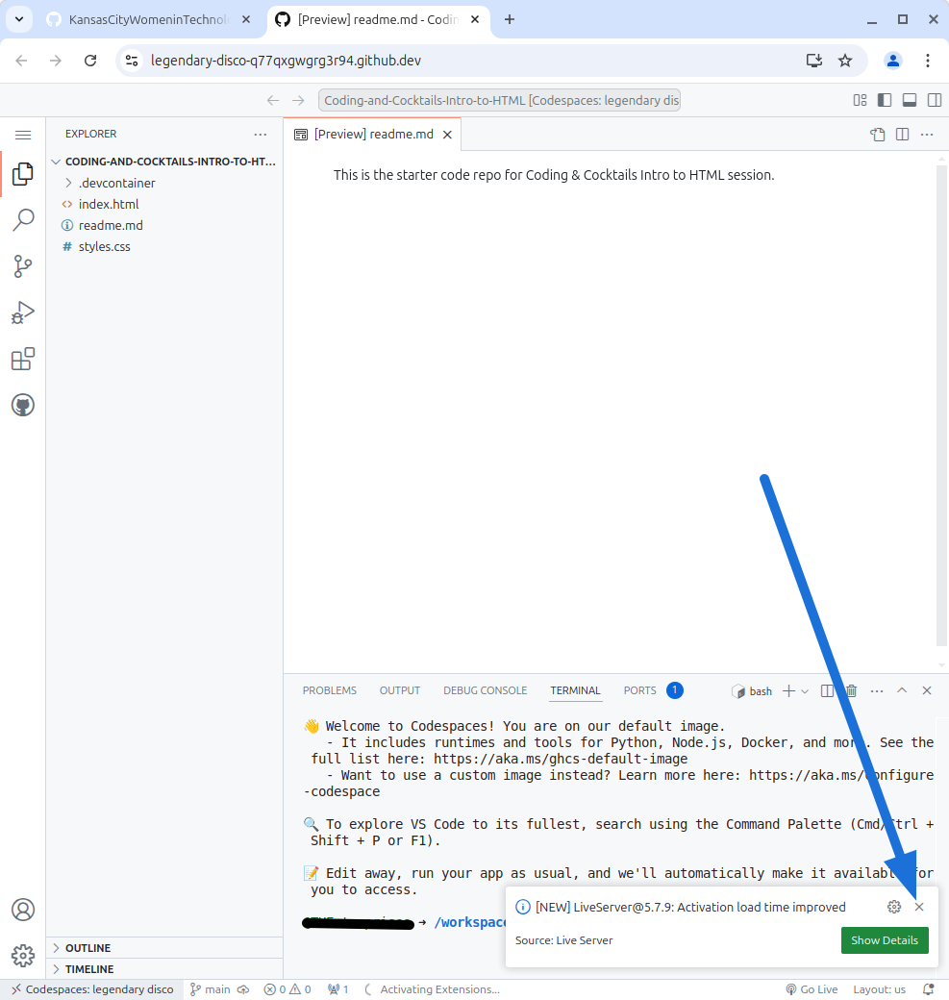
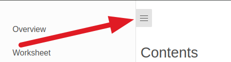

# Setup :id=setup

Tonight we will learn the basics of applying styles to a website using **C**ascading **S**tyle **S**heets (**CSS**).

Follow the instructions on this page to prepare your workspace.

> [!TIP]
> Open [Slack](http://kcwit.slack.com/) to the **#codingandcocktails** channel. It's a great way to stay in touch with your Coding & Cocktails friends and to ask questions during and after the session. We'll also post updates and tips in Slack if we run in to any stumbling blocks tonight.

> [!WARNING]
> We will use a cloud development environment called **GitHub Codespaces**. In order to use Codespaces, you will need a GitHub account. Codespaces **only** works with Chrome, so it is important that you use Google Chrome for today. If you use a different browser, things will not behave as this tutorial expects.

> Navigate to [**GitHub**](https://github.com) to create a personal account or log in. Feel free to ask your mentor for help! When complete and logged in to GitHub, return here to continue the instructions.

# Create Intro to CSS Codespace

We will use GitHub Codespaces for our workshop. GitHub Codespaces is a cloud development environment which means you have an access to your code even if you are not on your own laptop.

1. Navigate to [**GitHub**](https://github.com/login) and log in with your GitHub account.

    

2. Once you're signed in, click on the following link to [**the starter code repo**](https://github.com/KansasCityWomeninTechnology/Coding-and-Cocktails-Intro-to-HTML) and click the "Use this template" button in the upper right-hand corner of the screen.

    

3. Next, select the "Open in a codespace" option.

    

4. Now you are ready to write some code! The Codespace page is split into 3 different sections. On the far left is the project's file structure. The top right section is where you will write your code. The bottom right section is where you will find the terminal.

    You may see a notification in the lower right-hand corner of the screen. You can dismiss this by clicking the "x".

    

> [!TIP]
> If you want to change the project name, you can do so by clicking the **lock icon** on the top center.
> 

> [!TIP]
> View the worksheet and your IDE in split screen.
>
> If you click **Close** button on top right, it will close the browser view and you will have wider code section.
> 
> If you want to open the browser view in a new tab, click **Open in New Tab**
> You can always have code on one half of the screen and browser in the other half.
>
> If you have any questions, feel free to ask. Mentors are happy to help!

> [!TIP]
> Did you know you can collapse the table of contents for worksheets?
>
> Click on the hamburger menu (:fas fa-bars:) at the top of the page to toggle the table of contents.
>
> 

> [!TIP]
> Did you know you can perform common tasks such as copy and paste?
>
> When working without a mouse, keyboard shortcuts will be faster than a trackpad. Open the [handy dandy keyboard shortcut reference in a new tab](/css/references/ ":target=_blank") so you can refer to it easily!
