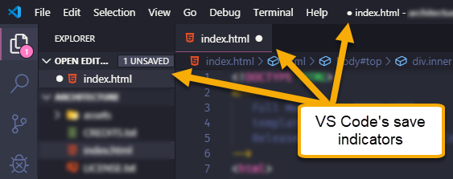

1. Open Visual Studio Code (VS Code) from your installed applications. In VS Code, select **File** :fas fa-long-arrow-alt-right: **Open Folder...**.

1. Navigate to and select the "CodingAndCocktails/session2" folder.
   >[!WARNING]
>If you don't have a "CodingAndCocktails/session2" directory, take a moment to [set up your workspace](../setup/?id=setup).
 

1. Create a file called _index.html_. In VS Code's **EXPLORER** pane, hover over **SESSION2** to display action buttons. Click the **New File** icon.

1. Name the file _index.html_ and press `Enter` to save it in your "CodingAndCocktails/session2" folder.

1. Copy and paste the following HTML code into your _index.html_ file.
  
   index.html
    ```html
<!DOCTYPE html>
<html lang="en">
   <head>
      <meta charset="UTF-8">
      <meta name="viewport" content="width=device-width, initial-scale=1">
      <title>LadyDev Bar &amp; Grill</title>
      <script src="https://use.fontawesome.com/81b69a015b.js"></script>
   </head>
   <body>
      <nav class="navbar">
         <ul>
            <li><a href="#">Home</a></li>
            <li><a href="#about">About</a></li>
            <li><a href="#menu">Menu</a></li>
            <li><a href="#contact">Contact</a></li>
         </ul>
      </nav>
      <section id="about" class="hero">
         <div class="hero-text">
            <h1>LadyDev</h1>
            <h1>Bar &amp; Grill</h1>
            <h2>Making development more delicious every day!</h2>
            <p>Welcome to the LadyDev Bar &amp; Grill. We're glad you're here!</p>
            <p>Sit down, relax, and enjoy good drinks, good eats, and good friends.</p>
         </div>
      </section>
      <main class="grid-container">
         <section id="menu" class="drinks">
            <h2>Menu</h2>
            <ul>
               <li class="item">
                  <a href="#"></a>
                  <h3 class="beverage">Martinis</h3>
                  <p>Made with our own homemade gin and dry vermouth. Choose from The Classic, Lemondrop, or Chocolate.</p>
               </li>
               <li class="item">
                  <a href="#"></a>
                  <h3 class="beverage">Wine</h3>
                  <p>There are just too many to list. Ask your server for a recommendation.</p>
               </li>
               <li class="item">
                  <a href="#"></a>
                  <h3 class="beverage">Whiskey cocktails</h3>
                  <p>Whiskey. Known as the water of life and a drink worthy of deep contemplation. Thank goodness it's not
                     just for men anymore.</p>
               </li>
               <li class="item">
                  <a href="#"></a>
                  <h3 class="beverage">Margaritas</h3>
                  <p>Slushy frozen delicousness, in Peach, Strawberry, or Mango. Served with a rock-salted rim and lime.
                  </p>
               </li>
               <li class="item">
                  <a href="#"></a>
                  <h3 class="beverage">Hot &amp; Creamy</h3>
                  <p>Just what you need to kick off a night of coding. We offer concoctions with coffee, Kahlua, Bailey's,
                     and
                     more.</p>
               </li>
               <li class="item">
                  <a href="#"></a>
                  <h3 class="beverage">Beer</h3>
                  <p>We serve the finest microbrews from around the world. How about a Saison, IPA, or Stout?</p>
               </li>
               <li class="item">
                  <a href="#"></a>
                  <h3 class="beverage">Non alcoholic</h3>
                  <p>We have plenty of NA options available to quench your thirst, like lemonade, milk or soda.</p>
               </li>
            </ul>
         </section>
         <section class="small-plates">
            <h2>Small plates</h2>
            <ul class="food">
               <li>Grassfed beef sliders</li>
               <li>Spicy calamari</li>
               <li>Coconut shrimp</li>
               <li>Veggie spring rolls</li>
               <li>Deviled eggs</li>
               <li>Tuscan bean dip</li>
               <li>Chicken lettuce wraps</li>
            </ul>
         </section>
      </main>
      <footer id="contact">
         <p>&copy; 2020 LadyDev Bar &amp; Grill</p>
         <ul>
            <li><a href="http://facebook.com/ladydevbargrill"><i class="fa fa-facebook-official fa-lg"></i></a></li>
            <li><a href="http://twitter.com/ladydevbargrill"><i class="fa fa-twitter fa-lg"></i></a></li>
            <li><a href="http://instagram.com/ladydevbargrill"><i class="fa fa-instagram fa-lg"></i></a></li>
            <li><a href="mailto:ladydevbargrill@example.com"><i class="fa fa-envelope-open-o fa-lg"></i></a></li>
         </ul>
      </footer>
   </body>
</html>
   ```

1. Save the file by selecting **File** :fas fa-long-arrow-alt-right: **Save**. You can also use the keyboard shortcut `ctrl + s` on Windows or `cmd + s` on Mac. Unsaved files in VS Code have a little dot on the tab.

   

   >[!TIP]
   >You may run into an error saving _index.html_ if your VS Code needs elevated permissions on Windows. Select **Retry as Admin** to finish saving.


1. Now we'll prepare the images. First we need a folder for the images. In VS Code, hover over **SESSION2** and click on the **New Folder** icon. Name the folder "images".

1. In Chrome, open a [new tab to download the contents of our GitHub repository containing the images](https://github.com/KansasCityWomeninTechnology/CSSCompilerPractice/archive/master.zip).

   >[!INFO]
   >Clicking on the link automatically downloads a zip file that contains multiple files. The worksheet will walk you through file organization.
   >
   >[GitHub](https://github.com/) is a tool we use to store code.

1. Unzip the file and move all the images inside the "images" folder to your new "images" folder in "CodingAndCocktails/session2/images".

   >[!TIP]
   >Not sure how to extract the contents of the zip file?
   >
   >**Mac users**: Double click on the downloaded file with the .zip extension<br/>
   >**Windows users**: Right click on the file with the .zip extension and choose "Extract All." Select the destination you would like to extract the files to. 
	
	When you're done, your "images" folder should contain:
	```
	beer.jpg
	hero.jpg
	hot-cocktail.jpg
	margarita.jpg
	martini.jpg
	milk.jpg
	whiskey-cocktails.jpg
	wine.jpg
	```

   >[!TIP]
   >That's all we need from *CSSCompilerPractice_master.zip*. You can delete all the other files from the download.


Congratulate your neighbors for getting all the HTML setup done. Break the ice by asking your neighbor "What's the most embarrassing fashion trend you used to rock"?