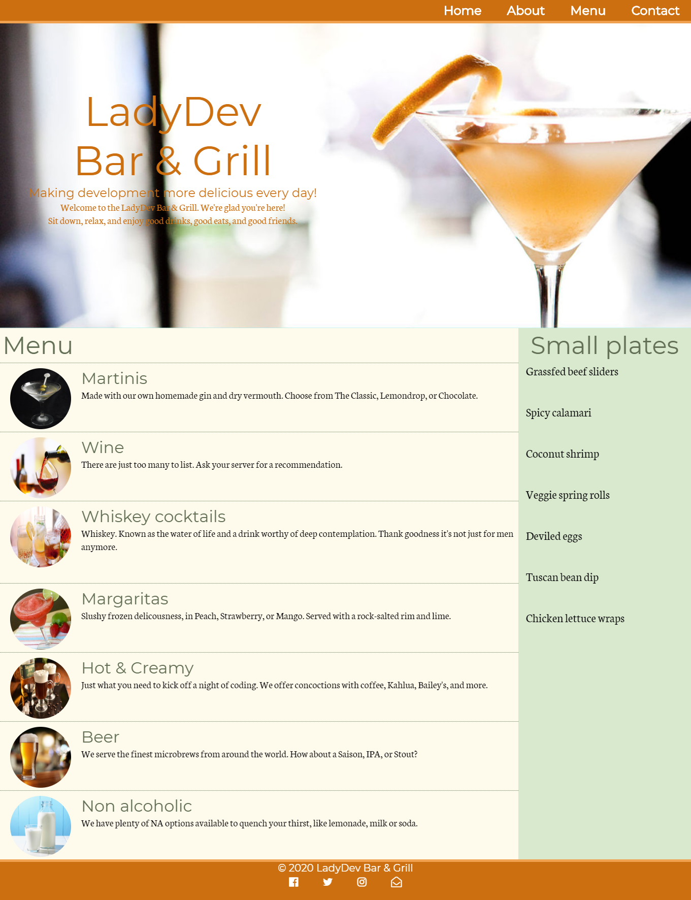
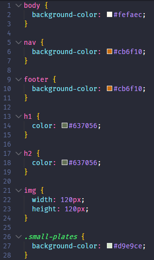

# CSS Basics
**C**ascading **S**tyle **S**heets (**CSS**) decorates your website with visual appeal and invites the user to connect with your website's personality. Tonight we'll apply CSS to the "LadyDev Bar & Grill" web page. If you follow our instructions your page will end up looking like the example below but feel free to add in some of your own creativity if you feel comfortable! 

>[!WARNING]
>Before starting the worksheet, please take a moment to review the [Setup instructions](../setup/?id=setup) to ensure you have all the tools and workspace setup you need for tonight's work.

>[!WARNING]
>If you are using CodeSandbox, please skip to [CodeSandbox instructions](./?id=cloud-ide) below.

# Prepare the HTML file
First we need the HTML file. We'll create the file, download the images, and set up the development environment.

[filename](./1html-file.md ':include')

# Create and link the stylesheet to the HTML :id=link-stylesheet

[filename](./2create-css.md ':include')

# Resize images using relative and absolute sizes 
Images are a big part of any website and what most people see first because your eyes are drawn to visuals. Let’s learn about absolute and relative sizing and apply it to the images in the menu.

[filename](./3resize-images.md ':include')

# Change the color of the title
Color helps differentiate sections within a website and helps convey importance. In this section we'll change the color of the headers.

[filename](./4title-color.md ':include')


# Cascade background color changes
The ability to cascade styles makes CSS powerful. In this section we will apply background colors to demonstrate how to cascade styles.

[filename](./5background-color.md ':include')

### Nice work!
Celebrate with a toast with your neighbors. Take a screenshot and share on Slack so we can all admire your color selection.

# Checkpoint 
Compare your _styles.css_ against the answer key for your work so far. It might look a little different depending on the color palette you chose.  

>[!CODECHECK]
>
>      
>You can also compare your _index.html_ file with our [answer key](https://github.com/KansasCityWomeninTechnology/AnswerKeys/blob/checkpoint-html-elements/html/index.html) if the image is too difficult to read.
>You can also compare your _styles.css_ file with our [answer key](https://github.com/KansasCityWomeninTechnology/CSSCompilerPractice/blob/checkpoint-1-css-basics/css/styles.css) if the image is too difficult to read.

## References and helpful links 
[Mozilla Developer Network CSS reference documentation](https://developer.mozilla.org/en-US/docs/Web/CSS/Reference)

### Cloud IDE instructions :id=cloud-ide

[filename](./cloud-ide.md ':include')