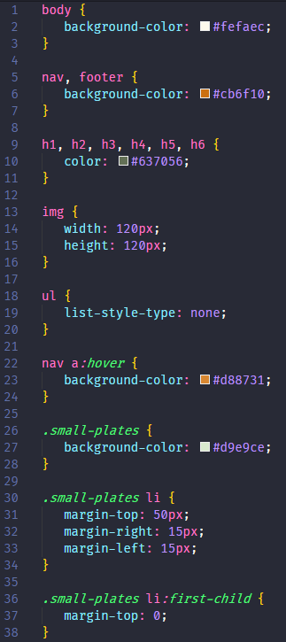

# Grouping and Selectors
CSS allows you to be as generic or as specific as you want. In this section we will learn how to apply styles to multiple selectors and work with special selectors. 

# Set default color for all header text 
Setting a style on multiple selectors at once makes CSS succinct. In this section you'll set a default color for all header text.

[filename](./1header-colors.md ':include')

# Change hover color of hyperlinks using pseudo classes
Providing user feedback on clickable elements such as hyperlinks is thoughtful user interaction. You'll set a hover color, style lists, and practice CSS organization.

[filename](./2hover-color.md ':include')

# Using list pseudo classes and combinators to style lists 
We'll work some more with list styling and add spacing between list elements.

[filename](./3list-item-space.md ':include')

# Checkpoint 
Compare your _styles.css_ against the answer key for your work so far. It might look a little different depending on the color palette you chose.  

>[!CODECHECK]
>
>
>You can also compare your _styles.css_ file with our [answer key](https://github.com/KansasCityWomeninTechnology/CSSCompilerPractice/blob/checkpoint-2-grouping-special-selectors/css/styles.css) if the image is too difficult to read.

## References and helpful links 
[Mozilla Developer Network CSS selector documentation](https://developer.mozilla.org/en-US/docs/Web/CSS/CSS_Selectors)

[Mozilla Developer Network styling list documentation](https://developer.mozilla.org/en-US/docs/Learn/CSS/Styling_text/Styling_lists)