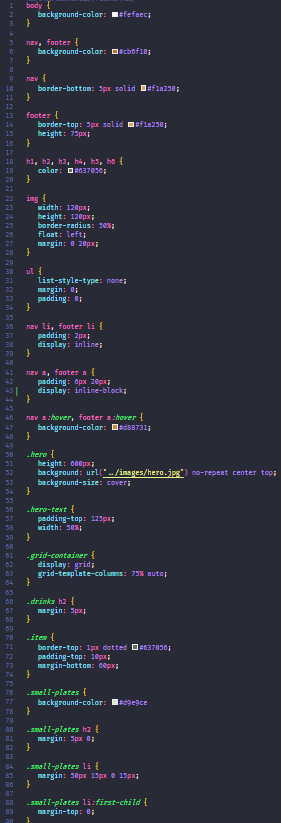

# Box Model & Layout
Cluttered web pages overload the brain. Spacing and layout helps draw attention to different parts of the website by making it easier for users to "see". We will continue our work on LadyDev Bar & Grill by applying spacing and layout concepts.

# Define section boundaries with borders 
Borders help define sections and helps the user by grouping like items together. You will explore different border properties to bring definition to your webpage.

[filename](./1borders.md ':include')

# Use the Box Model to add padding and margins 
The Box Model defines spacing around elements. You will apply Box Model concepts to add whitespace to LadyDev Bar & Grill.
Refer to the [CSS Cheat Sheet](/css/references/css_cheat_sheet.md) to help.

[filename](./2padding-margin.md ':include')

# Define a background image to use for the hero image 
Most eye-catching websites have a hero image. Let’s learn about background properties and use what we learned about absolute and relative sizing and apply it to the hero image.

[filename](./3hero.md ':include')

# Use CSS grid for layout 
We want the drink menu and small plates menu as two columns next to each other. We will use the power of CSS Grid to help us out.

[filename](./4grid-layout.md ':include')

# Checkpoint 
Compare your _styles.css_ against the answer key for your work so far. It might look a little different depending on the color palette you chose.  

>[!CODECHECK]
>
>
>You can also compare your _index.html_ file with our [answer key](https://github.com/KansasCityWomeninTechnology/CSSCompilerPractice/blob/checkpoint-3-box-model-layout/css/styles.css) if the image is too difficult to read.

## References and helpful links 
[Mozilla Developer Network Box Model documentation](https://developer.mozilla.org/en-US/docs/Learn/CSS/Introduction_to_CSS/Box_model)

[Mozilla Developer Network Display documentation](https://developer.mozilla.org/en-US/docs/Web/CSS/display)

[Mozilla Developer Network Background documentation](https://developer.mozilla.org/en-US/docs/Web/CSS/background)

[Mozilla Developer Network Grid Layout documentation](https://developer.mozilla.org/en-US/docs/Web/CSS/CSS_Grid_Layout/Basic_Concepts_of_Grid_Layout)
