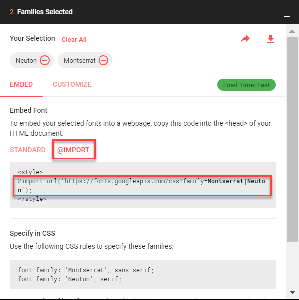

1. Navigate to [Google Fonts](https://fonts.google.com/) and find a font to use for headers.
    
1. Click the red **+** in the upper right of that font's section.

   
    
   At the bottom of your page, a snackbar with the text **1 Family Selected** will appear.  
   

1. Find a font to use for body text and select the font using the steps outlined above. The snackbar at the bottom of the page will say **2 Families Selected**.
1. Click on the snackbar to open to instructions on using the font. Click on **@IMPORT** and copy the `@import` statement.

   

    >[!TIP]
    >If you don't see the **@IMPORT** click on the arrow first.
    >
    >

1. Paste the `@import` statement at the top of your _styles.css_ file, before the normalizing styles.

1. In the style declared for the `body`, add font for body text using the CSS rules specified by Google. In the example above, Google specified `font-family: 'Neuton', serif;`.

    >[!INFO]
    >If you select a font with 2 word in the name you'll need to wrap the font name in quotation marks.

1. Add the font family for header text to the style you declared for all headers using Google's supplied CSS rule. Add the font to other styles if you want to override any other text, such as the text in the `nav` and `footer`. 

    >[!EXTRACREDIT]
    >Often you'll want to provide backup fonts for the page to fall back on in case it can't load the chosen font. A common fallback for sans-serif fonts might include Arial, Helvetica, sans-serif. For serif fonts it might include "Times New Roman", Times, serif as backups. You can add multiple fallbacks like this `font-family: Neuton, "Times New Roman", Times, serif;`
    >
    >You can see the fallback fonts in action if you remove the "@import" statement for the fonts in your _styles.css_ file, save your file, and view the page. Notice how the font changes.

    >[!INFO]
    >Learn more by reading [MDN documentation on font family](https://developer.mozilla.org/en-US/docs/Web/CSS/font-family).
