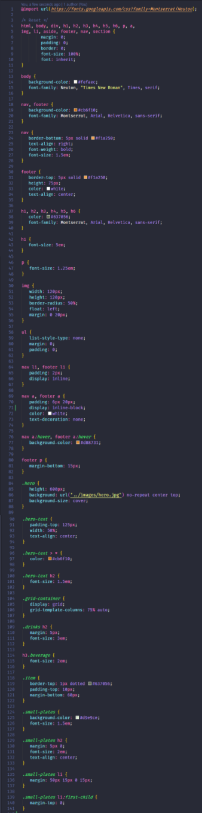

# Text
With layout complete, styling text adds the final polish to a website. Using a different font for sections of the web page adds interest and appeal. 

# Normalize style for cross browser consistency 
Your users will use different browsers. Help your users have a consistent browsing experience by resetting all styles.

[filename](./1normalize.md ':include')

# Select header and body fonts and define fallback fonts
Different fonts help define areas. But you have to have a backup plan. Let's select fonts for our web page and define fallback fonts as a contingency.

[filename](./2select-fonts.md ':include')

# Define font styles 
Beautiful text adds final polish to websites. Let's resize and decorate text to polish LadyDev Bar & Grill website.

[filename](./3fonts.md ':include')

# Style the navigation and footer 

Navigation and footer information helps frame the main body of the site. 

[filename](./4navigation-footer.md ':include')

# Checkpoint 
Compare your _styles.css_ against the answer key for your work so far. It might look a little different depending on the color palette you chose.  

>[!CODECHECK]
>
>      
>You can also compare your _index.html_ file with our [answer key](https://github.com/KansasCityWomeninTechnology/CSSCompilerPractice/blob/checkpoint-4-text/css/styles.css) if the image is too difficult to read.

## References and helpful links 
[Mozilla Developer Network Font properties documentation](https://developer.mozilla.org/en-US/docs/Web/CSS/font)

[Mozilla Developer Network Text properties documentation](https://developer.mozilla.org/en-US/docs/Web/CSS/CSS_Text)

