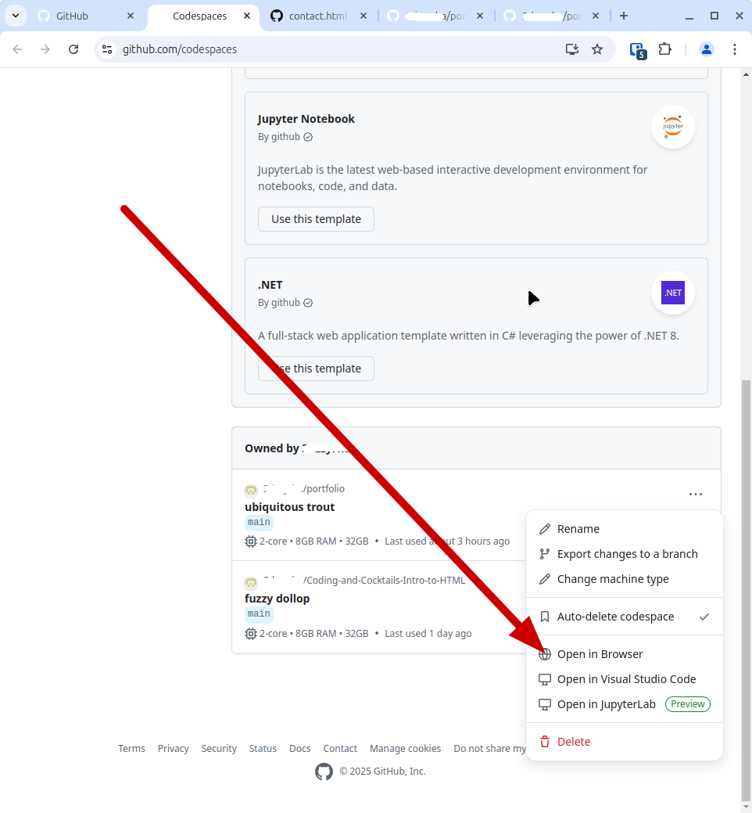
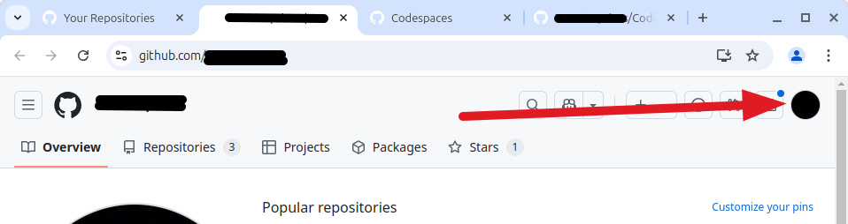
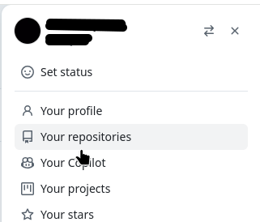
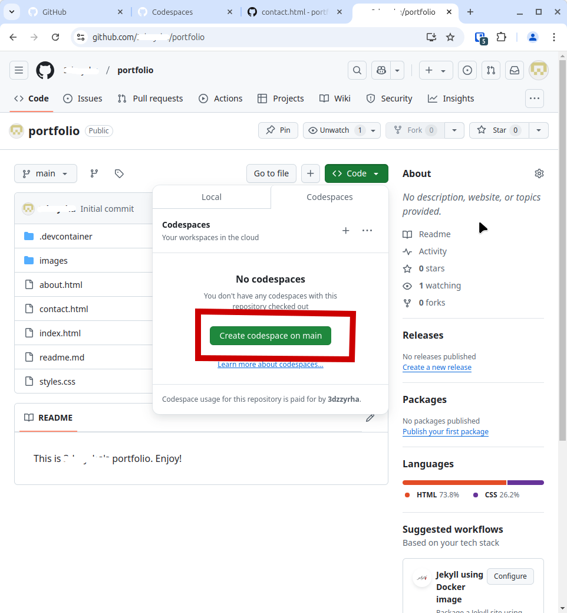

    
    <h2 style="display:inline-block;margin-top:1em;">Coding &amp; Cocktails: The Garnish</h2>
    <h3 style="margin-top:0;margin-bottom:2em;">CSS Side Quest</h3>

### Overview

Now that you've got a few pages for your portfolio, let's get them styled.

Go to your [GitHub Codespaces page](https://github.com/codespaces). If you see a Codespaces page for your repo, click on the three dots and select "Open in browser."

If you don't see a Codespace for your portfolio repo, Click on the profile picture in the upper right-hand corner of the page and select "Your repositories."

Now click on the link for your portfolio repository, then click on the green "Code" button. Select "Codespaces," then "Create codespace on main."

When your codespace is open, double-click on the _styles.css_ file. In this file, you will see CSS that we created for you when we created the Intro to HTML starter code. Select the contents of the file and delete them.

Go back to the _styles.css_ file in your Intro to CSS repo and copy the normalizations to your portfolio's _styles.css_ file.

It's good to spend some time thinking about how you want your pages to look. Take a look at some web pages that you like, and some that you don't, and figure out what resonates most with how you want your portfolio to appear, then plan out on paper where you want elements of your page to appear and what they should look like before you start applying CSS.

One really good skill to build is learning how to search for information on how to do things. In the tutorial we just completed, you were given some resources. One of these is the Mozilla Development Network. This organization has documentation about [CSS](https://developer.mozilla.org/en-US/docs/Web/CSS) that you will find useful.

You can search this resource to find out how to apply styling your website.

Remember, too, that there are other resources available in the [slides](https://kansascitywomenintechnology.github.io/CodingCocktailsSlideTemplate/css-series/2023-css.html#/) from the Intro to CSS session!

Don't forget to commit your changes to your repo!

Once you've got your site set up the way you like it, post the link to your repo in the  **#codingandcocktails** channel on [Slack](http://kcwit.slack.com/) to let us see what you can do.