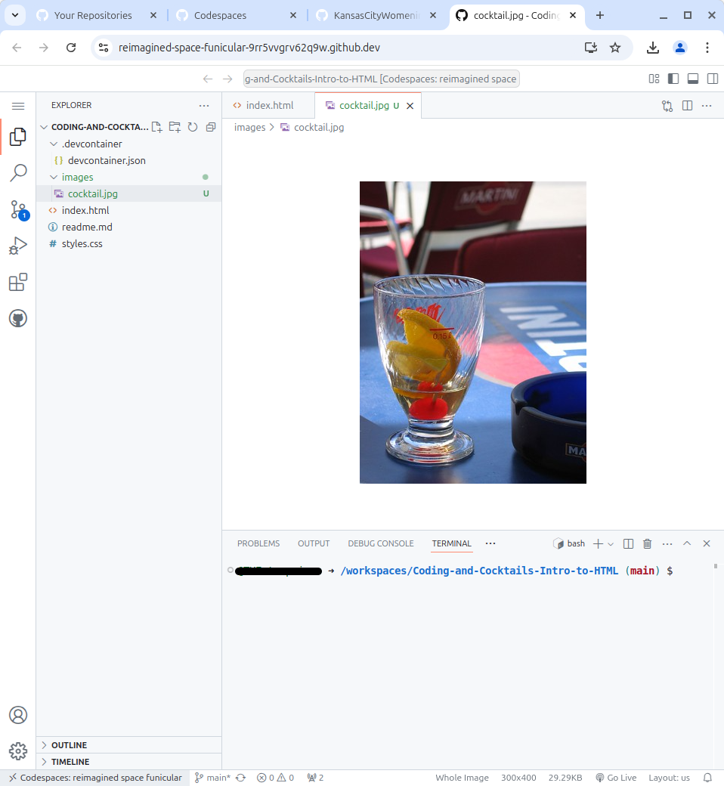

# HTML Element Attributes

Now back to coding!

Our web page is coming together. But web pages have images and links. All these HTML elements use **attributes** for extra metadata they need to work.

We’ll add an image and links to practice using attributes.

# Find and download a fun and exciting image

Websites have eye catching images. Let's find one we like and get it ready to add to our site!

1. In Google Chrome, navigate to [flickr.com](https://flickr.com).
2. Search for a cocktail image.
3. Change the license filter from "Any License" to "Commercial use allowed".

   

4. Choose your favorite image, click on it and click on the download icon in the lower right corner. You get to choose what size you'd like on your page. Name it something easy to remember.

   

5. Now let's upload the image to your GitHub Codespace. Hover over the bold **Coding-and-Cocktails-Intro-to-HTML** in the explorer and look for the `New Folder` button to the right.
   
   

6. Name the folder "images."
   
   

7. Now navigate to the downloads folder on your computer and find the image file you downloaded. Drag and drop it on the "images" folder you just created. Voilá! Your image is now available to use.
   
   

# Add an image

Now it's time to add the image to our website. We get to use our first attributes to provide the info the browser needs to display the image.

1. Image elements don't require closing tags. In your ïndex.html file, find the "About" section. Add an `` tag below the "**About**" header on your page to add an image.

   > [!INFO]
   > We created a **self-closing** tag. Self-closing tags have the `/>` written into the tag. HTML elements that don't require content or derive their information from attributes are self-closing.

2. We need to add metadata to the `` tag so that the browser knows what image to display. The first one we'll add is the image source, `src`. The `src` attribute tells your code where to look for your image. Place your cursor inside the`` tag after the `g` and press `Space`. Type `src="FILESOURCE"`. Your image tag will look like this

   index.html

   ```html
   
   ```

   > [!EXTRACREDIT]
   > We now have an image element with an invalid source location. Try saving the _index.html_ and viewing it in Chrome. We see the dreaded broken image icon! What happens if you open Chrome DevTools?

3. Now we need to replace the "FILESOURCE" with the real file source of the image including the file extension.

   > [!INFO]
   > We're setting the value of the attribute `src` to the filename. You'll see instructions directing you to set the value of an attribute throughout this section. Use the same format `attribute="value"`.

   > [!TIP]
   > The path of the image is ./images/<filename>. Make sure to include the path for the value of the attribute `src`.

4. Now take a look at your page in Chrome. Do you see your image? 

   > [!TIP]
   > Not seeing your image? Try opening up Chrome DevTools to see if there's an error. Does your path of the image match up to what's in the `src` attribute?

# Use `anchor` elements for navigation

A navbar isn't helpful if it doesn't navigate to the different sections of the webpage. In this section we'll add `anchor` elements to the list of sections in the navbar and make it link their respective section in the webpage. The linked section also needs an attribute for hyperlinks to work.

1. Links use the anchor element, `<a>`. We'll wrap the list items "About" and "Contact" in the navbar to link to their respective sections. Place your cursor after the opening `<li>` tag and before the text **"About"** and type `<a>` to create a the anchor tag. Add the closing `</a>` after the text. The **"About"** text should now look like this:

   index.html

   ```html
   <li><a>About</a></li>
   ```

2. Clicking "About" link should move to the **"About"** section of the page. We need to specify the hyperlink reference source for the anchor (where the link takes you when you click on it). This is an attribute `href`. Inside the opening `<a>` tag, add the attribute `href` with the value "#about".

   > [!INFO]
   > The '#' in front of the "about" is a special symbol that denotes the id of an element. It specifies that the link is within this web page and not to another webpage on the internet.

   > [!EXTRACREDIT]
   > Here is an example of using an attribute to tie HTML elements together. Now that we have a value for the attribute `href`, can you guess what we need to do to link the `<a>` element to the corresponding HTML element?
   >
   > Feel free to talk it through with your mentor before moving on to the next step of the worksheet.

3. Find the `<section>` element for "About" in your _index.html_. This is where we add the link for the anchor. We'll use an `id` attribute. Inside the opening `<section>` tag, add the attribute `id` with the value "about".

4. Take a look at your page in Chrome. The "About" text in the navbar at the top of the page now has an underline. You can test your link now.

   > [!TIP]
   > Since we don't have a lot of content on our page it may not appear to work at first. If you shrink the size of your browser window down so it is about half as tall, try clicking on the "About" navigation item again and the "about" section should show at the top!

   >Alternatively, you can take a look at the URL for your page. When you click on the "About" link in the navigation bar, you will see the URL change to include "#about" at the end of the address.

5. Now let's do "Contact". Repeat the same steps we took for the "About" section but apply it to "Contact". Don't forget you have to add the anchor and update the id for the section.

   > [!HINT]
   > Wrap the "Contact" text in the list with `<a>` tag and add the `href` attribute. Set the value to "#contact". Add the closing `</a>` tag. Find the `<section>` for "Contact" and add the attribute `id`</code>`. Set the value to "contact". Your code should look like this
   >
   > ```html
   > <li><a href="#contact">Contact</a></li>
   > ... skipping code here
   > <section id="contact">
   >   <h3>Contact</h3>
   >   ...remaining code for webpage here
   > </section>
   > ```

6. Take another look at your page in Chrome.

   You did it! You created a website!

7. Now commit your project to your repo like you did before.

# Checkpoint

Compare your _index.html_ against the answer key for your work so far. It might look a little different depending on your spacing and text.

> [!CODECHECK] > 
> You can also compare your _index.html_ file with our [answer key](https://github.com/KansasCityWomeninTechnology/AnswerKeys/blob/checkpoint-html-attributes/html/index.html) if the image is too difficult to read.

## References and helpful links

[Mozilla Developer Network anchor element documentation](https://developer.mozilla.org/en-US/docs/Web/HTML/Element/a)
