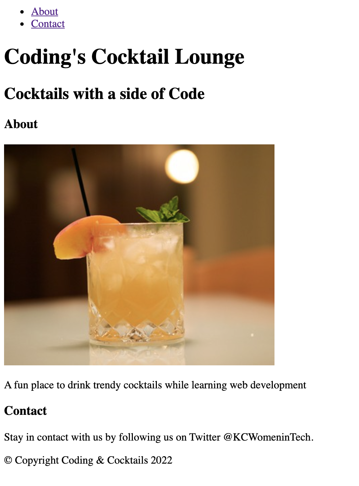
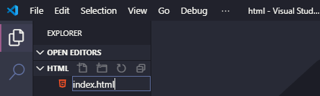

# What is Web Development & HTML

Today we cover what web development is and HTML basics. In this section of the worksheet, you will create your own _index.html_ page from the ground up. The _index.html_ file is the main HTML for a web page. HTML is one of the building blocks of a web page. It defines the structure of the page and lays the foundation to then add styles and dynamic content.

At the end of this section, you will have a webpage that looks like this:



> [!WARNING]
> Before starting the worksheet, please take a moment to review the [Setup instructions](../setup/?id=setup) to ensure you have all the tools and workspace setup you need for today's work.

> [!WARNING]
> If you are using StackBlitz, please skip to [StackBlitz instructions](./?id=cloud-ide) below.

# Create the HTML file

<!-- [filename](./1file.md ':include') -->
<!-- Contents from file. make changes in external files and copy here until bug is fixed -->

1. Using the file explorer, in the "CodingAndCocktails/session1" folder you created during the tools setup, create a new folder named "html".

1. In VS Code, select **File** :fas fa-long-arrow-alt-right: **Open Folder...** for Windows and **File** :fas fa-long-arrow-alt-right: **Open...** for Mac. Navigate to and select the "CodingAndCocktails/session1/html" folder.

1. Create a file called _index.html_. In VS Code's **EXPLORER** pane, hover over **HTML** to display action buttons. Click the **New File** button.

   

1. In the text box that appears, name the file _index.html_ and press `Enter` to save it in your "CodingAndCocktails/session1/html" folder.

   

# Create HTML structure :id=structure

<!-- [filename](./2structure.md ':include') -->
<!-- Contents from file. make changes in external files and copy here until bug is fixed -->

1. VS Code should open the _index.html_ file for you in the editor.

1. Copy the following code snippet and paste it into your _index.html_ file.

   index.html

   ```html
   <!DOCTYPE html>
   <html lang="en">
     <head>
       <meta charset="UTF-8" />
       <meta name="viewport" content="width=device-width, initial-scale=1.0" />
       <meta http-equiv="X-UA-Compatible" content="ie=edge" />
       <title>Document</title>
     </head>
     <body></body>
   </html>
   ```

   > [!EXTRACREDIT]
   > Take a look at the spacing in the file. Some tags, such as `head` and `body` indent from their parent tag, `html`. This means they are children of the `html` tag. Can you match up the start and end of the `head`, `body`, and `html` tags?
   >
   > The `meta` and `title` tags are also children. What tag is `meta` and `title`'s parent? Feel free to grab a mentor to talk out the answers to these questions. They LOVE to help and act as a soundboard!

1. Save the file.

1. Cheers! You set up the structural foundation of a web page!

# HEAD section

<!-- [filename](./3head.md ':include') -->
<!-- Contents from file. make changes in external files and copy here until bug is fixed -->

1. In VS Code, change the text between the `<title></title>` tags. The title displays on the browser tab. Today we'll make a Cocktail Lounge site so change the text from "Document" to "YourName's Cocktail Lounge".

   > [!INFO]
   > The title is in the `head` section. The `head` section contains data telling your browser more information about your page. This is also where you link to your styles and script files.

1. Save the file.

# View your web page

<!-- [filename](./4view.md ':include') -->
<!-- Contents from file. make changes in external files and copy here until bug is fixed -->

1. Now we want to preview the _index.html_ file in Chrome. Instead of saving and reloading the page like we did earlier, we'll use the VS Code plugin **Live Server**. This extension opens up the web page in your default web browser and reloads the page whenever you save files. In VS Code, start the live server by right clicking on _index.html_ in the **EXPLORER** pane and selecting **Open with Live Server**. A browser tab will open.

   > [!WARNING]
   > If you don't have the **Live Server** option, take a moment to [set up your workspace](../../tools/vscode/?id=required-extensions).

   > [!WARNING]
   > If the tab opens in another browser, copy the URL and paste it into a new tab in Chrome. The reload will automatically happen in Chrome.
   >
   > If you get an access warning, click "Allow" to let **Live Server** serve the application.
   >
   > If you are borrowing a laptop and get an access warning, please contact a member of the Coding & Cockails leadership team for access.

1. You won't see anything exciting on the page yet, but you should see your title displayed in the page tab.

Most of our work today will be inside the `<body></body>` tags. This is where visible page content goes.

## References and helpful links

[Mozilla Developer Network Head element documentation](https://developer.mozilla.org/en-US/docs/Web/HTML/Element/head)

### Cloud IDE instructions :id=cloud-ide


We will create a new StackBlitz for the HTML section of the worksheet.

1. Log in with your GitHub account

1. Once you're logged in, navigate to your **Dashboard** in StackBlitz by clicking on the StackBlitz icon at the top left of the toolbar.

1. On the **Dashboard** view, under **Create a new project** section, click **Static** icon. This creates a new project with your _index.html_ already created.

1. Delete all the code from the _index.html_ so that you can follow the worksheet instructions and save your file by clicking **Save** icon at the top left of the toolbar.

1. You created your project and are ready to go! Follow along with [Create HTML structure](?id=structure) using StackBlitz in place of Visual Studio Code.
   
