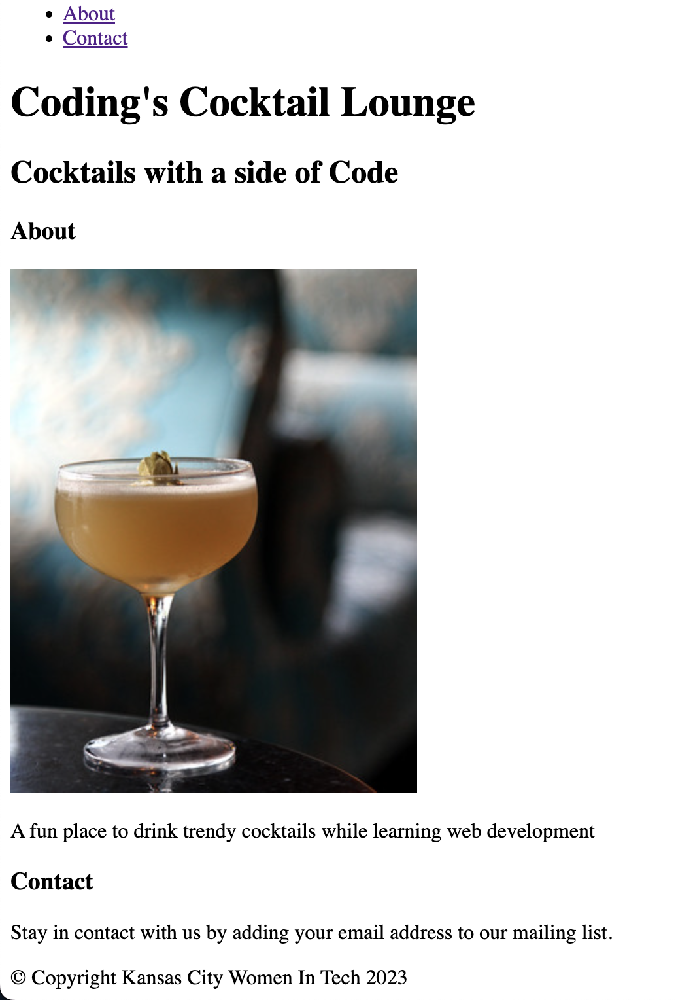
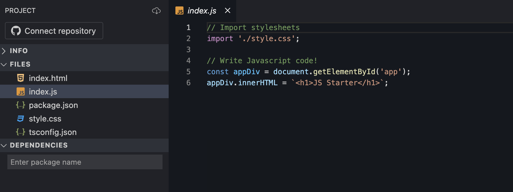
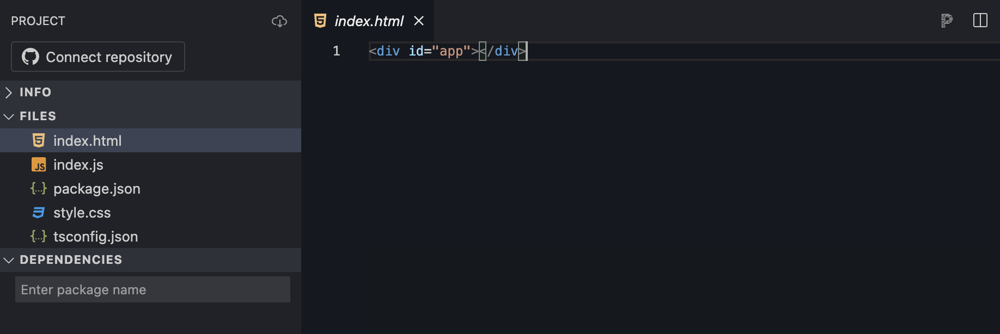
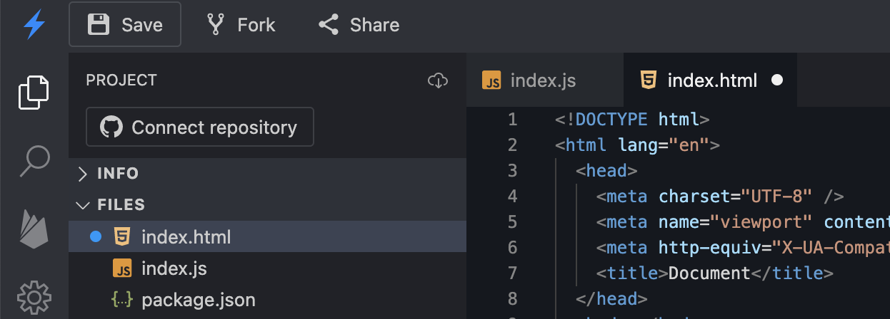
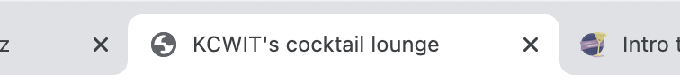

# What is Web Development & HTML

Today we cover what web development is and also some HTML basics. In this section of the worksheet, you will create your own _index.html_ page from the ground up. The _index.html_ file is the main HTML for a web page. HTML is one of the building blocks of a web page. It defines the structure of the page and lays the foundation to then add styles and dynamic content.

At the end of this section, you will have a webpage that looks like this:



> [!WARNING]
> Before starting the worksheet, please take a moment to review the [Setup instructions](../setup/?id=setup) to ensure you have all the tools and workspace setup you need for today's work.

# Prepare the project for our code

StackBlitz creates some files and codes for us when we create a new project. Let's checkout out what StackBlitz gave us and prepare the project for our code.

1. First, let's check out _index.js_. We already have some codes but we don't need line 6. Let's delete line 6.

   index.js line #6

   ```js
   appDiv.innerHTML = `<h1>JS Starter</h1>`;
   ```



2. Now let's move on to _index.html_. We will add our code here so let's clear this file and leave it empty.



> [!TIP]Don't forget to save the files. If you have a white circle next to file name, it means you have changes that haven't saved yet. You can either click **Save** button on the top left or use shortcut `cmd` + `s` for Mac or `ctrl` + `s` for Window.
>
> 

# Create HTML structure :id=structure

1. Copy the following code snippet and paste it into your _index.html_ file.

   index.html

   ```html
   <!DOCTYPE html>
   <html lang="en">
     <head>
       <meta charset="UTF-8" />
       <meta name="viewport" content="width=device-width, initial-scale=1.0" />
       <meta http-equiv="X-UA-Compatible" content="ie=edge" />
       <title>Document</title>
     </head>
     <body></body>
   </html>
   ```

   > [!EXTRACREDIT]
   > Take a look at the spacing in the file. Some tags, such as `head` and `body` indent from their parent tag, `html`. This means they are children of the `html` tag. Can you match up the start and end of the `head`, `body`, and `html` tags?
   >
   > The `meta` and `title` tags are also children. What tag is `meta` and `title`'s parent? Feel free to grab a mentor to talk out the answers to these questions. They LOVE to help and act as a soundboard!

2. Save the file.

3. Cheers! You set up the structural foundation of a web page!

# HEAD section

1. In _index.html_, change the text between the `<title></title>` tags. The title displays on the browser tab. Today we'll make a Cocktail Lounge site so change the text from "Document" to "YourName's Cocktail Lounge".



> [!INFO]
> The title is in the `head` section. The `head` section contains data telling your browser more information about your page. This is also where you link to your styles and script files.

2. Save the file.

   > [!WARNING]
   > If you didn't open the browser view in a new tab, you won't be able to see the change.

You won't see anything exciting on the page yet, but you should see your title displayed in the page tab.

Most of our work today will be inside the `<body></body>` tags. This is where visible page content goes.

## References and helpful links

[Mozilla Developer Network Head element documentation](https://developer.mozilla.org/en-US/docs/Web/HTML/Element/head)
