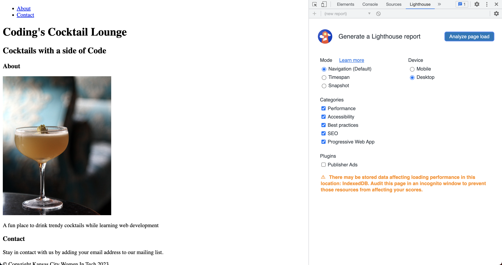
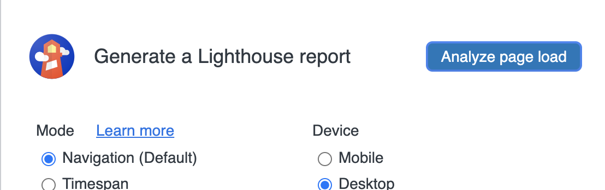

# Accessibilty

Now that we are done with the content, we need to check if our website is inclusive.

# Add alt attribue

You can have more than 1 attribute on a HTML element. Image tags have another attribute for alternate content, `alt`.

1. Inside the `img` tag after the `src` attribute, type `alt="Image of cocktail"`. You can replace "Image of cocktail" to text better describing your image. Your image tag will look like this

   index.html

   ```html
   
   ```

   > [!INFO]
   > The `alt` attribute content displays if the browser can't show (aka **render**) your image. Screen readers use the `alt` for better accessibility to help visually impaired users of the site.

# Check with lighthouse

We will use lighthouse to check our accessibility score.

1. Go to `lighthouse` tab in DevTools.
   
2. Click `Analyze page load` check our website score.
   
3. Check your score and see where you can improve
   

Great job with your website! Share your success by posting a screenshot to Slack!

