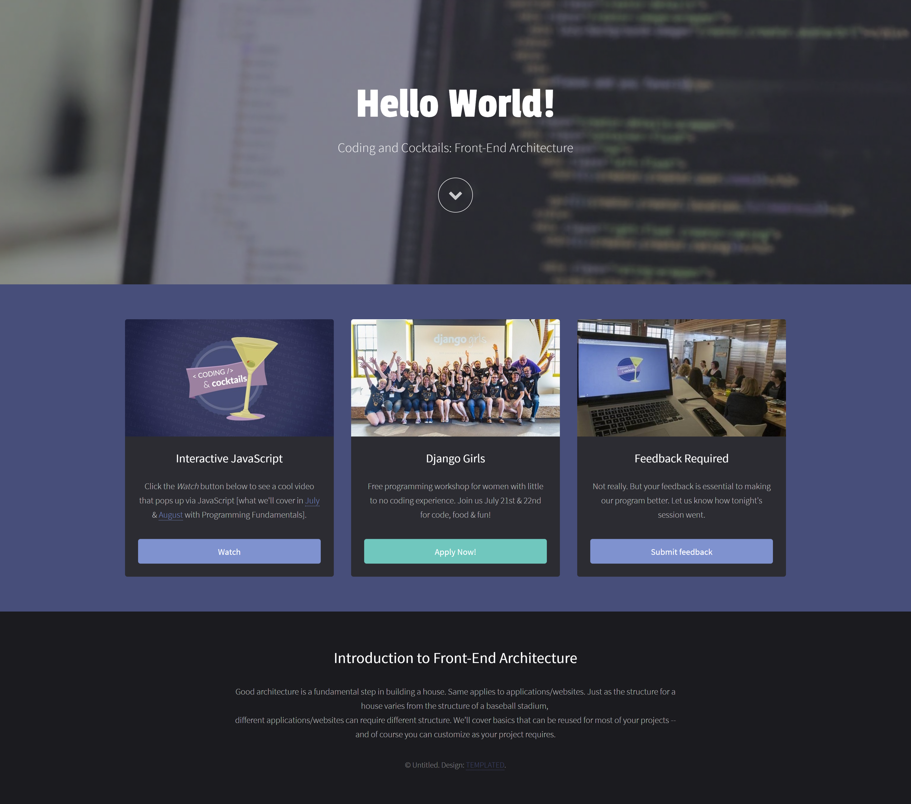
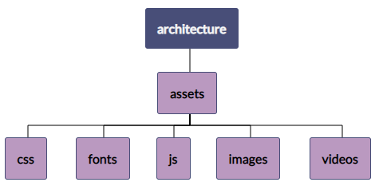
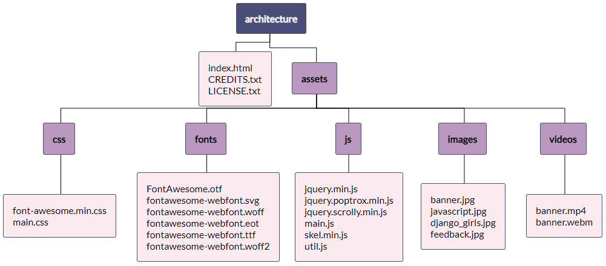
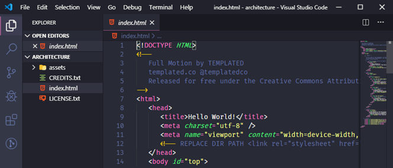
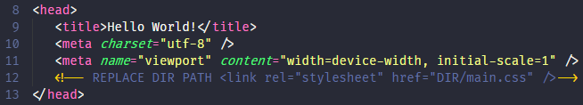
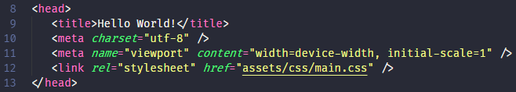
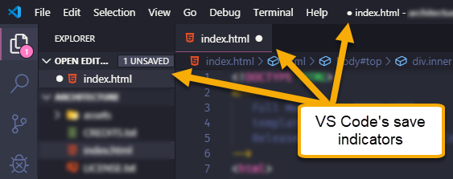
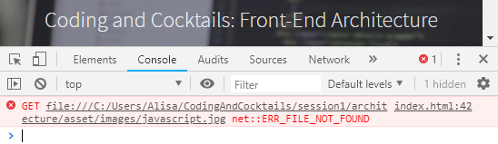

# Front-End Architecture and HTML
Tonight we cover front-end architecture and HTML basics. 

The combination of these two concepts provides the structure and the bones of a website. Or if you're creating a cocktail, it's the glass that holds your cocktail together.

We’ll put both concepts to use here creating our own web page and begin understanding how to organize your code, HTML structure, as well as becoming more comfortable using an **I**ntegrated **D**evelopment **E**ditor (**IDE**) to write HTML.

>[!INFO]
>**Tonight's Goals**
>
>We'll first organize code for a web application then we'll learn HTML basics to create our own web page from the ground up.

----

Front-end architecture is the organization of code and project files. Though there may be coding standards and practices specific to a team, the goal of good front-end architecture is to provide an efficient workflow that is maintainable throughout the project’s life.

In this section of the worksheet, we will organize files with similar purposes to make it easy to maintain the website.

At the end of this section, you will have a webpage that looks like this:

>[!WARNING]
Before starting the worksheet, please take a moment to review the [Setup instructions](../setup/?id=setup) to ensure you have all the tools and workspace setup you need for tonight's work.

>[!WARNING]
If you are using CodeSandbox, please skip to [CodeSandbox instructions](./?id=cloud-ide) below.

# Create application folder and download assets
Let's get the files we need so we can practice website asset organization.

<!-- [filename](./1download.md ':include') -->
<!-- Contents from file. make changes in external files and copy here until bug is fixed -->

1. Download the assets at [http://bit.ly/2bVHBAi](http://bit.ly/2bVHBAi) and unzip the file. Leave the file explorer open to your unzipped files.

   >[!TIP]
   >Not sure how to extract the contents of the zip file?
   >
   >**Mac users**: Double click on the downloaded file with the .zip extension 
   >**Windows users**: Right click on the file with the .zip extension and choose **Extract All**.

   If it's taking a minute to download, use the time to introduce yourself to your neighbors! Your neighbors will be your buddies tonight and someone you can reach out to on Slack between sessions! 
   
   Here's an icebreaker question. Ask your neighbors, "What is your most used emoji and why"?

1. Create a new folder named "architecture" in your "CodingAndCocktails/session1" folder. We will use this for the front-end architecture portion of the worksheet and will serve as the root directory for your application. You will be moving the unzipped code files into this new "architecture" folder.

   >[!WARNING]If you don't have a "CodingAndCocktails/session1" directory, take a moment to [set up your workspace](/html/setup/?id=setup).
    
   >[!INFO] 
   >The **root** directory is the top level directory for your project.
   >
   >The _CREDITS_, _LICENSE_ and _index.html_ files will live here for the website we'll be previewing. These contain information on copyright information and credits for any licensed objects. The template downloaded is licensed by [templated.co](http://templated.co), a great resource for website templates.

# Group like files into appropriate directories :id=group
Now we need to group like files so that the website assets are well organized.

<!-- [filename](./2organize.md ':include') -->
<!-- Contents from file. make changes in external files and copy here until bug is fixed -->

1. Create the following folder structure inside your "architecture" directory. The "assets" folder contains 5 folders inside of it.

   

1. Let’s get organizing! Move the downloaded project files to the correct folder like in the following diagram. You will move files from your unzipped folder to the ones you created in the "architecture" directory. Notice some of the files live in the **root** folder. 

   

   >[!INFO]**Assets** are valuable files for your web site or application. Think **CSS**, **JavaScript**, images, videos, etc.
   >
   >The directory name **js** is interchangeable with the directory name **scripts**. Using "scripts" or "js" as the directory name is a personal preference.

1. Open the _index.html_ file in Google Chrome to preview your site. Oh no! Looks like the site is broken. We’re missing the styling and some images specifically. Our HTML page doesn’t know how we’ve organized our project so we’ll need to tell it where to find the files it needs. Leave the tab open so we can see our progress in the next section.

   >[!TIP]You can open an _index.html_ file in Chrome by double clicking on the file.

   

# Update references in the HTML file
Let's update references to the assets in _index.html_ by replacing the string `DIR` with the correct path name so that our website displays properly.

<!-- [filename](./3references.md ':include') -->
<!-- Contents from file. make changes in external files and copy here until bug is fixed -->

1. Open Visual Studio Code (VS Code) from your installed applications. You can close all the default tabs that display. In VS Code, select **File** :fas fa-long-arrow-alt-right: **Open Folder...**. Navigate to and select the "architecture" folder. 

1. In VS Code, expand the "architecture" folder in the **EXPLORER** pane and double click _index.html_ to open it for editing. Your VS Code editor should look like the picture below.

   

1. In the _index.html_ file, search for a line starting with `<!-- REPLACE DIR PATH` and ending with `-->`.
   >[!INFO]The `<!--   -->` wraps a comment in HTML. We'll learn more about it tonight.

1. Let's work through the first one we see on line 12 together.
  
1. Remove the opening comment block, `<!-- REPLACE DIR PATH`. Also remove the closing comment mark, `-->` at the end of the same lines.

1. In the remaining code on that line, you’ll see `DIR` where the path of the referenced file should be. Replace `DIR` with the applicable file path. In the example below, the path is `assets/css`.

   Before:

   

   After:
   
   

1. Save your file to see your work by selecting **File** :fas fa-long-arrow-alt-right: **Save** in VS Code. You can also use the keyboard shortcut `ctrl + s` on Windows or `cmd + s` on Mac. Unsaved files in VS Code have a little dot on tab of the file and in the **EXPLORER** pane.

   

   >[!TIP]You may run into an error saving _index.html_ if your VS Code needs elevated permissions on Windows. Select **Retry as Admin** to finish saving.

1. In Chrome, reload _index.html_. Wow! The page looks so different with styles! 

1. In VS Code, go through the rest of the _index.html_ file and make the same necessary changes for the other lines beginning with  `<!-- REPLACE DIR PATH`. Feel free to save and inspect your work in Chrome as you go along. Once done, save _index.html_.
  >[!TIP]
  >If you can't remember the folder names, you can expand the "architecture" folder in VS Code's **EXPLORER** pane.

   >[!WARNING]
   >Keep an eye out for `data-video="DIR"`. When you get to this code block, make sure to read all the `<!-- Banner -->` comment details for replacing `DIR` with the file path. When you set this, there is **JavaScript** that will load a video in the background of your site.

1. Reload _index.html_ in Chrome. Chrome has a powerful built-in way to look for errors and inspect your code, called **Chrome DevTools**. We can use Chrome DevTools to see if there are any errors finding references.

   >[!INFO]
   >Opening up Chrome DevTools to identify and fix errors is **debugging** code. Fancy!

1. Open Chrome DevTools on Windows by pressing `F12` and on a Mac using the keyboard shortcut `cmd + option + i`. If you missed a file reference it will show up as an error. Errors show up as a red 'x' in the toolbar of DevTools. Select **Console** to see more details about an error.

   

1. Fix any errors you find. The red text in the console will give you a clue on where the error is. Pat yourself on the back if you don't have any errors! Pat yourself on the back if you had errors and fixed it using Chrome DevTools! 

   

1. Your site should now be working! We’ve organized all your files AND _index.html_ references all the assets properly.

### Nice job! Celebrate a toast with your neighbor!

### References and helpful links
[Good Front End Architecture](https://www.sitepoint.com/good-front-end-architecture/)

### Cloud IDE instructions :id=cloud-ide

[filename](./cloud-ide.md ':include')
