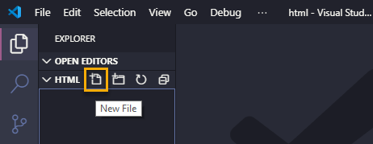
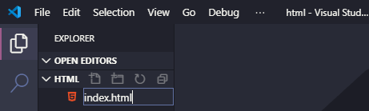

1. Using the file explorer, in the "CodingAndCocktails/session1" folder you created during the tools setup, create a new folder named "html".

1. In VS Code, select **File** :fas fa-long-arrow-alt-right: **Open Folder...** for Windows and **File** :fas fa-long-arrow-alt-right: **Open...** for Mac. Navigate to and select the "CodingAndCocktails/session1/html" folder.

1. Create a file called _index.html_. In VS Code's **EXPLORER** pane, hover over **HTML** to display action buttons. Click the **New File** button.

  

1. In the text box that appears, name the file _index.html_ and press `Enter` to save it in your "CodingAndCocktails/session1/html" folder.

   