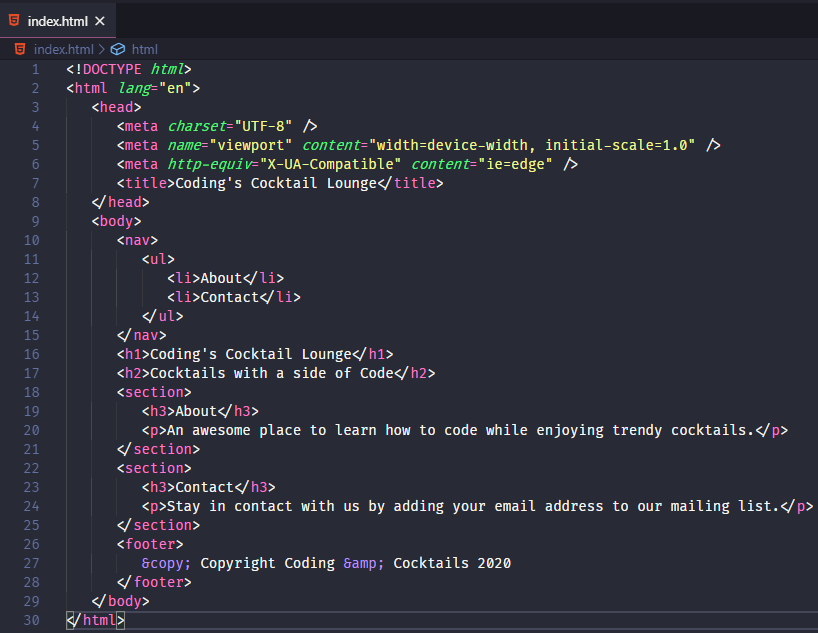

# HTML Body 
The body section of your HTML contains the visible part of your webpage. Let's start building out some content!

# Add headers 
Let's start adding some visual elements to our web page by adding headers.

<!-- [filename](./1headers.md ':include') -->
<!-- Contents from file. make changes in external files and copy here until bug is fixed -->

1. In VS Code, place your cursor on the blank line between `<body>` and `</body>`.
   >[!INFO]Most HTML elements have an opening and closing tag. The `<body>` tag is the opening tag. The `</body>` tag closes that element.
   
   >[!TIP]The worksheet will specify adding new HTML elements between the opening and closing tags of existing tags. Sometimes it's easier to match up the tags before adding a new element. You got this!

1. Add a header by typing `<h1></h1>`. Write the name of your cocktail lounge between the opening and closing tags.

1. Save your file. The file should reload automatically in Chrome when you have Live Server running. Take a look at your webpage. **We have content!**

   

1. In VS Code, after the closing `</h1>` tag, press `Enter` to start a new line and add an `<h2>` tag for a subtitle.

1. Add the text "Cocktails with a side of Code". The body section should look something like this

   index.html
    ```html
    <body>
        <h1>Coding's Cocktail Lounge</h1>
        <h2>Cocktails with a side of Code</h2>
    </body>
    ```

    >[!INFO]
>There are 6 levels of section headings, `h1` - `h6`. 
>
>If you imagine your HTML as an outline, the highest section level is `h1` and `h6` is the lowest section level. As we move into more details within the webpage, we decrease the header section level. Use the different header levels to categorize content in your web page, not because you want different size text.

1. Exciting! You're rocking now! Show off your webpage to your neighbors. Take a screenshot and upload a picture of your webpage to the **#codingandcocktails** channel in [Slack](http://kcwit.slack.com/)! 
    


# Create "About" and "Contact" sections 
Next, we'll want an "About" section and a "Contact" sections and add text. We'll explore using `section` and `p` elements.

<!-- [filename](./2sections.md ':include') -->
<!-- Contents from file. make changes in external files and copy here until bug is fixed -->

1. After the `<h2></h2>` subtitle, press `Enter` to start a new line. Add a "About" section by typing `<section></section>`.
   >[!INFO]
>There's a lot of different HTML elements. When writing HTML, focus on the content and the meaning of what you are trying to communicate, not the website presentation. Good web development practice recommends doing so and calls this style of coding **Semantic HTML**.
>
>`section` groups standalone content, typically include a header, and helps organize the HTML into logical pieces. Use the element that best describes your content to align with Semantic HTML practices. 
>
>You may have seen or heard of `<div>` as a means to group content. Following best practices, use `<div>` to group elements only for styling purposes, not for content organization. Read more about `<section>` and `<div>` [in the references](./?id=cloud-ide). 

1. Between the opening and closing tags for `<section>`, let's add the "About" header. Since this is the third most important heading on the page, we'll use an `<h3>` tag.
   >[!HINT]
   >Place your cursor between the opening and closing tags for `section`, press `Enter`, and type `<h3>About</h3>`. Your code should look like this
   >```html
   ><section>
   >   <h3>About</h3>
   ></section>
   >```

1. After the "About" header, but still inside the `<section>` element, we should add a description about this fine establishment. Add a paragraph element and type in a description of your choosing. The paragraph element is `<p>`. 
   >[!TIP]Don't forget to close the `<p>` tag.

1. Save your file and preview your page in Chrome.  
   >[!INFO]Feel free to save your work and preview your page as you code tonight. It's fun to see how each element progresses the creation of the webpage.

1. Now we want to add a new section to the page for "Contact". After the closing tag for `<section>`, add a new section element.
   >[!HINT]
   >Place your cursor after `</section>`, press `Enter`, and type `<section></section>`. Your code should look like this
   >```html
   ><section>
   >   <h3>About</h3>
   >   <p>A fun place to drink trendy cocktails while learning web development</p>
   ></section>
   ><section>
   ></section>
   >```

1. The "Contact" section needs a header and a description, just like the "About" section. Let's start with the header. Add the header and use the text "Contact".

1. Then add a description for the "Contact" section using the text 
   "Stay in contact with us by adding your email address to our mailing list."
   >[!HINT]
   >Place your cursor between the opening and closing tags for `<section>`, press `Enter`, and type `<h3>Contact</h3>`. Then add `<p></p>` tag with the text. Your code should look like this
   >```html
   ><section>
   >   <h3>Contact</h3>
   >   <p>Stay in contact with us by adding your email address to our mailing list.</p>
   ></section>
   >```

1. Save your file and view it in Google Chrome. Your page should look similar to this:
   
   


# Navigation list of sections 
Most websites have a navigation element with a list of links also called a "navbar". We'll add the links later, but for now, we can create the navbar structure. We have two page sections - About and Contact - so we'll need two navigation list items.

Using list elements is also helpful for accessibility since screenreaders utilize the metadata it provides.

<!-- [filename](./3lists.md ':include') -->
<!-- Contents from file. make changes in external files and copy here until bug is fixed -->

1. We want to add the navigation bar at the very top of the web page. Place your cursor after the opening tag for `<body>` and press `Enter`. You are now adding HTML before the `<h1>` tag.

1. Navigation sections have their own HTML element called `nav`. Add a `nav` element (don't forget the closing tag). Your code will look something like this.

   index.html
    ```html
    <body>
        <nav>
        </nav>
        <h1>Coding's Cocktail Lounge</h1>
        Remaining code for subtitle and sections...
    </body>
    ```

1. Inside the `nav` element, we want to add a list of sections we created, "About" and "Contact". To create an unordered list, add a `ul` element. 

   >[!INFO]
There are 2 types of lists-- **u**nordered (bulleted) **l**ists and **o**rdered (numbered) **l**ists. Website navigation is often an unordered list.

1. Each item in the unordered list has its own tag, `li`. Inside the `ul` element, add two `li` elements with the text "About" and "Contact".
   >[!HINT]
   >Place your cursor after `<ul>`, press `Enter`, and type `<li>About</li>`. Add a new `<li>` for "Contact". Your code should look like this
   >```html
   ><body>
   >   <nav>
   >      <ul>
   >         <li>About</li>
   >         <li>Contact</li>
   >      </ul>
   >   </nav>
   >   <h1>Coding's Cocktail Lounge</h1>
   >   Remaining code for subtitle and sections...
   ></body>
   >```


# Add a footer 
We want recognize our work and add a footer with copyright information.

<!-- [filename](./4footer.md ':include') -->
<!-- Contents from file. make changes in external files and copy here until bug is fixed -->

1. After the "Contact" section, at the very end of the page but still in the `body`, we want to add a footer. The HTML element for footer is `footer`. Place your cursor after the closing `section` tag for "Contact", press `Enter`, and add the `footer` element.

1. Footers often contain copyright information so try using an [HTML entity](https://developer.mozilla.org/en-US/docs/Glossary/Entity) to add a copyright symbol. Between the opening and closing `<footer></footer>` tags add the text 

   `&copy; Copyright Your Name 2020`.


# Inspect HTML in Chrome 
You'll often find yourself needing to look at how your page renders in the browser to troubleshoot issues so let's give that a try.

<!-- [filename](./5chrome-dev-tools.md ':include') -->
<!-- Contents from file. make changes in external files and copy here until bug is fixed -->

1. In Chrome, right-click on your `<h2>` element and select **Inspect**. This will open up your Chrome Developer Tools (DevTools) to the **Elements** tab and highlight the element in the HTML.
   >[!TIP]
>Chrome DevTools has a lot of features. We used it earlier tonight to look for console logs and now to inspect elements. We'll continue to use DevTools in upcoming sessions to help us dig deeper into our code.

2. Notice you can see all your tags that you've added to the page and how they nest inside each other. It should look something like this:

   

3. Notice as you mouse over elements in the DevTools that they highlight in the rendered view above.

   

4. You can also click the arrows to the left of your `<section>` elements to expand them and see the elements inside them.

In addition to viewing elements, you can make and preview changes here before making them in your code.
1. In the **Elements** section of the DevTools, double click on the text inside your `<h2>` tag. This should make it editable. Change it to "Hello World" and then press `Enter`

   

1. Your `<h2>` text should now display "Hello World" on your rendered page.

    

   >[!WARNING]
This only lasts until you refresh the page! If you want to make a lasting change you need to make the change to the code in your IDE. 

1. Refresh your page to see your text return to what you have in your code. You can either keep your DevTools open or close them with the small x in the upper right corner of the DevTools.

   >[!INFO]
Element inspection comes in handy when you're trying to style your page too so we'll use this a lot next month when we learn about CSS!


### You're doing great! 
Take a moment to celebrate what you've learned tonight!


# Checkpoint
Compare your _index.html_ against the answer key for your work so far. It might look a little different depending on your spacing and text.  

>[!CODECHECK]
>
>      
>You can also compare your _index.html_ file with our [answer key](https://github.com/KansasCityWomeninTechnology/AnswerKeys/blob/checkpoint-html-elements/html/index.html) if the image is too difficult to read.


## References and helpful links :id=references
If you want to read up on heading or HTML elements, check out the documentation from Mozilla Developer Network:

[MDN Documentation on heading elements](https://developer.mozilla.org/en-US/docs/Web/HTML/Element/Heading_Elements)

[MDN Documentation on section elements](https://developer.mozilla.org/en-US/docs/Web/HTML/Element/section)

[MDN Documentation on div elements](https://developer.mozilla.org/en-US/docs/Web/HTML/Element/div)

[MDN Documentation on HTML elements](https://developer.mozilla.org/en-US/docs/Web/HTML/Element)

