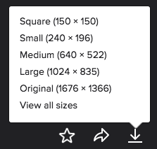

1. In Google Chrome, navigate to [flickr.com](http://flickr.com).

2. Search for a cocktail image.

3. Change the license filter from "Any License" to "Commercial use allowed".

4. Choose your favorite image, click on it and click on the download icon in the lower right corner. You get to choose what size you'd like on your page. You'll want to save it into your "CodingAndCocktails/session1/html" folder.  Name it something easy to remember.

    

    >[!EXTRACREDIT]
    >Apply the concepts you learned about front-end architecture tonight! 
    >
    >Create folders and move the cocktail image to use the same directory structure we used to group images together in the front-end architecture portion of the worksheet. 
