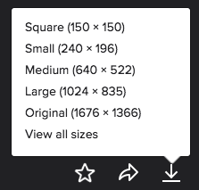
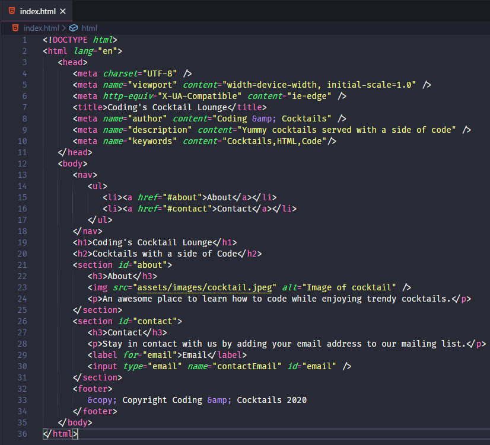

# HTML Element Attributes

Our web page is coming together. But web pages have images, input, and links. All these HTML elements use **attributes** for extra metadata it needs to work. 

There's also special tags we can add to make our webpage more searchable by search engines like Google. This practice is called **S**earch **E**ngine **O**ptimization. These tags rely on attributes.

We'll add an image, text input field, links, and to practice using attributes.

# Find and download a fun and exciting image
Websites have eye catching images. Let's find one we like and get it ready to add to our site!

<!-- [filename](./1download-image.md ':include') -->
<!-- Contents from file. make changes in external files and copy here until bug is fixed -->


1. In Google Chrome, navigate to [flickr.com](http://flickr.com).

2. Search for a cocktail image.

3. Change the license filter from "Any License" to "Commercial use allowed".

4. Choose your favorite image, click on it and click on the download icon in the lower right corner. You get to choose what size you'd like on your page. You'll want to save it into your "CodingAndCocktails/session1/html" folder.  Name it something easy to remember.

    

    >[!EXTRACREDIT]
    >Apply the concepts you learned about front-end architecture tonight! 
    >
    >Create folders and move the cocktail image to use the same directory structure we used to group images together in the front-end architecture portion of the worksheet. 


## Add an image
Now it's time to add the image to our website. We get to use our first attributes to provide the info the browser needs to display the image.

<!-- [filename](./2image.md ':include') -->
<!-- Contents from file. make changes in external files and copy here until bug is fixed -->

1. Images elements don't require closing tags. In VS Code, find the "About" section. Add an `` tag below the "**About**" header on your page to add an image.
   >[!INFO]
   >We created a **self-closing** tag. Self-closing tags have the `/>` written into the tag. HTML elements that don't require content or derive their information from attributes are self-closing.


1. We need to add metadata to the `` tag so that the browser knows what image to display. The first one we'll add is the image source, `src`. The `src` attribute tells your code where to look for your image. Place your cursor inside the`` tag after the `g` and press `Space`. Type `src="FILENAME"`. Your image tag will look like this

   index.html
   ```html

   ```

   >[!EXTRACREDIT]
   >We now have an image element with an invalid source location. Try saving the _index.html_ and viewing it in Chrome. We see the dreaded broken image icon! What happens if you open Chrome DevTools?

1. Now we need to replace the "FILENAME" with the real filename of the image including the file extension.

   >[!INFO]
   >We're setting the value of the attribute `src` to the filename. You'll see instructions directing you to set the value of an attribute throughout this section. Use the same format `attribute="value"`. 

   >[!TIP]
   >If you created a directory structure to hold the image following what we learned in front-end architecture section, make sure to include the path just like you did earlier in the worksheet.

1. You can have more than 1 attribute on a HTML element. Image tags have another attribute for alternate content, `alt`. Inside the `img` tag after the `src` attribute, type `alt="Image of cocktail"`. You can replace "Image of cocktail" to text better describing your image. Your image tag will look like this

   index.html
   ```html

   ```

   >[!INFO]
   >The `alt` attribute content displays if the browser can't show (aka **render**) your image. Screen readers use the `alt` for better accessibility to help visually impaired users of the site.
   

1. Save your file and preview it in Chrome. Do you see your image? 

   >[!TIP]
   >Not seeing your image? Try opening up Chrome DevTools to see if there's an error. Does your filename of the image match up to what's in the `src` attribute?


## Set up an text input element
Some websites have the ability to subscribe to a mailing list. We won't set up the HTML form elements necessary to make it work, but we can practice learning about HTML elements and attributes by setting up a text input element.

<!-- [filename](./3input.md ':include') -->
<!-- Contents from file. make changes in external files and copy here until bug is fixed -->

1. In VS Code, find the "Contact" section in your _index.html_ and add a new line after the paragraph element.

1. We want to display a label so people know to put their email address in the input. Labels have their own HTML element, `<label>`. Add a `<label>` tag. Between the opening and closing `<label>` tag, add text for the label, such as "Email".

  >[!INFO]
   >Using a `label` for HTML input is best practice for assistive technologies. Labels help describe the input control to provide correct semantics and also helps apply focus on the input control automatically.

1. Now we use an attribute to help tie HTML elements together. The `for` attribute specifies the id of the control to tie it to (which we will create soon). Inside the opening `<label>` tag, add a`for` attribute and set the value to "email", like you did for the image `src` attribute and the filename of the image. 

   >[!HINT] 
   >Inside the opening `<label>` tag, type `for="email"`. Your code should look like this
   >```html
   ><label for="email">Email</label>
   >```

1. Save your file and preview it in Chrome. Do you see your "Email" label right above the footer?

1. Let's add the email input! In VS Code, add a new line after the `<label></label>` element.

1. Inputs have their own HTML element called `<input>` and are **self-closing**. All the information the input needs are in attributes. Type `<input />`. 

1. We need to provide the input `type`, `name`, and `id` as attributes. We'll add them in order. Inside the `<input />` tag, add the first attribute `type` and set the value to "email".
   >[!INFO]
   >Isn't it cool when you use a website from your phone and the keyboard changes to the number input when typing in a phone number? Using the correct `type` on your input elements helps the browser figure out how to best help you.

1. Now add the `name` attribute with the value "contactEmail". This is for identifing the control within a form. We aren't using a form today, but we'll add it for correctness. 

1. Lastly, add the `id` attribute with the value "email". The `id` of the control must match the label's `for` attribute. This is what ties the label and the input together. 

   >[!HINT]
   >All these attribute instructions can be confusing. Double check your input element. Your code should look like this
   >```html
   ><label for="email">Email</label>
   ><input type="email" name="contactEmail" id="email" />
   >```

1. Save your file and preview it in Chrome.


## Use `anchor` elements for navigation 
A navbar isn't helpful if it doesn't navigate to the different sections of the webpage. In this section we'll add `anchor` elements to the list of sections in the navbar and make it link their respective section in the webpage. The linked section also needs an attribute for hyperlinks to work.

<!-- [filename](./4link.md ':include') -->
<!-- Contents from file. make changes in external files and copy here until bug is fixed -->

1. Links use the anchor element, `<a>`. We'll wrap the list items "About" and "Contact" in the navbar to link to their respective sections. In VS Code, place your cursor after the opening `<li>` tag and before the text **"About"** and type `<a>` to create a the anchor tag. Add the closing `</a>` after the text. The **"About"** text should now look like this:

    index.html
    ```html
    <li><a>About</a></li>
    ```

1. Clicking "About" link should move to the **"About"** section of the page. We need to specify the hyperlink reference source for the anchor (where the link takes you when you click on it). This is an attribute `href`. Inside the opening `<a>` tag, add the attribute `href` with the value "#about".

   >[!INFO]
   >The '#' in front of the "about" is a special symbol that denotes the id of an element. It specifies that the link is within this web page and not to another webpage on the internet. We'll use element ids again when we write JavaScript later in the curriculum.

   >[!EXTRACREDIT]
   >Here is another example of using an attribute to tie HTML elements together, just like we did for input. Now that we have a value for the attribute `href`, can you guess what we need to do to link the `<a>` element to the corresponding HTML element?
   >
   >Feel free to talk it through with your mentor before moving on to the next step of the worksheet.

1. Find the `<section>` element for "About" in your _index.html_. This is where we add the link for the anchor. Just like we did for input, we'll use an `id` attribute. Inside the opening `<section>` tag, add the attribute `id` with the value "about".

1. Save your file and preview in Chrome. The "About" text in the navbar at the top of the page now has an underline. You can test your link now.
   >[!TIP]
   >Since we don't have a lot of content on our page it may not appear to work at first. If you shrink the size of your browser window down so it is about half as tall, try clicking on the "About" navigation item again and the "about" section should show at the top!

1. Now let's do "Contact". In VS Code, repeat the same steps we took for the "About" section but apply it to "Contact". Don't forget you have to add the anchor and update the id for the section.

   >[!HINT]
   >Wrap the "Contact" text in the list with `<a>` tag and add the `href` attribute. Set the value to "#contact". Add the closing `</a>` tag. Find the `<section>` for "Contact" and add the attribute `id`</code>`. Set the value to "contact". Your code should look like this
   >```html
   ><li><a href="#contact">Contact</a></li>
   >... skipping code here
   ><section id="contact">
   >   <h3>Contact</h3>
   >...remaining code for webpage here
   >```

1. Save your file and preview in Chrome.


## Add tags to improve SEO 
Your website is almost done! Now we want to apply concepts we learned about **S**earch **E**ngine **O**ptimization (SEO) to make your web page easier for search engines like Google to index.

<!-- [filename](./5metatags.md ':include') -->
<!-- Contents from file. make changes in external files and copy here until bug is fixed -->

1. Inside the `<head>` section of your file, add a `<meta>` tag. The `meta` tag is self-closing and has 2 attributes, `name` and `content`.

1. Inside the `meta` tag, add a`name` attribute. Set the value of `name` to "author". 

1. Add the `content` attribute. Set the value of `content` to your name. You are the author of this website!

1. Repeat the steps above for description `meta` tag. Create a `meta` tag with a `name` attribute using "description" as the value.

1. Fill in the `content` attribute for "description" to describe your cocktail lounge. This is the text that Google and other search engines used for website summaries in search results.

1. Create another `meta` tag for keywords and fill in the `content` attribute for "keywords" using a comma separated list of words for search engines to use, such as "Cocktails,Code".

   >[!HINT]
   >Your code should look like this
   >```html
   ><!DOCTYPE html>
   ><html lang="en">
   >   <head>
   >      ... other head tags here
   >      <meta name="author" content="Coding &amp; Cocktails">
   >      <meta name="description" content="Yummy cocktails served with a side of code">
   >      <meta name="keywords" content="Cocktails,HTML,Code">
   >    </head>
   >   <body>
   >   </body>
   ></html>
   >```

1. Save your file. You won't see any visible changes, but under the covers, your website is now more searchable.


You did it! You created a website!


# Checkpoint
Compare your _index.html_ against the answer key for your work so far. It might look a little different depending on your spacing and text.  

>[!CODECHECK]
> 
>      
> You can also compare your _index.html_ file with our [answer key](https://github.com/KansasCityWomeninTechnology/AnswerKeys/blob/checkpoint-html-attributes/html/index.html) if the image is too difficult to read.

## References and helpful links

[Mozilla Developer Network Input element documentation](https://developer.mozilla.org/en-US/docs/Web/HTML/Element/input)

[Mozilla Developer Network anchor element documentation](https://developer.mozilla.org/en-US/docs/Web/HTML/Element/a)

If you want to read up on Search Engine Optimization (SEO), check out Google's

[SEO Starter Guide](https://static.googleusercontent.com/media/www.google.com/en//webmasters/docs/search-engine-optimization-starter-guide.pdf)
