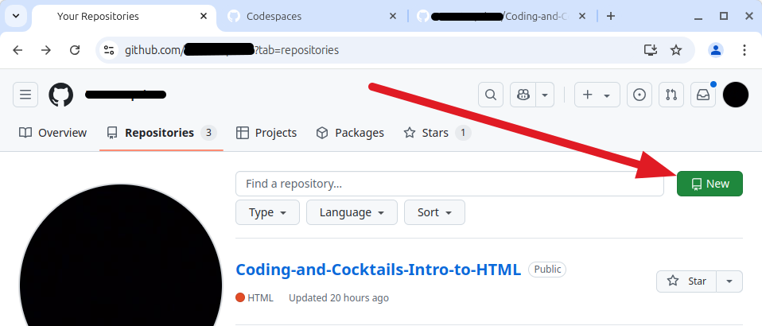
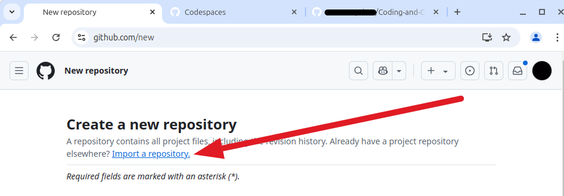
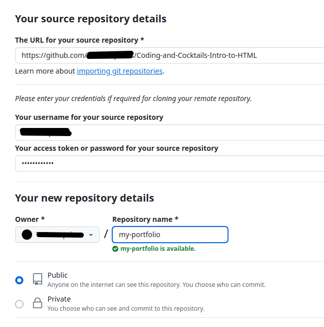

    
    <h2 style="display:inline-block;margin-top:1em;">Coding &amp; Cocktails: The Glass</h2>
    <h3 style="margin-top:0;margin-bottom:2em;">HTML Side Quest</h3>

### Overview

Now that you've got a page for our cocktail lounge, let's take it a step further.

Go to your GitHub page (github.com/<yourprofilename>). Click on the profile picture in the upper right-hand corner of the page and select "Your repositories."

Now right click on the green "New" button in the upper right-hand corner and open it in a new tab.

Next, select the link that says "Import a repository."

Go back to the tab that has your repositories listed and right click on the "Coding-and-Cocktails-Intro-to-HTML" link, and copy the link address.

Return to the tab that has the import tool on it and paste the URL you just copied into the box for the source repository URL. Enter your GitHub user name and password in the boxes provided.

Type something in the "Repository name" box, as well.

Make sure your repository is public, or no one will be able to see it!

Click "Begin import." It will take a minute or two for the repository to finish being imported.

Now go to your Codespaces page on GitHub and select the green "New codespace" button in the upper right-hand corner.

On the next page, select "Select a repository," then select the new repo you just created, then click the green "Create codespace" button.

The first thing that you will see is the readme file for the repository. Delete the text that appears there and write something new. Generally, the readme is to tell people what the repo is for.

Next, double-click on index.html. Change things in this file however you like to create the front page of your portfolio website. Remove everything in here that refers to the Coding and Cocktails tutorial, since you will likely want to show off your interests and learning.

You can keep the nav section, but since you're going to be showing your web development skills, you'll want to add separate "About" and "Contact" pages.

One really good skill to build is learning how to search for information on how to do things. In the tutorial we just completed, you were given some resources. One of these is the Mozilla Development Network. This organization has documentation about [HTML](https://developer.mozilla.org/en-US/docs/Web/HTML) that you will find useful.

You can search this resource to find out how to link to different pages in your website (relative URLs). Handy hint:  There's a link to this particular entry in the tutorial.

Remember, too, that there are other resources available in the [slides](https://kansascitywomenintechnology.github.io/CodingCocktailsSlideTemplate/01-glasswork/2023-front-end-html.html#/) from the Intro to HTML session!

To add a new page to your site, click on the "New File" icon and type the name of the page for the file name. Don't forget to add .html to the end of the file! For example, for an "About" page,  you'll want to name the file "about.html".

Add an "About" page and a "Contact" page, at the very least, and if you want, add another page or two.

Don't forget to commit your changes to your repo!

Once you've got your site set up the way you like it, post the link to your repo in the  **#codingandcocktails** channel on [Slack](http://kcwit.slack.com/) to let us see what you can do.