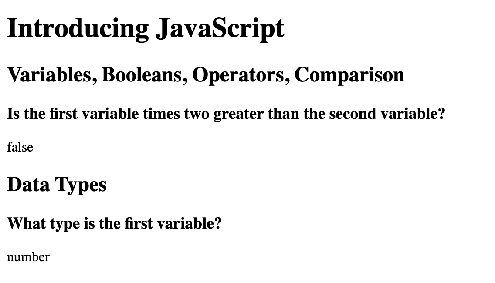

# Introduction to JavaScript (ECMAScript 6)

JavaScript is one of many programming languages used for application development. It is the programming language of the web and is the basis of everything we see on the internet.  Or, if you're creating a cocktail, JavaScript is the liquor -- the base and foundation of the drink.

In this session, we will explore the building blocks for programming -- variables, math operators, and data types -- using JavaScript.

We'll build our knowledge of JavaScript by becoming familiar with some of the features in the newest version of JavaScript, ES6, including new variable declarations (const and let), arrow functions, new array methods, and many others.

> [!WARNING]
> Before starting the worksheet, please take a moment to review the [Setup instructions](../setup/?id=setup) to ensure you have all the tools and workspace setup you need for today's work.

# Declare variables and assign values

You'll start practicing some JavaScript basics covered in the presentation and play a variation of [Mad Libs](https://en.wikipedia.org/wiki/Mad_Libs). You will replace temporary code snippets with nouns or verbs of your choosing as instructed. The code to replace will look like this: **&lt;noun_1>**. You'll replace everything, including the angle brackets, so **&lt;noun_1>** becomes **drink**.

## Prepare the HTML file

1. Replace code in _index.html_ with the code below.

   index.html

   ```html
   <!DOCTYPE html>
   <html lang="en">
     <head>
       <title>Intro to JS</title>
     </head>

     <body>
       <h1>Introducing JavaScript</h1>

       <h2>Variables, Booleans, Operators, Comparison</h2>
       <h3>
         Is the first variable times two greater than the second variable?
       </h3>
       <div id="math"></div>

       <h2>Data Types</h2>
       <h3>What type is the first variable?</h3>
       <div id="type"></div>
       <script src="script.js" type="text/JavaScript"></script>
     </body>
   </html>
   ```

> [!TIP]Don't forget to save the files. If you have a white circle next to file name, it means you have changes that haven't saved yet. You can either click **Save** button on the top left or use shortcut `cmd` + `s` for Mac or `ctrl` + `s` for Windows.
>
> 

> [!TIP]
> Need a refresher on HTML? Check out the [HTML session worksheet](../../html/).

## Prepare the script.js file

1. Replace code in _script.js_ with the code below.

script.js

    // Define two numeric variables
    const <noun_1> = 5;
    const <noun_2> = 25;

    // Set a new variable to determine if twice the first numeric variable is greater than the second numeric variable from above.
    const <noun_3> = <noun_1> * 2 > <noun_2>;

    // Output the comparison.
    document.getElementById("math").innerHTML = <noun_3>;

    // Practice types and equality
    document.getElementById("type").innerHTML = typeof(<noun_1>);

> [!WARNING]
> Don’t worry about the error message! We’ll fix that in a minute

## Look for the MadLibs items to replace

Remember these are the noun or verb text surrounded by angle brackets: **&lt;noun_2>**. You can use choose any noun or verb you like for the variable name.

> [!TIP]
> Feel free to ask mentors for help! We are here to help you!

> [!TIP]
> A noun is a person, place or thing such as "pen" or "drink."
>
> A verb is a word used to describe an action such as "make" or "become."

> [!TIP]
> If you highlight, then right-click on "<noun_1>" or any other text surrounded by angle brackets (be sure to include the angle brackets!), you will get a menu that will allow you to "Change All Occurrences." This is a good way to make sure you don't miss an occurrence of the thing you want to change.

> [!WARNING]
> Make sure to replace all instances of a variable with the same noun!
>
> Make sure to remove the angle brackets <> around the text so your code will work!

Check what you have!



# Checkpoint

Compare your _script.js_ against the answer key for your work. It might look a little different depending on the variable names you chose.

> [!CODECHECK]
>
> ```js
> const numOne = 5;
> const numTwo = 25;
>
> const numThree = numOne * 2 > numTwo;
>
> document.getElementById("math").innerHTML = numThree;
>
> document.getElementById("type").innerHTML = typeof numOne;
> ```

# Explore type comparisons and equality operators

Logical operations are the basis of computer programming. Explore types, arithmetic operations, and equality comparison.

1.  Try some other data types and comparisons! Change the first variable's value to the string "5" by adding quotation marks around the 5. Change second variable's value to the number 5 without quotation marks.

> [!HINT]
> The value of a variable is to the right of the '=' sign.

> [!HINT]
> What is the output of "What type is the first variable" when you add quotation marks around the 5? What if you change the variable in `typeof()` on line 12 to use the variable **&lt;noun_3>** from line 6?

2.  Remove the `* 2` from line 6 then change the `>` to `==`. Make note of the comparison value in the output.

3.  After reviewing the comparison with `==`, change it to `===`. How is the output different from the `==` comparison in the previous step?

> [!INFO]
> `==` compares the value and does not care about the data type so a string "5" is the same as the number 5.
>
> `===` compares both the value and the data type so a string "5" is not the same as the number 5.

4. Try out other variable values, different mathematic operators, or different comparison operators and see what happens.

| Mathematic operator | Operation      |
| ------------------- | -------------- |
| +                   | Addition       |
| -                   | Subtraction    |
| \*                  | Multiplication |
| /                   | Division       |
| %                   | Modulus        |

| Comparison operator | Operation                |
| ------------------- | ------------------------ |
| >                   | Greater than             |
| >=                  | Greater than or equal to |
| <                   | Less than                |
| <=                  | Less than or equal to    |
| ==                  | Equality                 |
| ===                 | Strict equality          |
| !=                  | Inequality               |
| !==                 | Strict inequality        |

# References and helpful links

[JavaScript data types](https://developer.mozilla.org/en-US/docs/Web/JavaScript/Data_structures)

[JavaScript operators](https://developer.mozilla.org/en-US/docs/Web/JavaScript/Reference/Operators/Arithmetic_Operators)
