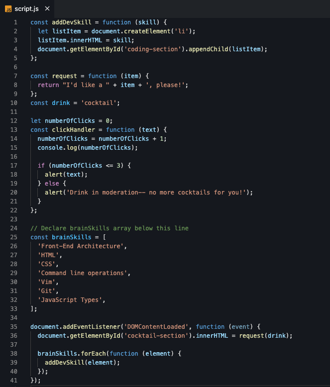

# Arrays and loops

In this section, we will create and populate an array and iterate through the array to add list items to the web page.

## Declaring and defining arrays

First we'll declare an array so we can use the array data in the application. We'll also use the array length property to determine how many items are in the array.

1. Declare a const variable called `brainSkills` below the `// Declare brainSkills array below this line` and set the value to an empty array (`[]`).

   > [!HINT]
   > Type `const brainSkills = [];`

2. Place your cursor between the opening and closing square brackets and press `Enter`. Type `"JavaScript Types"`.

   > [!TIP]
   > Don't forget the quotes to make the value a string.

   > [!INFO]
   > You added an element to the array. Your array now has a length of 1.

3. Inside the `document.addEventListener` method, add a `console.log` to log out the array. What do you see in DevTools when you reload the webpage?

   > [!HINT]
   > Type `console.log(brainSkills);`

4. Arrays have built in properties. One property of an array is the length. Let's change our `console.log` above to log out the length of the array by using `brainSkills.length`. What do you see in DevTools when you reload the webpage?

5. Add more skills you learned at Coding & Cocktails or about coding tonight to the array by comma separating values. Your `brainSkills` array might look something like this:

   script.js
   ```js
   const brainSkills = [
     "Front-End Architecture",
     "HTML",
     "CSS",
     "Command line operations",
     "Vim",
     "Git",
     "JavaScript Types",
   ];
   ```

What is your array length now?

## Working with arrays

To use the array data, we need to access the array elements. We can do this by index (AKA array position) or by iterating over each item in the array.

1. Iterate through the array using a `for` loop. Inside the `document.addEventListener` method, iterate through `brainSkills` array and add a console log for `index`:

   script.js
   ```js
   for (let index = 0; index < brainSkills.length; index++) {
     console.log('index', index);
   }
   ```

   > [!INFO]
   > You are logging out the array index. The index is the value corresponding to the element's position in the array.

2. We can access an array element by the index using the syntax `name-of-array[index]`. Inside the `for` loop, change the `console.log` to access each array element:

   script.js
   ```js
   console.log('index', index + " " + 'brainSkills index', brainSkills[index]);
   ```

3. In Chrome, take a look in the DevTools console to see the output.

   > [!TIP]
   > Notice the first element is index 0 and the last index is array.length - 1. This affects conditional logic and is often the cause of errors. Developers call these errors "off by one error".

4. Let's call the provided `addDevSkill` function for each element of the array. Remove the `console.log` and replace with a call to `addDevSkill` and pass in the array element:

   script.js
   ```js
   addDevSkill(brainSkills[index]);
   ```

5. We now see the content of our array in the web page!

   > [!INFO]
   > The `addDevSkill` function takes a string and adds it to the web page as a list item. Feel free to inspect using `debugger` to see the parameter for each function call.

6. Let's refactor our `for` loop to use a shorthand syntax, `forEach`. Comment out the `for` loop by adding `//` before each line of code to look like this:

   script.js
   ```js
   // for (let index = 0; index < brainSkills.length; index++) {
   //       addDevSkill(brainSkills[index]);
   // }
   ```

   > [!TIP]
   > You can also highlight all 3 lines of the `for` loop and use keyboard shortcut `ctrl` + `/` on Windows and `cmd` + `/` on Macs to toggle between adding and removing comments.

   Below the existing `for` loop, add `brainSkills.forEach();`. We will get an error in the console.

7. The `forEach` method requires a parameter of type `function` that gets called on each array element. We need to pass in a function with an element parameter. Place your cursor between the open and close parenthesis of the `forEach` and add `function(element) {}` to look like this:

   script.js
   ```js
   brainSkills.forEach(function (element) {});
   ```

   > [!INFO]
   > In JavaScript, you can declare **functions** and **function expressions**. Function declarations use the syntax `function myFunction(){}` while function expressions use the syntax `const myFunction = function(){};`. In a function expression, you are assigning the function to a variable. This makes it easier to pass functions as parameters. We have been using **function expressions**.
   >
   > Additionally, JavaScript functions can be named or anonymous. The function declaration inside the `forEach` is an example of an anonymous function.
   >
   > Check out the references in this section to read more about functions.

8. Place your cursor between the opening and closing curly brace and press `Enter`. Type `console.log(element);` to log the element parameter to the console.

9. We're back in business! Remove the `console.log(element);` and replace it with the call to `addDevSkill`.

   > [!HINT]
   > Use `addDevSkill(element);` to call the function with the array element to display on the web page.

10. Delete the commented out `for` loop and the log for the array length above it.

11. Don't forget to commit your work!

### Good job! Take a moment to think about all the things you learned tonight and pat yourself on the back!


## Checkpoint

Compare your _script.js_ against the answer key for your work so far. It might look a little different depending on spacing.

> [!CODECHECK]
> 
>
> Hard to read? Compare your _script.js_ file with our [answer key](https://github.com/KansasCityWomeninTechnology/javascript-101/blob/answerkey-arrays/scripts.js).

## References and helpful links

[MDN Reference: Array](https://developer.mozilla.org/en-US/docs/Web/JavaScript/Reference/Global_Objects/Array)

[MDN Reference: Function](https://developer.mozilla.org/en-US/docs/Glossary/Function)
