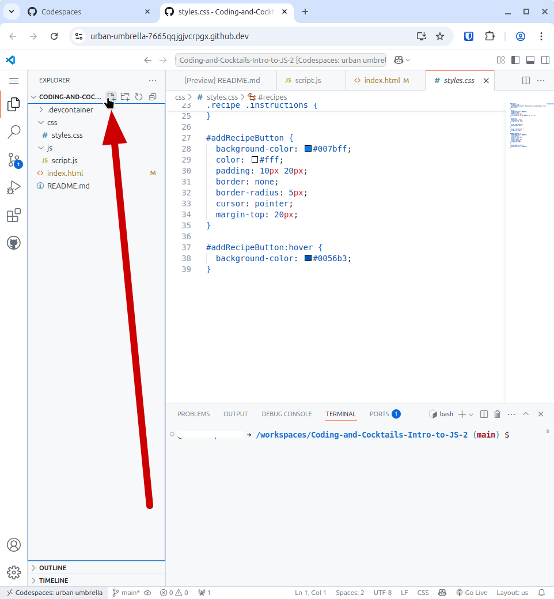

# Writing more advanced JavaScript

Now we will create a project with interactive elements. In the rest of the worksheet we will add functionality to make the project more dynamic. When complete, you will have a web page that looks like this:


## Referencing modules, declaring arrays and using operators

In this section, we will practice declaring variables, importing modules and using the Rest and Spread operators.

## Prepare your workspace

1. Click on the following link to [the starter code repo](https://github.com/KansasCityWomeninTechnology/Coding-and-Cocktails-Intro-to-JS-2) for the rest of the session. Click the "Use this template" button in the upper right-hand corner of the screen, as before.

2. Next, select the "Open in a codespace" option.

3. Compare the code in your  _index.html_ file with the code below.

   index.html

   ```html
<!DOCTYPE html>
<html lang="en">
  <head>
    <meta charset="UTF-8" />
    <meta name="viewport" content="width=device-width, initial-scale=1.0" />
    <title>Drink Recipes</title>
    <link rel="stylesheet" href="styles.css" />
  </head>
  <body>
    <div id="recipes"></div>
    <button id="addRecipeButton">Add New Recipe</button>

    <script type="module" src="./js/script.js"></script>
  </body>
</html>
  ```

4. Compare the CSS code in your _styles.css_ file with the following code.

  styles.css
  ```css
  #recipes {
    display: grid;
    grid-template-columns: repeat(auto-fit, minmax(250px, 1fr));
    gap: 20px;
  }

  .recipe {
    background-color: #f9f9f9;
    padding: 20px;
    border-radius: 8px;
    box-shadow: 0 4px 8px rgba(0, 0, 0, 0.1);
  }

  .recipe h3 {
    font-size: 1.5rem;
    margin-bottom: 10px;
  }

  .recipe .ingredients {
    font-weight: bold;
  }

  .recipe .instructions {
    margin-top: 10px;
  }

  #addRecipeButton {
    background-color: #007bff;
    color: #fff;
    padding: 10px 20px;
    border: none;
    border-radius: 5px;
    cursor: pointer;
    margin-top: 20px;
  }

  #addRecipeButton:hover {
    background-color: #0056b3;
  }
  ```

## Adding a new file to your project

5. Create a _utils.js_ file and copy the code below into the new file.  To create a new file, click on the _js_ folder in your explorer, then click on the New File icon, then name the file _utils.js_.


  


  


  utils.js
```js
const apiUrl = 'https://www.thecocktaildb.com/api/json/v1/1';

export async function fetchInitialRecipes() {
    try {
        const response = await fetch(`${apiUrl}/search.php?s=margarita`);
        const data = await response.json();
  
        const drinks = data.drinks.slice(0, 3);
        const recipes = [];
  
        for (let i = 0; i < drinks.length; i++) {
            const drink = drinks[i];
        
            const recipe = {
            name: drink.strDrink,
            ingredients: [
                drink.strIngredient1,
                drink.strIngredient2,
                drink.strIngredient3,
                // Add more if needed
            ],
            instructions: drink.strInstructions,
            }
  
        recipes.push(recipe);
        }
  
      console.log(recipes);
      return recipes;
  
    } catch (error) {
      throw new Error(`Error fetching recipes: ${error.message}`);
    }
}
  

export function addRecipe(recipe) {
  try {
    // Logic to add the recipe to your database/API would go here
    console.log('Adding recipe:', recipe);
    return recipe;
  } catch (error) {
    throw new Error(`Error adding recipes: ${error.message}`);
  }
}
```

## Examine the code in the JS file

6. Examine the code in your _script.js_ file and compare it with the following code.


  script.js
```js
const recipesContainer = document.getElementById('recipes');

const addRecipeButton = document.getElementById('addRecipeButton'); 

function displayRecipes(recipes) {
    recipesContainer.innerHTML = '';
    recipes.forEach(function(recipe) {
        const recipeElement = document.createElement('div');
    recipeElement.innerHTML = `
    <h3></h3>
    <p>Ingredients:</p>
    <p>Instructions:</p>
    `;
    recipesContainer.appendChild(recipeElement);
    });
}

async function handleAddRecipe() {

    const ingredients = prompt('Enter ingredients (comma separated):').split(',');

    try {
        const newRecipe = { name, ingredients, instructions };
        newRecipes.push(newRecipe);
        displayRecipes();
    } catch (error) {
            console.error('Error adding recipe:', error);
    }
}

addRecipeButton.addEventListener('click', handleAddRecipe);

let initialRecipes = []; 
async function init() {
    try {
        initialRecipes = await fetchInitialRecipes();
        displayRecipes(initialRecipes);
    } catch (error) {
        console.error('Error fetching recipes:', error);
    }
}

init();
```

7. At the top of the file add a statement to pull in the  _fetchInitialRecipes_ from the utils.js file.

8. Inside of the displayRecipes method, you'll need to add some code to recipeElement.innerHTML so that the recipe data appears on your page. You'll want to use template literals.

9. Under the line declaring the constant addRecipeButton, declare an array to hold new recipes that will be added.

10. Within the function _handleAddRecipe_ declare a constant variable and create a prompt users will see when they need to name the new drink

11. Within the same function, declare a constant variable and prompt for when users need to add instructions for creating the new drink. 
Note: Reference the _try_ clause in the function to see what variable names are expected.

12. Within the same function, inside the _try_ clause, add code that will display the information you want to see on your page, i.e., the initial recipes and any recipes you add thereafter. Hint:  This will involve spreading an array.

> [!TIP]
> Add comments throughout the page so you can remember what your code does the next time you come back to it.

> [!INFO]
> Add info to help clarify

> [!TIP]
> Don't forget mentors are here to help you. If you have any questions, feel free to ask!

> [!TIP]
> Don't forget to commit your code, periodically.

# Checkpoint

Compare your _script.js_ against the [answer key](https://github.com/KansasCityWomeninTechnology/Coding-and-Cocktails-Intro-to-JS-2-answer-key/blob/main/script-mvo.js). It might look a little different depending on the variable names you chose.

### Celebrate with a cocktail or mocktail! You deserve it, rockstar!


## References and helpful links

[MDN Reference: Expressions and operators](https://developer.mozilla.org/en-US/docs/Web/JavaScript/Reference/Operators)

[MDN Reference: if else](https://developer.mozilla.org/en-US/docs/Web/JavaScript/Reference/Statements/if...else)

[Chrome DevTools JavaScript Debugging Reference](https://developers.google.com/web/tools/chrome-devtools/javascript/reference)


