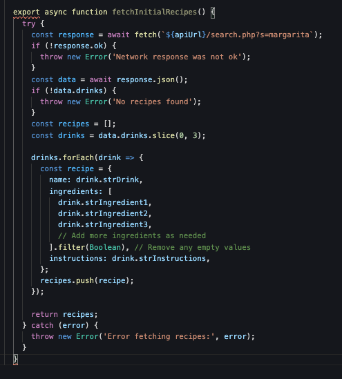
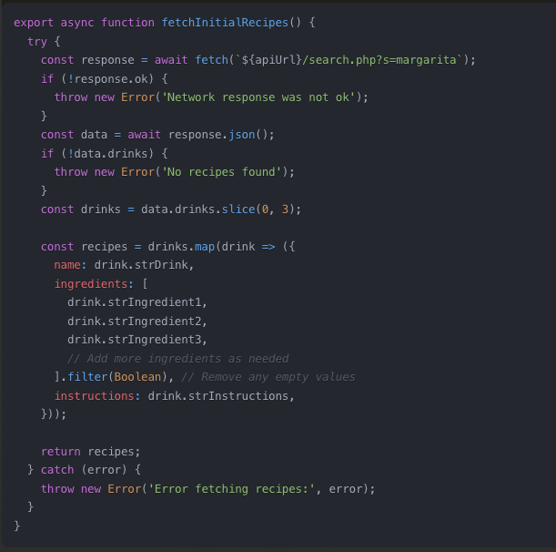

# Data Types and Methods

## In this section, we'll practice working with objects, template literals and array methods

1.  Return to the _utils.js_ file.  In the fetchInitialRecipies() function, rewrite the for loop using forEach();

# Checkpoint

Compare your _script.js_ against the answer key for your work. It might look a little different depending on the variable names you chose.

> [!CODECHECK]
> 

2. If that works, try rewriting it again using map().

# Checkpoint

> [!CODECHECK]
>

> [!TIP]
> Need a refresher on template literals? Remember that they allow us to embed variables
> and expressions within our strings.
> Example 1: `string text ${expression} string text`

3. Return to your _script.js_ file.  In the displayRecipes() function, create template literals in recipeElement.innerHTML for the following:

The name of the recipe

 The ingredients of the recipe <i>hint: you will need to add .join</i>

 The instructions for how to prepare the recipe

 
## References and helpful links

[MDN Reference: Array](https://developer.mozilla.org/en-US/docs/Web/JavaScript/Reference/Global_Objects/Array)

[MDN Reference: Function](https://developer.mozilla.org/en-US/docs/Glossary/Function)

[MDN Reference: Template Literals](https://developer.mozilla.org/en-US/docs/Web/JavaScript/Reference/Template_literals)

