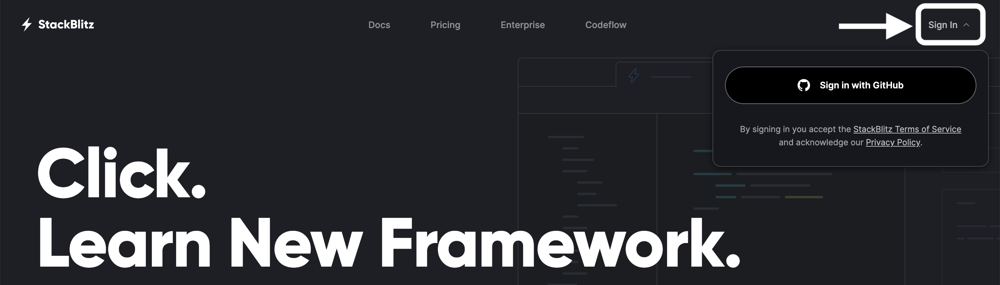
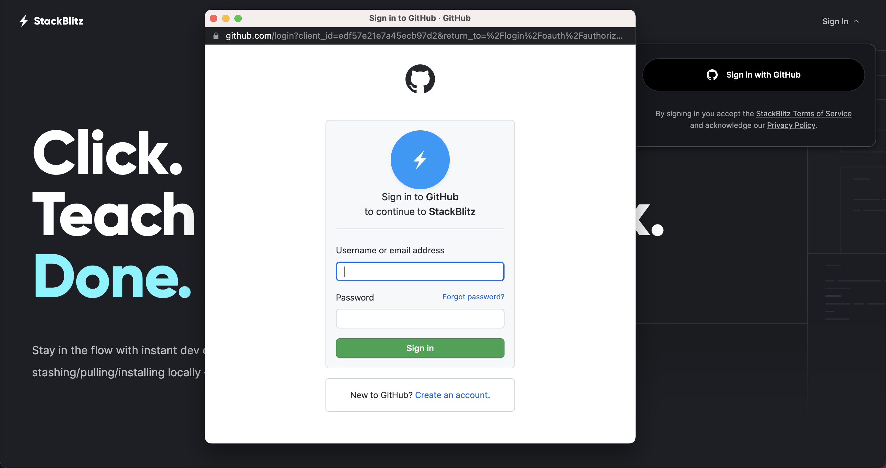
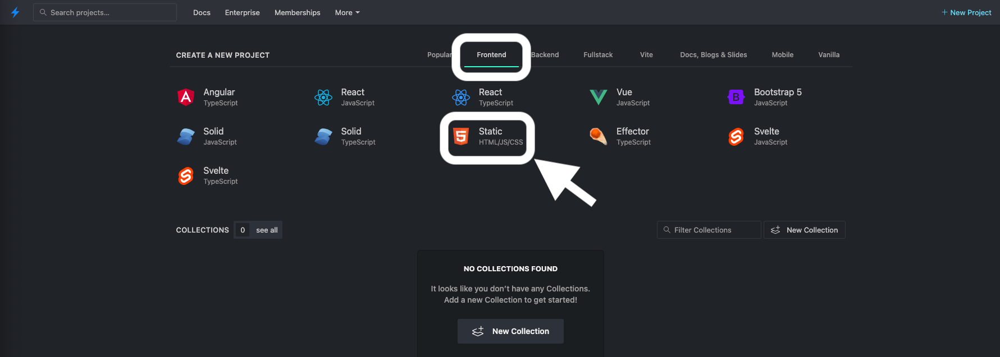
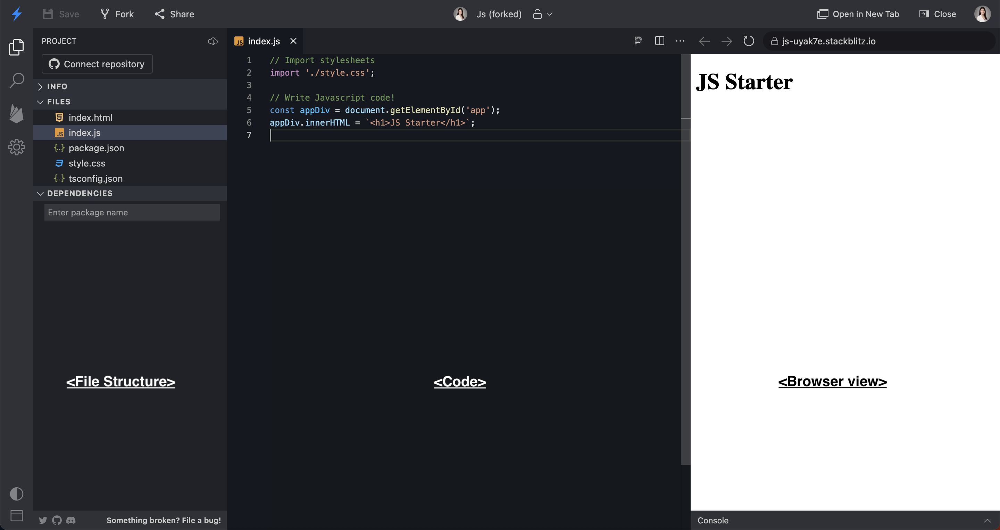
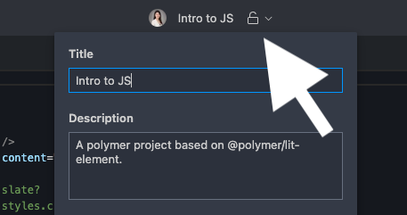
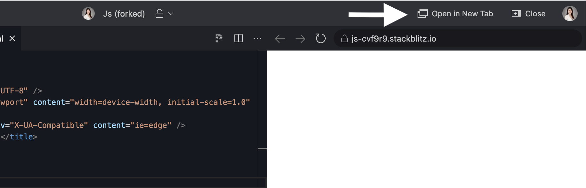

# Setup :id=setup

Tonight we will learn the basics of applying functionality to a website using **J**ava**S**cript(**JS**).

Follow the instructions on this page to prepare your workspace.

> [!TIP]
> Open [Slack](http://kcwit.slack.com/) to the **#codingandcocktails** channel. It's a great way to stay in touch with your Coding & Cocktails friends and to ask questions during and after the session. We'll also post updates and tips in Slack if we run in to any stumbling blocks tonight.

> [!WARNING]
> We will use a cloud development environment called [**StackBlitz**](https://stackblitz.com/). In order to use StackBlitz, you will need a GitHub account.
>
> Navigate to [**GitHub**](https://github.com) to create a personal account or log in. Feel free to ask your mentor for help! When complete and logged in to GitHub, return here to continue the instructions.

# Create a new StackBlitz project :id=create-new-project

We will use StackBlitz for our workshop. StackBlitz is a cloud development environment which means you have access to your code even if you are not on your own laptop.

1. Navigate to [**StackBlitz**](https://stackblitz.com/) and sign in with your GitHub account.

2. Once you're signed in, click **Static** under **Frontend** tab to create a new project for the session.

3. Now you are ready to write some code! The StackBlitz page is split into 3 different sections. Far left is the project's file structure. The middle section is where you will write your code. Far right section is how your code looks like in a browser. Whenever you make a code change, you will see the change in the browser view as well.

> [!TIP]
> If you want to change the project name, you can do so by clicking the **lock icon** on the top center.
> 

> [!TIP]
> View the worksheet and your IDE in split screen.
>
> If you click **Close** button on top right, it will close the browser view and you will have wider code section.
> 
> If you want to open the browser view in a new tab, click **Open in New Tab**
> You can always have code on one half of the screen and browser in the other half.
>
> If you have any questions, feel free to ask. Mentors are happy to help!

> [!TIP]
> Did you know you can collapse the table of contents for worksheets?
>
> Click on the hamburger menu (:fas fa-bars:) at the top of the page to toggle the table of contents.

> [!TIP]
> Did you know you can perform common tasks such as copy and paste?
>
> When working without a mouse, keyboard shortcuts will be faster than a trackpad. Open the [handy dandy keyboard shortcut reference in a new tab](/javascript/references/ ":target=_blank") so you can refer to it easily!
