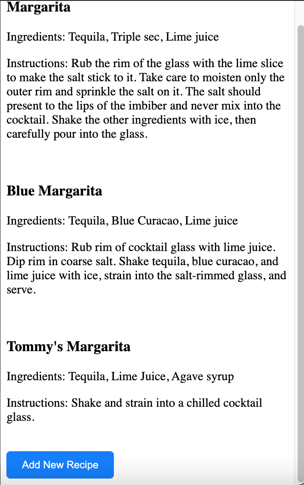
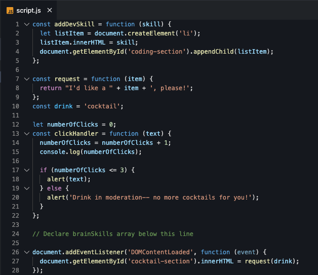

# Writing Javascript ES6

Now we will create a project with interactive elements. In the rest of the worksheet we will add functionality to make the project more dynamic. When complete, you will have a web page that looks like this:



## TODO Anita  - figure out why some code isn't in color

In this section, we will practice declaring variables, importing modules and using the Rest and Spread operators.

## Prepare your workspace

Let's create a new static project and set up our workspace.

> [!TIP]
> If you need a refresher on how to create a new project in StackBlitz, refer to [Create a new StackBlitz project](../setup/?id=create-new-project) section.

1. Remove the code in your  _index.html_ file. Replace it with the following HTML code.

   index.html

   ```html
   <!DOCTYPE html>
<html lang="en">
  <head>
       <!--Change title to Live Userr Filter-->
    <title>My Project</title>
    <meta charset="UTF-8" />
    <meta name="viewport" content="width=device-width" />
    <!--
      Need a visual blank slate?
      Remove all code in `styles.css`!
    -->
    <link rel="stylesheet" href="styles.css" />
    <script type="module" src="script.js"></script>
  </head>
  <body>
      <div class="container">
        <header class="header">
             <!--change h4 to Live User Filter -->
          <h4 class="headline">Search Project</h4>
          <!--change small to Search by name and/or location -->
          <small class="subtitle">Find</small>
          <!--change Placeholder to Search -->
          <input type="text" id="filter" placeholder="Placeholder">
        </header> 

          <li>
            <h3>Loading...</h3>
          </li>
         </ul>
 
        </div>
  </body>
</html>

   ```
#TODO Anita- Figure out why this isn't showing the text color

2. Remove the css code in your _styles.css_ file and replace it with the following code.


   styles.css

   ```css
   @import url("https://fonts.googleapis.com/css?family=Work+Sans");
* {
  box-sizing: border-box;
}

body {
  background-color: #f8f9fd;;
  font-family: 'Roboto', sans-serif;
  display: flex;
  flex-direction: column;
  align-items: center;
  justify-content: center;
  margin-top: 0px;
}

.container {
  border-radius: 5px;
  box-shadow: 3px 3px 10px rgba(0, 0, 0, 0.2);
  width: 300px;
}

.headline {
  margin: 0;
}

.subtitle {
  display: inline-block;
  margin: 5px 0 20px;
  opacity: 0.8;
}

.header {
  background-color: #3e57db;
  color: #ffff;
  padding: 20px 20px;
}

.header input {
  background-color: rgba(0, 0, 0, 0.3);
  border: 0;
  border-radius: 50px;
  color: #fff;
  font-size: 14px;
  padding: 10px 15px;
  width: 100%;
}

.header input:focus {
  outline: none;
}

.user-list {
  background-color: #fff;
  list-style-type: none;
  margin: 0;
  padding: 0;
  max-height: 400px;
  overflow-y: auto;
}
 .user-list li {
   display: flex;
   padding: 10px;
 }

 .user-list img {
   border-radius: 50%;
   object-fit: cover;
   width: 50px;
   height: 50px;
 }

 .user-list .user-info {
   margin-left: 10px;
 }

 .user-list .user-info h4 {
  margin: 0 0 10px;
}

.user-list .user-info p {
  font-size: 12px;
}

.user-list li:not(:last-of-type) {
  border-bottom: 1px solid #eee;
}

.user-list li.hide {
  display: none;
}
   ```


3. Copy and paste the following JavaScript code into your _script.js_ file.

   script.js

   ```js
  
const result = document.getElementById('result'); 
const filter = document.getElementById('filter');
const listItems = [];

getData();

filter.addEventListener('input', (e) => filterData(e.target.value));


async function getData() {
  const res = await fetch('https://randomuser.me/api?results=10');

  // Use this first, then destruct as shown: const data = await res.json()

  const { results } = await res.json();

  // clear results
  result.innerHTML = '';

  //write out as a regular function first? then change to arrow?
  results.forEach((user) => {
    //console.log(user)
    const li = document.createElement('li');

    listItems.push(li);

    //Add addition info to the user info
    li.innerHTML = `
      
      <div class="user-info">
        <h4>${user.name.first} ${user.name.last}</h4>
        <p>${user.location.city}, ${user.location.country}</p>
    `;

    result.appendChild(li);
  });
}

function filterData(searchTerm) {
  listItems.forEach((item) => {
    if (item.innerText.toLowerCase().includes(searchTerm.toLowerCase())) {
      item.classList.remove('hide');
    } else {
      item.classList.add('hide');
    }
  });
}


   ```

## Create a Module


Let's get coding! We'll make our code cleaner by creating a separate module for one of our functions.

1. Create a new file under your Files

2. Name it getData.js

3. Go back to your script. JS file and copy the entire getData() function (lines 12-40)

4. Go to your new getData module (file) and paste the entire function there. 

```
[!INFO] Remember that we need to tell modules to export their information and we need to tell the files that need that information to import it
```

5. At the bottom of the code in the getData module, add this line to export the data:

export { getData };

6. Now we need to tell the file that needs this data to import it. At the top of your script.js file, add this line:

import {getData} from './getData.js';

7. Now, you can comment out the getData function code (You probably don't want to delete it until everything is working!)


   
   ```

> [!TIP]
> Don't forget to save files as you go!

> [!TIP]
> Add comments throughout the page

> [!INFO]
> Add info to help clarify


> [!TIP]
> Don't forget mentors are here to help you. If you have any questions, feel free to ask!


> [!INFO]
>
> `debugger;` is helpful for writing code, but don't use it for production code. Most linters will red flag `debugger` during the build process to help safe-guard your application.

### Celebrate with a cocktail or mocktail! You deserve it, rockstar!


# Checkpoint

Compare your _script.js_ against the answer key for your work. It might look a little different depending on the variable names you chose.

> [!CODECHECK]
> 
>
> Hard to read? Compare your _script.js_ file with our [answer key](https://github.com/KansasCityWomeninTechnology/javascript-101/blob/answerkey-functions/scripts.js).

## References and helpful links

[MDN Reference: Expressions and operators](https://developer.mozilla.org/en-US/docs/Web/JavaScript/Reference/Operators)

[MDN Reference: if else](https://developer.mozilla.org/en-US/docs/Web/JavaScript/Reference/Statements/if...else)

[Chrome DevTools JavaScript Debugging Reference](https://developers.google.com/web/tools/chrome-devtools/javascript/reference)
