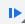

# Writing Javascript ES6

Now we will create a project with interactive elements. In the rest of the worksheet we will add functionality to make the project more dynamic. When complete, you will have a web page that looks like this:


## TODO Anita  - Upadate code:

In this section, we will practice declaring variables, importing modules and using the Rest and Spread operators 

## Prepare your workspace

Let's create a new static project and set up our workspace.

> [!TIP]
> If you need a refresher on how to create a new project in StackBlitz, refer to [Create a new StackBlitz project](../setup/?id=create-new-project) section.

1. Remove the code in your  _index.html_ file. Replace it with the following HTML code.

   index.html

   ```html
   <!DOCTYPE html>
<html lang="en">
  <head>
       <!--Change title to Live Userr Filter-->
    <title>My Project</title>
    <meta charset="UTF-8" />
    <meta name="viewport" content="width=device-width" />
    <!--
      Need a visual blank slate?
      Remove all code in `styles.css`!
    -->
    <link rel="stylesheet" href="styles.css" />
    <script type="module" src="script.js"></script>
  </head>
  <body>
      <div class="container">
        <header class="header">
             <!--change h4 to Live User Filter -->
          <h4 class="headline">Search Project</h4>
          <!--change small to Search by name and/or location -->
          <small class="subtitle">Find</small>
          <!--change Placeholder to Search -->
          <input type="text" id="filter" placeholder="Placeholder">
        </header> 

          <li>
            <h3>Loading...</h3>
          </li>
         </ul>
 
        </div>
  </body>
</html>

   ```
#TODO Anita- Figure out why this isn't showing the text color

2. Remove the css code in your _styles.css_ file an replace it with the following code.


   styles.css

   ```css
   @import url("https://fonts.googleapis.com/css?family=Work+Sans");
* {
  box-sizing: border-box;
}

body {
  background-color: #f8f9fd;;
  font-family: 'Roboto', sans-serif;
  display: flex;
  flex-direction: column;
  align-items: center;
  justify-content: center;
  margin-top: 0px;
}

.container {
  border-radius: 5px;
  box-shadow: 3px 3px 10px rgba(0, 0, 0, 0.2);
  width: 300px;
}

.headline {
  margin: 0;
}

.subtitle {
  display: inline-block;
  margin: 5px 0 20px;
  opacity: 0.8;
}

.header {
  background-color: #3e57db;
  color: #ffff;
  padding: 20px 20px;
}

.header input {
  background-color: rgba(0, 0, 0, 0.3);
  border: 0;
  border-radius: 50px;
  color: #fff;
  font-size: 14px;
  padding: 10px 15px;
  width: 100%;
}

.header input:focus {
  outline: none;
}

.user-list {
  background-color: #fff;
  list-style-type: none;
  margin: 0;
  padding: 0;
  max-height: 400px;
  overflow-y: auto;
}
 .user-list li {
   display: flex;
   padding: 10px;
 }

 .user-list img {
   border-radius: 50%;
   object-fit: cover;
   width: 50px;
   height: 50px;
 }

 .user-list .user-info {
   margin-left: 10px;
 }

 .user-list .user-info h4 {
  margin: 0 0 10px;
}

.user-list .user-info p {
  font-size: 12px;
}

.user-list li:not(:last-of-type) {
  border-bottom: 1px solid #eee;
}

.user-list li.hide {
  display: none;
}
   ```


3. Copy and paste the following JavaScript code into your _script.js_ file.

   script.js

   ```
   //import * as getData from getData.js;

const result = document.getElementById('result');
const filter = document.getElementById('filter');
const listItems = [];

getData();

filter.addEventListener('input', (e) => filterData(e.target.value));


async function getData() {
  const res = await fetch('https://randomuser.me/api?results=10');

  // Use this first, then destruct as shown: const data = await res.json()

  const { results } = await res.json();

  // clear results
  result.innerHTML = '';

  //write out as a regular function first? then change to arrow?
  results.forEach((user) => {
    //console.log(user)
    const li = document.createElement('li');

    listItems.push(li);

    //Add addition info to the user info
    li.innerHTML = `
      
      <div class="user-info">
        <h4>${user.name.first} ${user.name.last}</h4>
        <p>${user.location.city}, ${user.location.country}</p>
    `;

    result.appendChild(li);
  });
}

function filterData(searchTerm) {
  listItems.forEach((item) => {
    if (item.innerText.toLowerCase().includes(searchTerm.toLowerCase())) {
      item.classList.remove('hide');
    } else {
      item.classList.add('hide');
    }
  });
}


   ```

## Create a module

Let's get coding! We'll make our code cleaner but creating a separate module for one of our functions.

1. Create a new file under your Files

2. Name it getData.js

3. Go back to your script. JS file and copy the entire getData() function (lines 12-40)

4. Go to your new getData module (file) and paste the entire function there. 

Remember that we need to tell modules to export their information and we need to tell the files that need that information to import it

5. At the bottom of the code in the getData module, add this line to export the data:

export { getData };

6. Now we need to tell the file that needs this data to import it. At the top of your script.js file, add this line:

import {getData} from './getData.js';

7. Now, you can comment out the getData file (You probably don't want to delete them until everything is working!)


Search for **&lt;noun>** and **&lt;verb>** and replace the variables. Save the file and look at the web page in Chrome. The lavender button now has the text "I'd like a cocktail please!", but we want it do something when we click on it.

> [!TIP]
> Don't forget to save files!

3. It's easier to understand what's going on if we have visual indications of our work. Browsers have a built-in function to display alert messages. Let's display an alert message with the word "click" inside of it. Find the `clickHandler` function in _script.js_ and add `alert('click');` inside the function (between the curly braces). The `clickHandler` function should look like this:

   script.js

   ```
   const clickHandler = function (text) {
     alert("click");
   };
   ```

> [!TIP]
> Notice `alert('click');` is **indented** inside the function. Indenting code inside functions make it easier for you to see where a function begins (the open curly brace) and where it ends (the close curly brace). Indention makes code human readable.

> [!INFO]
> We passed in the string "click" to the built in function `alert`. You can use either double quotes "" or single quotes '' for strings.

4. Now try clicking the button in Chrome. An alert message appears! Close the alert message by clicking **Ok**.

5. In _script.js_, define a new variable called `numberOfClicks` above the line with the code `const clickHandler = function(text)` so we can keep track of the number of button clicks and set the value to 0. Your variable should look like this:

   script.js

   ```
   let numberOfClicks = 0;
   ```

> [!INFO]
> You declared `numberOfClicks` variable outside of the function so that it's accessible by more than `clickHandler` function. The **scope** of the variable and function determines accessibility of that variable or function in the application.
> Learn more by reading [MDN documentation on scope](https://developer.mozilla.org/en-US/docs/Glossary/Scope).

6. Track the clicks by incrementing `numberOfClicks` by 1 for each button click. We can do this inside the `clickHandler` function. Place your cursor after the opening curly brace and press `Enter` to create a new line above `alert('click');`. Type the following statement:

   script.js

   ```
   numberOfClicks = numberOfClicks + 1;
   ```

> [!INFO]
> We are adding 1 to `numberOfClicks` variable and setting the result back to `numberOfClicks`.
> There are other ways to assign an increment to the `numberOfClicks` variable. You could have also written:
>
> ```
>   numberOfClicks += 1;
> ```
>
> or
>
> ```
>   numberOfClicks++;
> ```

7. Update the alert message to show the number of clicks by adding `numberOfClicks` to the display text using string concatenation.

   script.js

   ```
   alert('click ' + numberOfClicks);
   ```

8. In Chrome, click the button a few times to see your click counter in action. Don't forget to close the alert message between each click.

## Navigate Chrome DevTools debugging interface and learn different debugging techniques

As applications grow, we need ways to troubleshoot code. We'll learn the basics of debugging a web app.

1. There's a better message to display in the alert, to provide more context. In _script.js_, change the parameter you pass in to the `alert` method to use the variable named `text`. You are using the same parameter passed into the `clickHandler` function. Your code should look like this:

   script.js

   ```
   alert(text);
   ```

> [!TIP]
> Don't forget mentors are here to help you. If you have any questions, feel free to ask!

> [!INFO]
> Notice there are no quotation marks. This now references the variable named `text`, not the string "text". Try adding quotation marks and interact with the button in Chrome to see the difference.

2. We still want to see the button click counter for troubleshooting purposes. We can log the number of clicks to the console. Add `console.log(numberOfClicks);` right after incrementing the clicks in the `clickHandler` function.

3. Make sure your project is opened in a new tab. In the project tab, to see console logging in action, open the Chrome DevTools and click on the button. You should see the number of clicks write to the console. Leave DevTools open.

> [!TIP]
> Open Chrome DevTools by using `cmd` + `option` + `i` on Macs, `F12` on Windows. Refer to [Helpful Keyboard Shortcuts](/javascript/references/).

4. We declared `numberOfClicks` using `let`. What happens if we used `const`? In _script.js_, change the declaration for `numberOfClicks` to use `const`.

> [!HINT]
> Change `let numberOfClicks = 0;` to `const numberOfClicks = 0;`

5. Try clicking on the button in Chrome. Oh no! Now we see an error in the console. Notice how DevTools helps you debug your script. It tells you which line of code the failure occurs `scripts.js:7`. The line number may be different for you.

> [!INFO]
> It also provides information on caller of the failing line-- `HTMLButtonElement.onClick (index:25)`. As you create complex applications, there may be layers of functions called. The layers of functions called is a **call stack**. The output containing the error, along with all the functions called leading up to it, is a **stack trace**.

6. The keyword `const` makes a variable read-only, so we can't increment the value. The error message helps us identify the problem by providing both the line of code and why. In _script.js_, change the declaration of `numberOfClicks` to use `let`. Leave DevTools open.

> [!INFO]
> Since we want to reassign the value of numberOfClicks every time we click the button, we are using `let` instead of `const`
> Learn more about difference between const and let by reading [Medium article on JavaScript ES6+: var, let, or const?](https://medium.com/javascript-scene/javascript-es6-var-let-or-const-ba58b8dcde75)

7. Click the button in Chrome and notice we fixed the error.

## Conditional logic

Business needs can be complex. We'll add conditional logic to execute different code paths.

1. Inside the `clickHandler` function, add an `if` statement to only show the alert for greater than 2 button clicks by adding a conditional statement:

   script.js

   ```
   if (numberOfClicks > 2) {
         alert(text);
   }
   ```

   > [!TIP]
   > Notice the indention on the `alert(text);`. Indent everything inside the `if` statement to make it easier to read your code. Doing so helps your brain group logical units of code together at a glance!

2. Use the `console.log` output to confirm we show the alert starting from the 3rd button click.

   > [!TIP]
   > You will use StackBlitz to type code statements and Chrome to verify your work when your web page reloads. Don't forget to save _scripts.js_ every time you type a code statement.

3. If we want to only show the alert the first 3 times you clicked the button, how would you change the conditional statement?

   > [!HINT]
   > There are 2 different ways to apply this condition.
   > Change `if (numberOfClicks > 2)` to either
   >
   > ```
   > if (numberOfClicks <= 3)
   > ```
   >
   > Or
   >
   > ```
   > if (numberOfClicks < 4)
   > ```

4. What if we want to show a different alert message after 3 button clicks? Add an `else` clause to the conditional statement:

   script.js

   ```
   if (numberOfClicks <= 3) {
     alert(text);
   } else {
     alert("Drink in moderation-- no more cocktails for you!");
   }
   ```

5. This is starting to become difficult to track using `console.log`. Let's try **debugging** the `onClickHandler` function in DevTools. Add `debugger;` as the first line of the `clickHandler` function. Your function should look like this:

   script.js

   ```
   const clickHandler = function (text) {
     debugger;
     numberOfClicks = numberOfClicks + 1;

     // rest of the function remains here
   };
   ```

6. In Chrome, click on the button. Your web page paused execution and DevTools now shows _script.js_. We can now step through the code line by line and inspect the function along the way.

> [!TIP]
>
> `debugger;` works only when debugging capabilities, such as Chrome DevTools, is open.

7. In the _scripts.js_ tab in Chrome, hover over `numberOfClicks`. It shows you the current value of the variable, 0. Click **Step** button,  (located at the upper right of DevTools window), to execute the next line of code in _script.js_. The line where we increment `numberOfClicks` highlights. The current value of `numberOfClicks` is still 0.

> [!TIP]
> Need help with debugging tool? Feel free to reach out to mentors!

8. Click **Step** again. Now we see `numberOfClicks` increment to 1.


9. Click **Step** until the `if` statement highlights.

10. Click **Step** to execute the `if` statement. Since 1 is less than or equal to 3, we expect to execute `alert(text);` statement. Does it?

11. Click **Resume**, , to resume execution on the rest of the code.

> [!INFO]
> We are using **Step** in this session, but debugging tools, such as Chrome DevTools, have other capabilities to make debugging easy. You can add **breakpoints** to force your web page to pause execution without adding `debugger;` statements so you can execute multiple lines of code pausing execution using the **Resume** button instead of **Step**. You can also add the `numberOfClicks` variable to a watch list so that you can see the value at a glance.

12. Repeat the stepping through the code and resuming until you click for the 4th time. Does the `else` condition execute?

13. In _script.js_, remove the `debugger;` statement so we aren't interrupted in the rest of the worksheet. Feel free to add it back if you get stuck!

> [!INFO]
>
> `debugger;` is helpful for writing code, but don't use it for production code. Most linters will red flag `debugger` during the build process to help safe-guard your application.

### Celebrate with a cocktail or mocktail! You deserve it, rockstar!


# Checkpoint

Compare your _script.js_ against the answer key for your work. It might look a little different depending on the variable names you chose.

> [!CODECHECK]
> 
>
> Hard to read? Compare your _script.js_ file with our [answer key](https://github.com/KansasCityWomeninTechnology/javascript-101/blob/answerkey-functions/scripts.js).

## References and helpful links

[MDN Reference: Expressions and operators](https://developer.mozilla.org/en-US/docs/Web/JavaScript/Reference/Operators)

[MDN Reference: if else](https://developer.mozilla.org/en-US/docs/Web/JavaScript/Reference/Statements/if...else)

[Chrome DevTools JavaScript Debugging Reference](https://developers.google.com/web/tools/chrome-devtools/javascript/reference)
