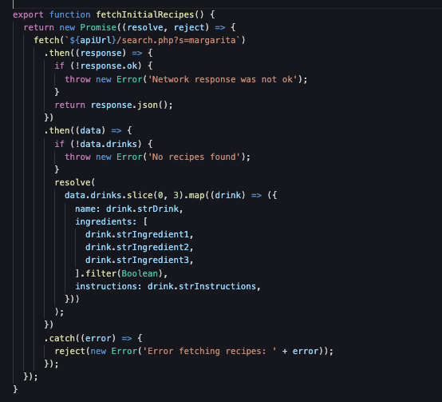

## Functions, Promises and Finally

 
 1. In the utils.js file, try rewriting the fetchInitialRecipes() function using a Promise. Look for comments in the code to help show you where to make the changes:


 utils.js
```js
//update the type of function 
export async function fetchInitialRecipes() {
  //remove the try and replace it with a new promise. 
  //instead of creating new constant, use an arrow function to connect the new promise
  //to your fetch call
try {
    const response = await fetch(`${apiUrl}/search.php?s=margarita`);

    if (!response.ok) {
      throw new Error('Network response was not ok');
    }
    //instead of creating a constant here, return response.json();  
    //Then use an arrow function with .then to check if there are drinks
    const data = await response.json();
    if (!data.drinks) {
      throw new Error('No recipes found');
    }
    //Add a resolve statement here
    const recipes = data.drinks.slice(0, 3).map((drink) => ({
      name: drink.strDrink,
      ingredients: [
        drink.strIngredient1,
        drink.strIngredient2,
        drink.strIngredient3,
       
      ].filter(Boolean), 
      instructions: drink.strInstructions,
    }));
    //Replace your existing catch and throw, the last 4 lines of code, with these 7 lines:
      );
      })
      .catch((error) => {
        reject(new Error('Error fetching recipes: ' + error));
      });
  });
}

 ```


# Checkpoint

Compare your _script.js_ against the answer key for your work. It might look a little different depending on the variable names you chose.

> [!CODECHECK]
> 

## References and helpful links

[MDN Reference: Array](https://developer.mozilla.org/en-US/docs/Web/JavaScript/Reference/Global_Objects/Array)

[MDN Reference: Function](https://developer.mozilla.org/en-US/docs/Glossary/Function)
