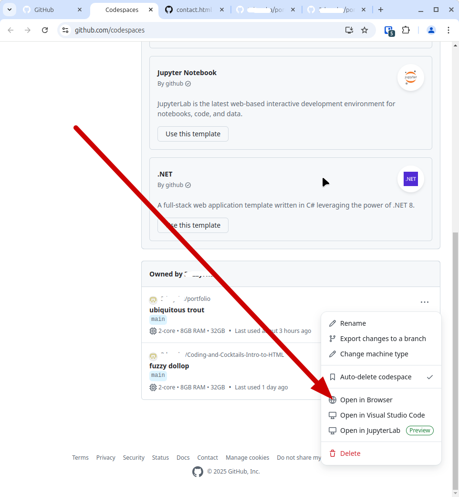
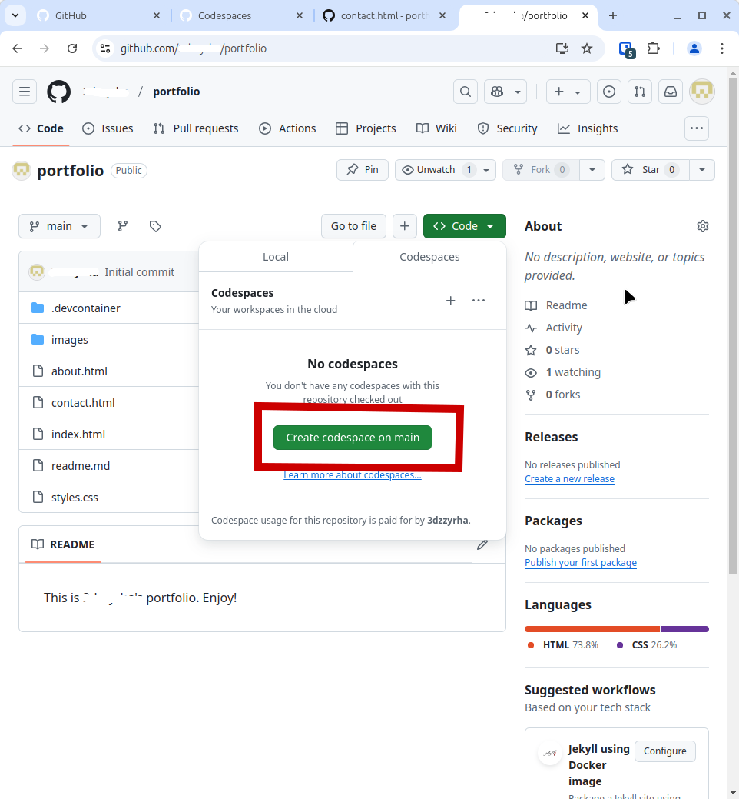

<div>
    
    <h2 style="display:inline-block;margin-top:1em;">Coding &amp; Cocktails: The Liquor</h2>
    <h3 style="margin-top:0;margin-bottom:2em;">JavaScript Side Quest</h3>
</div>

### Overview

Now that you've got a few pages for your portfolio and you have them styled, let's add a "go to top" button!

Go to your [GitHub Codespaces page](https://github.com/codespaces). If you see a Codespaces page for your repo, click on the three dots and select "Open in browser."




If you don't see a Codespace for your portfolio repo, Click on the profile picture in the upper right-hand corner of the page and select "Your repositories."


Now click on the link for your portfolio repository, then click on the green "Code" button. Select "Codespaces," then "Create codespace on main."



When your codespace is open, we're going to rearrange the file tree a bit.

Click on the "New Folder" icon that appears when you hover over the name of your repo (in bold). Name that folder "css."  Repeat this, except this time, name the new folder "js".

Now, drag your _styles.css_ file to the _css_ folder. Click on the green "Move" button when it asks if you are sure.

Double-click on the _index.html_ file. In the link to the stylesheet, add "../css/" to the beginning of the _styles.css_ href. This will allow your HTML file to find the new location of your CSS file. Now do the same for your "About" and "Contact" pages.

Commit your changes!

Now, let's add a button that will take people to the top of the page.

Inside the _js_ folder, create a new file called backToTop.js.

Copy and paste the following code into that file.

backToTop.js

```js

// This function toggles the visibility of the back-to-top button based on scroll position
const scrollFunction = () => {
const backToTopButton = document.querySelector(".back-to-top-btn");

// Get the current vertical scroll position
const documentScrollTop = document.documentElement.scrollTop || document.body.scrollTop;

// If scrolled more than 100px, show the button, otherwise hide it
if (documentScrollTop > 100) {
    backToTopButton.style.display = "block";
} else {
    backToTopButton.style.display = "none";
}
};

// This function smoothly scrolls the window back to the top when called
const scrollToTop = () => {
window.scrollTo({
    top: 0, // takes the window to the top of the page
    behavior: "smooth" // smooth scrolling animation
});
};

// Add a scroll event listener to trigger scrollFunction whenever the user scrolls
window.addEventListener("scroll", scrollFunction);
```

In each of your HTML files, add a link to the _backToTop.js_ file.

If you're having a problem figuring out how to link the JavaScript file, check below.

> [!CODECHECK]
>
> In the _head_ section, add this line:
>
> 
> ```js
> <script src="../js/backToTop.js"></script>
>```

In your _css_ folder, add a new file called backToTopButton.css. Copy and paste the following code into that file.

backToTopButton.css

```css

.back-to-top-wrapper {
/* Positions the back-to-top button fixed at bottom-right corner */
position: fixed;
bottom: 40px;
right: 40px;
z-index: 999;
}

.back-to-top-btn {
/* Initially hides the button and styles it as a circular clickable element */
display: none;
width: 40px;
padding: 3px;
background-color: white;
border-radius: 50%; /* makes button a circle */
border: 1px solid #2222224D;
cursor: pointer; /* Shows the user that button is clickable */
}

.back-to-top-btn:hover {
/* Changes background color on hover for visual feedback */
background-color: #2222224D;
border: none;
}

.back-to-top-btn svg {
/* Styles the SVG icon inside the button */
display: block;
color: #222222;
}

.back-to-top-btn svg:hover {
/* Changes the color of the SVG icon on hover */
color: #FFF;
}
```

Now add a link to this stylesheet in all your HTML heads.

Go to your site and test the button out!

One really good skill to build is learning how to search for information on how to do things. In the tutorial we just completed, you were given some resources. One of these is the Mozilla Development Network. This organization has documentation about [JavaScript](https://developer.mozilla.org/en-US/docs/Web/JavaScript) that you will find useful.

Remember, too, that there are other resources available in the [slides](https://kansascitywomenintechnology.github.io/CodingCocktailsSlideTemplate/03-liquor/javascript.html#/) from the Intro to JavaScript session!

Don't forget to commit your changes to your repo!

Once you've got your site set up the way you like it, post the link to your repo in the  **#codingandcocktails** channel on [Slack](http://kcwit.slack.com/) to let us see what you can do.