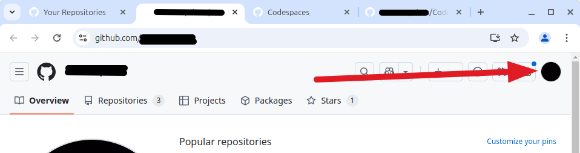

    
    <h2 style="display:inline-block;margin-top:1em;">Coding &amp; Cocktails: The Shaker</h2>
    <h3 style="margin-top:0;margin-bottom:2em;">Let's Build a Portfolio Website - HTML</h3>

### Overview

Go to your GitHub page (`https://github.com/<yourprofilename>`). Click on the profile picture in the upper right-hand corner of the page and select "Your repositories."

Now right click on the green "New" button in the upper right-hand corner and open it in a new tab.

Next, select the link that says "Import a repository."

Copy the following link address.

https://github.com/KansasCityWomeninTechnology/Coding-and-Cocktails-Portfolio

Return to the tab that has the import tool on it and paste the URL you just copied into the box for the source repository URL.

Ignore the "Your username for your source repository" and "Your access token or password for your source repository." (These are only needed if you're importing a repository that you own, that you have set to require a GitHub account and password to clone.)

Type something in the "Repository name" box, as well. You'll want to name the repo something like "my-portfolio" or "portfolio."

Make sure your repository is public, or no one will be able to see it!

Click "Begin import." It will take a minute or two for the repository to finish being imported.

Now go to your Codespaces page on GitHub and select the green "New codespace" button in the upper right-hand corner.

On the next page, select "Select a repository," then select the new repo you just created, then click the green "Create codespace" button.

The first thing that you will see is the readme file for the repository. Delete the text that appears there and write something new. Generally, the readme is to tell people what the repo is for.

Next, double-click on index.html. CThis is the file you will want to use to create content for the home page of your portfolio website.

Since you're going to be showing your web development skills, you'll likely want to add separate "About" and "Contact" pages, as well as other pages that you might decide to include.

To add a new page to your site, click on the "New File" icon and type the name of the page for the file name. Don't forget to add .html to the end of the file! For example, for an "About" page,  you'll want to name the file "about.html".

Add an "About" page and a "Contact" page, at the very least, and if you want, add another page or two.

Don't forget to commit your changes to your repo!