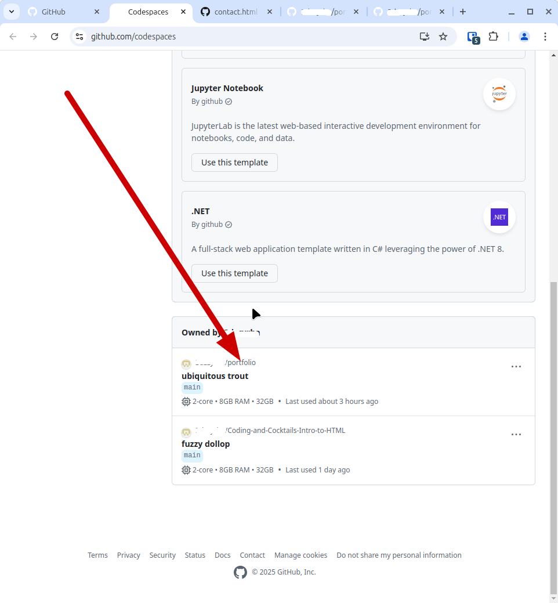
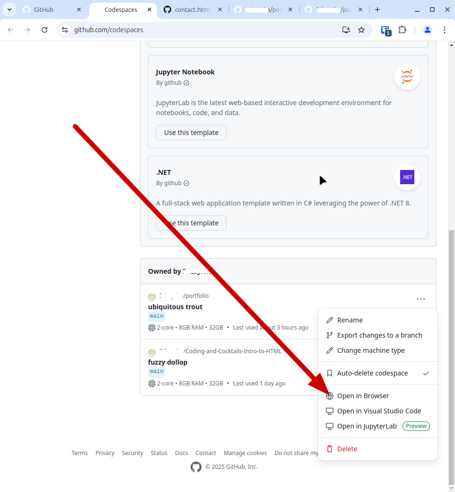
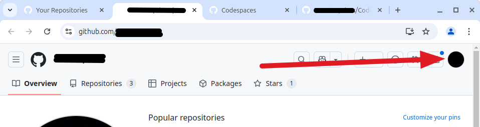

    
    <h2 style="display:inline-block;margin-top:1em;">Coding &amp; Cocktails: The Liquor</h2>
    <h3 style="margin-top:0;margin-bottom:2em;">JavaScript Side Quest</h3>

### Overview

Now that you've got a few pages for your portfolio and you have them styled, let's add a "go to top" button!

Go to your [GitHub Codespaces page](https://github.com/codespaces). If you see a Codespaces page for your repo, click on the three dots and select "Open in browser."

If you don't see a Codespace for your portfolio repo, Click on the profile picture in the upper right-hand corner of the page and select "Your repositories."

Now click on the link for your portfolio repository, then click on the green "Code" button. Select "Codespaces," then "Create codespace on main."

When your codespace is open, we're going to rearrange the file tree a bit.

Click on the "New Folder" icon that appears when you hover over the name of your repo (in bold). Name that folder "css."  Repeat this, except this time, name the new folder "js".

Now, drag your _styles.css_ file to the _css_ folder. Click on the green "Move" button when it asks if you are sure.

Double-click on the _index.html_ file. In the link to the stylesheet, add "../css/" to the beginning of the _styles.css_ href. This will allow your HTML file to find the new location of your CSS file. Now do the same for your "About" and "Contact" pages.

Commit your changes!

One really good skill to build is learning how to search for information on how to do things. In the tutorial we just completed, you were given some resources. One of these is the Mozilla Development Network. This organization has documentation about [JavaScript](https://developer.mozilla.org/en-US/docs/Web/JavaScript) that you will find useful.

You can search this resource to find out how to apply styling your website.

Remember, too, that there are other resources available in the [slides](https://kansascitywomenintechnology.github.io/CodingCocktailsSlideTemplate/03-liquor/javascript.html#/) from the Intro to JavaScript session!

Don't forget to commit your changes to your repo!

Once you've got your site set up the way you like it, post the link to your repo in the  **#codingandcocktails** channel on [Slack](http://kcwit.slack.com/) to let us see what you can do.