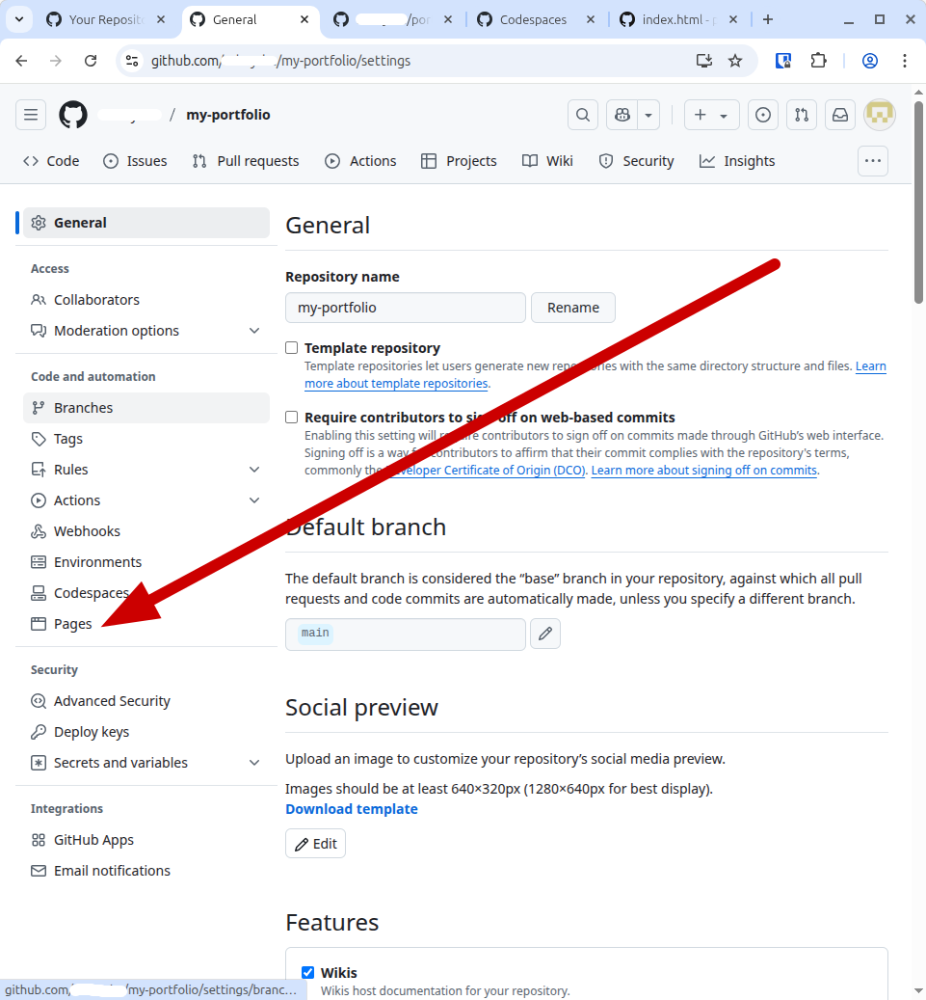
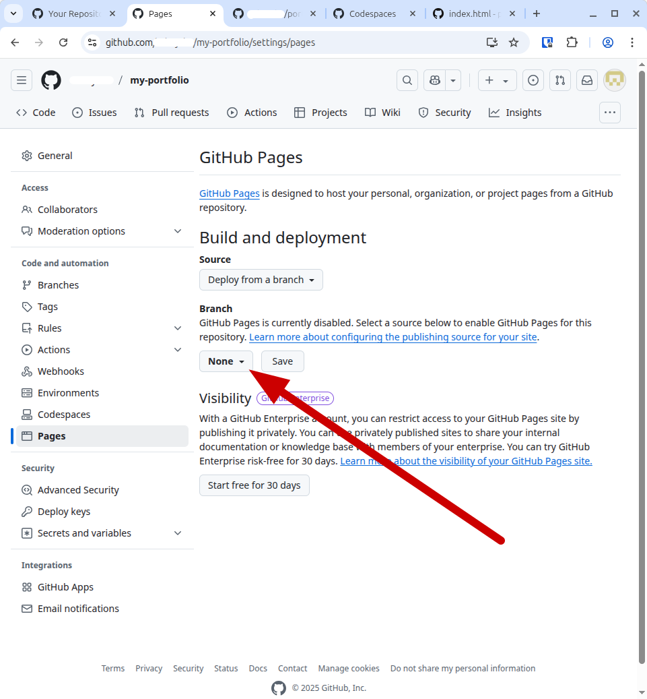

    
    <h2 style="display:inline-block;margin-top:1em;">Coding &amp; Cocktails: The Shaker</h2>
    <h3 style="margin-top:0;margin-bottom:2em;">Let's Build a Portfolio Website - Deployment</h3>

### Overview

Yay! You have a portfolio website built! There's only one problem:  It's only visible if you "go live" from inside your Codespace.

There's no point in having done all this work if we can't show it off.

There are many ways to put a website out on the internet. Most businesses, large or small, pay for hosting packages with web hosting companies. This generally costs some money, including paying for a domain name and for the hosting services.

Domain names don't cost much, but depending on the host you choose, hosting fees to have your site appear on the internet can add up quickly.

Luckily, GitHub has a **free** way to publish, or deploy, your portfolio site!

Go to your repo's home page (https://github.com/<YOUR_USER_NAME>/<YOUR_REPO_NAME>).

Click on "Settings." You will now see a page that looks something like this:

Click on the "Pages" link.

You will see several sections on this page. The one we are interested in is the "Branch" section.

Click on the "None" box and select your main branch, then click "Save."

Now, at the top of the page, click on "Actions." You should now see a page that looks something like this, with a yellow icon to the left of "pages build and deployment."

When that icon changes to a green check mark, click on "pages build and deployment." You will see a diagram with "build" on the left and "report-build-status" and "deploy" on the right. In the "deploy" box is a link to your web page. Click it and make sure everything works.

You will likely find that your links, styling, and JavaScript do not work. This is because you are able to deploy any repository in your GitHub account, so you need to add the name of your repository to the hrefs in your files. (This would not be necessary if you were using a hosting provider like GoDaddy or Ionos.) In this example, the repository is named "my-portfolio," so we need to add "/my-portfolio" to the beginning of every href in the repo.

You can find all your hrefs by using ctrl-shift-f (cmd-shift-f on a Mac) and entering "href." You can then click on each of them in succession and add the appropriate repo name to the beginning of every href. Take a look at the following screen shot for an example.

Once you have fixed all of your hrefs and committed your changes, your site will go through the build and deploy process automatically. This will take a couple of minutes, but when it's complete, your site should work as expected. Force refresh your page and make sure everything works.

Hurray! You've done it!
