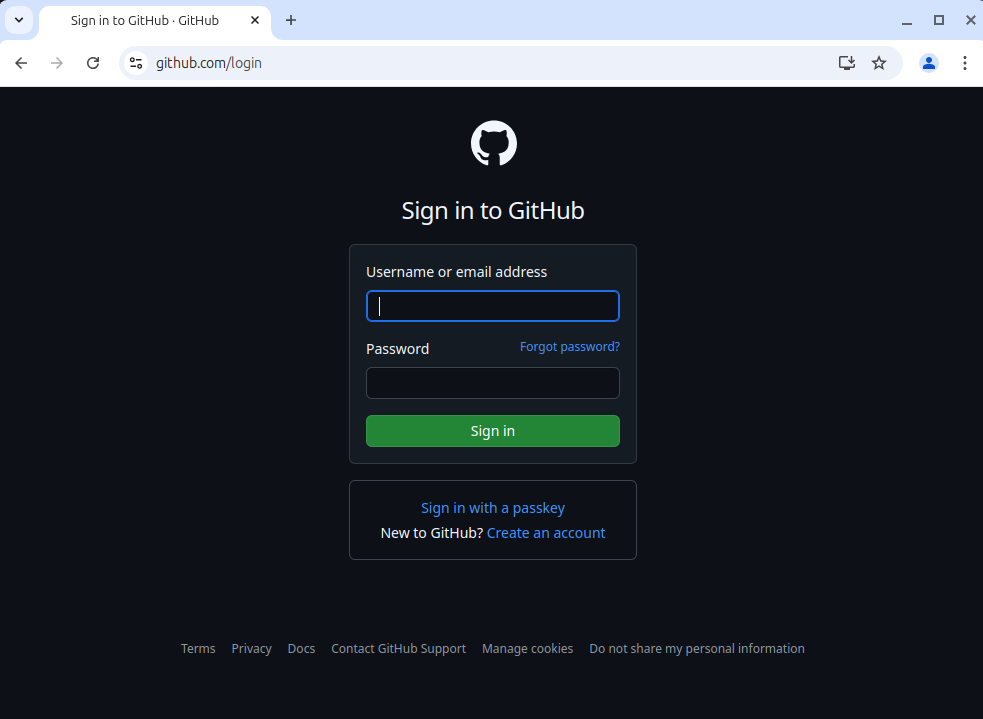

# Setup :id=setup

Tonight we will learn the basics of applying reusable pieces of UI to a website using **React**.

Follow the instructions on this page to prepare your workspace.

> [!TIP]
> Open [Slack](http://kcwit.slack.com/) to the **#codingandcocktails** channel. It's a great way to stay in touch with your Coding & Cocktails friends and to ask questions during and after the session. We'll also post updates and tips in Slack if we run in to any stumbling blocks tonight.

> [!WARNING]
> We will use a cloud development environment called **GitHub Codespaces**. In order to use Codespaces, you will need a GitHub account. Codespaces **only** works with Chrome, so it is important that you use Google Chrome for today. If you use a different browser, things will not behave as this tutorial expects.

> Navigate to [**GitHub**](https://github.com) to create a personal account or log in. Feel free to ask your mentor for help! When complete and logged in to GitHub, return here to continue the instructions.

# Create React Codespace :id=create-codespace

We will use GitHub Codespaces for our workshop. GitHub Codespaces is a cloud development environment which means you have an access to your code even if you are not on your own laptop.

1. Navigate to [**GitHub**](https://github.com/login) and log in with your GitHub account.

    

2. Once you're signed in, click on the following link to [**the starter code repo**](https://github.com/KansasCityWomeninTechnology/Coding-and-Cocktails-Intro-to-React) and click the "Use this template" button in the upper right-hand corner of the screen.

    

3. Next, select the "Open in a codespace" option.

    

> [!TIP]
> You may see an "unexpected error" notification that looks somewhat like this:
>
>  
>
> If you see this, just click the "Reload" button.

> [!TIP]
> Codespaces may take a long time to load in the first place. If this happens, close the tab that your Codespace is open in, then navigate to your "Codespaces" page in your GitHub account. Scroll to the bottom and find your Codespace, then select "Open in Browser," which appears when you click on the three-dot icon to the right.

> [!TIP]
> When your Codespace has finally finished loading, it may look like the image below, and it may tell you "vite: not found" as you can see inside the red oval in the image.
>
> If Vite has not installed, then type "npm install vite" (as in the green oval in the image) and hit "Enter." Vite will install. You will then need to type "npm start" and hit "Enter," and you'll be good to go!
>
> 

The Codespace page is split into 3 or 4 different sections, depending on whether Vite was already installed or whether you had to install it, yourself.

On the far left is the project's file structure. The top (middle) section is where you will write your code. The bottom (middle) section is where you will find the terminal. The far right section (if there are 4 sections) is the preview pane.

> [!TIP]
> View the worksheet and your IDE in split screen.
>
> By default, Codespaces opens a preview in a pane on your IDE. If you want to see the preview in a full-sized tab, you can click on the icon in the upper right-hand corner of the preview pane, as shown below. Your preview will remain in a pane alongside your code until you close that pane.
>
> 
>
> If you want to open the browser view in a new window, right click on the tab (control click on a Mac) and select "Move tab to new window." Then you can put the browser view of your web page on half of your screen and the IDE on the other half.
>
> 
>
> 
>
> If you have any questions, feel free to ask. Mentors are happy to help!

> [!TIP]
> Did you know you can collapse the table of contents for worksheets?
>
> Click on the hamburger menu (:fas fa-bars:) at the top of the page to toggle the table of contents.

> [!TIP]
> Did you know you can perform common tasks such as copy and paste?
>
> When working without a mouse, keyboard shortcuts will be faster than a trackpad. Open the [handy dandy keyboard shortcut reference in a new tab](/keyboard-shortcuts/ ":target=_blank") so you can refer to it easily!
