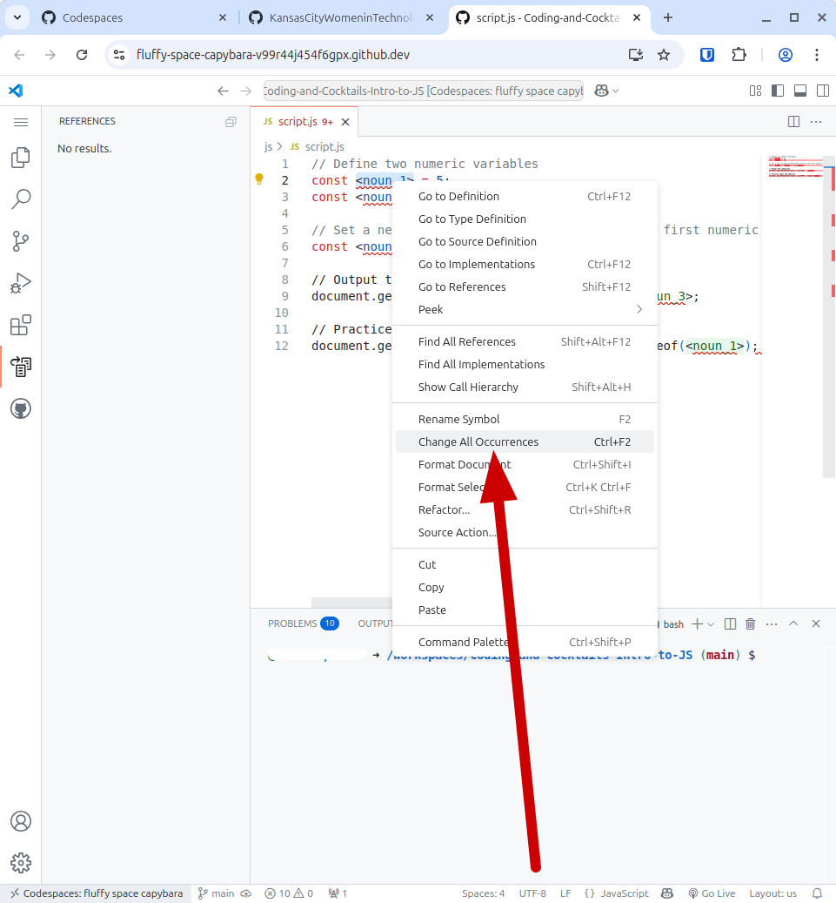

# Introduction to React

React is a JavaScript library created by Meta. (more stuff)

> [!WARNING]
> Before starting the worksheet, please take a moment to review the [Setup instructions](../setup/?id=setup) to ensure you have all the tools and workspace setup you need for today's work.

# stuff

## stuff

1. stuff

**codeblock sample**
   index.html

   ```html
   <!DOCTYPE html>
   <html lang="en">
     <head>
       <title>Intro to JS</title>
     </head>

     <body>
       <h1>Introducing JavaScript</h1>

       <h2>Variables, Booleans, Operators, Comparison</h2>
       <h3>
         Is the first variable times two greater than the second variable?
       </h3>
       <div id="math"></div>

       <h2>Data Types</h2>
       <h3>What type is the first variable?</h3>
       <div id="type"></div>
       <script src="./js/script.js" type="text/JavaScript"></script>
     </body>
   </html>
   ```

> [!TIP]
> Need a refresher on HTML? Check out the [HTML session worksheet](../../html/).

## stuff

1. stuff

**codeblock sample**
script.js
```js
    // Define two numeric variables
    const <noun_1> = 5;
    const <noun_2> = 25;

    // Set a new variable to determine if twice the first numeric variable is greater than the second numeric variable from above.
    const <noun_3> = <noun_1> * 2 > <noun_2>;

    // Output the comparison.
    document.getElementById("math").innerHTML = <noun_3>;

    // Practice types and equality
    document.getElementById("type").innerHTML = typeof <noun_1>;
```

## Go Live

Now, find the "Go Live" at the bottom right corner of the IDE and click it. This will open a new browser tab where you will be able to see your web page.

> [!TIP] If you accidentally close the browser tab that is displaying your page, go back down to where you saw "Go Live." There will be a "Port 5500" in its place. Click that to discard the live session. "Go Live" will reappear and you can click on it to create a new live session.

Remember these are the noun or verb text surrounded by angle brackets: **&lt;noun_2>**. You can use choose any noun or verb you like for the variable name.

> [!TIP]
> Feel free to ask mentors for help! We are here to help you!

**info on how to find all instances of a term in Codespaces**
> [!TIP]
> If you highlight, then right-click on "&lt;noun_1>" or any other text surrounded by angle brackets (be sure to include the angle brackets!), you will get a menu that will include an option to "Change All Occurrences." This is a good way to make sure you don't miss an occurrence of the thing you want to change.

> 

> If this doesn't work for you, and instead you see a drop-down, click the drop-down and select "Replace." This should allow you to change all instances at once.

> [!WARNING]
> Make sure to replace all instances of a variable with the same noun!
>
> Make sure to remove the angle brackets <> around the text so your code will work!

Check what you have!

**REPLACE THIS IMAGE**


# Checkpoint

Compare your WORK against the answer key for your work. It might look a little different depending on the variable names you chose.

**code to check against**
> [!CODECHECK]
>
> ```js
> const numOne = 5;
> const numTwo = 25;
>
> const numThree = numOne * 2 > numTwo;
>
> document.getElementById("math").innerHTML = numThree;
>
> document.getElementById("type").innerHTML = typeof numOne;
> ```

# References and helpful links


