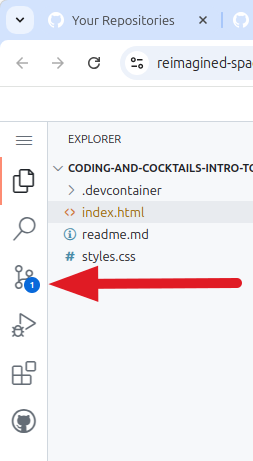
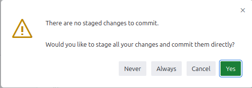
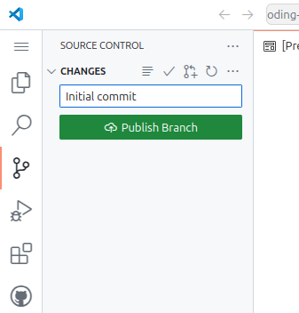

# Source Control

## Committing our work the first time

We want to make sure all our hard work is saved, so let's review how to commit to our repo.

1. Commit your code to a repository in your GitHub account by clicking on the "Source Control" icon along the left side of the explorer in your IDE.

   

2. Next, type a message in the text box above the green "Commit" button.
      
   

3. Next, click "Yes" in the box that says there are no staged changes to commit.

   

4. Now, click the "Publish Branch" button.

   
   
5. Click "Allow" on the box that says it wants to sign in to your GitHub account. 
   
   
   
6. Choose the GitHub account you want to use (the same one you used to create the Codespace). Click "Publish Branch" a second time and select the "public" repository name.

   
  
   > [!TIP]You can click "No" on the tile at the bottom right corner of the screen that asks if you want to periodically run git fetch.
   >
   >  

7. Now you can click the "Explorer" icon along the left side of the explorer in your IDE.

   

## Committing our work after the first time

The next time you commit, type a message in the box above the "Commit" button, click "Commit," then "Sync changes."
   >
   > 