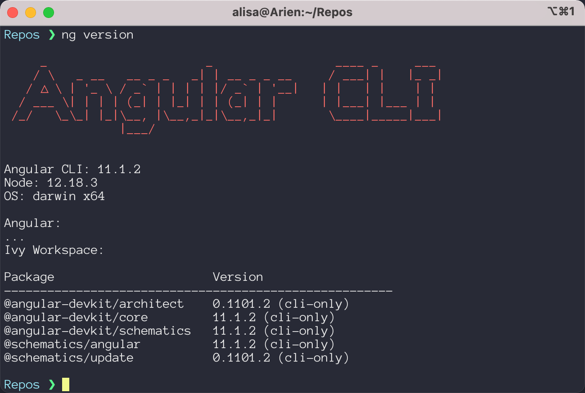
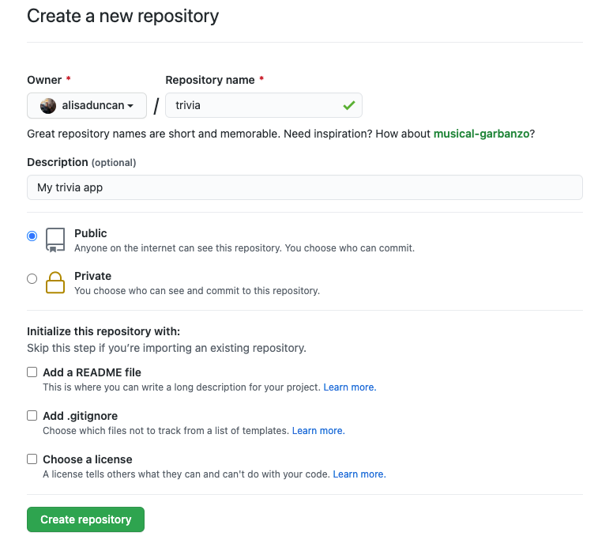
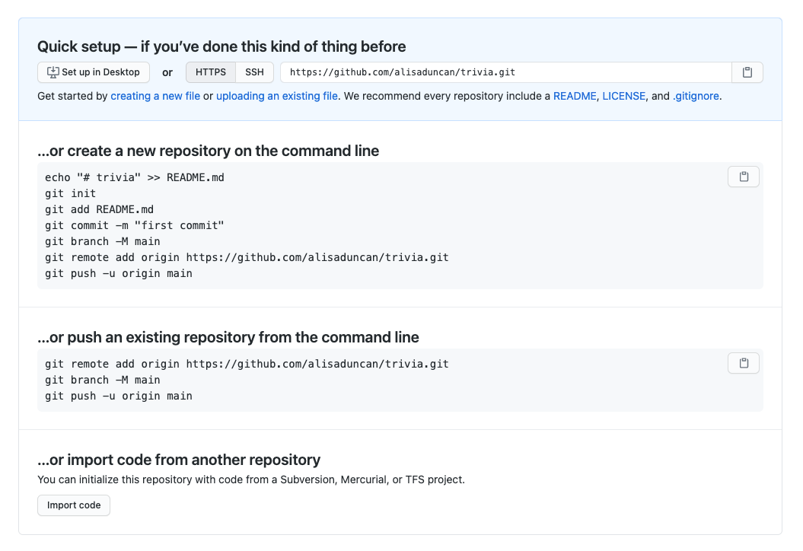

# Starting your Single Page Application

We will create a web application using a SPA framework with interactive elements and dynamic content that looks like this:


>[!WARNING]
>Before starting the worksheet, please take a moment to review the [Setup instructions](../setup/?id=setup) to ensure you have all the tools and workspace setup you need for tonight's work.

# Install Angular CLI

We will use Angular CLI to scaffold, generate new components, build the code, and serve the application. In your terminal, install Angular CLI by running the following command:

terminal
```sh
npm install --global @angular/cli
```

>[!INFO]
>We installed Angular CLI as a global package. This means we have access to it anywhere on our filesystem.

Verify your install of Angular CLI by checking the version. Run the following command to get detailed version info of the Angular CLI:

terminal
```sh
ng version
```

>[!INFO]
>To use Angular CLI, we use the command `ng` and pass in the action to perform. In this case, we pass in the parameter `version` to request version info.

You should see something that looks like this.



# Application foundation

Let's create the app! In your command line application, navigate to your Coding & Cocktails code directory. This is where we'll create the project.

terminal
```sh
cd path-to-Coding-And-Cocktails-code-folder
```

To scaffold a new Angular application named "triva", run the following Angular CLI command within in the Coding & Cocktails code directory:

terminal
```sh
ng new trivia
```

The `ng new` command prompts you for information about features to include in the app. We recommend selecting the default for the questions by pressing `Enter` for each, but you may elect to use a different stylesheet format as shown below:

1. Do you want to enforce stricter type checking and stricter bundle budgets in the workspace? (y/N): **N**
2. Would you like to add Angular routing? (y/N): **N**
3. Which stylesheet format would you like to use? (Use arrow keys): Select your favorite format. We recommend **CSS** or **SCSS**.

>[!INFO]
>In this Angular CLI command, we pass in parameters to create a `new` application called "trivia".
>
>Angular CLI automatically creates the project directory for you. In this case, it will create a new folder called "trivia", which is the name of the project you passed in. It will also scaffold out the startup files, install the necessary Angular npm packages and other dependencies, and initialize the project folder as a Git repository. This process will take a few minutes.

When the new application creation is complete, change your working directory to the "trivia" folder by running:

terminal
```sh
cd trivia
```

# Open the application in your IDE

Let's open the code up in the IDE to get a tour of the files and make code changes.

Open the "trivia" project folder in VS Code.

>[!INFO]
>You can open the current working directory in VS Code by running
>```sh
>  code .
>  ```
>If VS Code doesn't open, it may not be available in your system path.
>
>**Windows users** - close your terminal and reopen it.
>
>**macOS users** - follow the [instructions on VS Code's install page](https://code.visualstudio.com/docs/setup/mac#_launching-from-the-command-line)

>[!TIP]
>Did you know you can access your terminal within VS Code?
>Help declutter your workspace and use VS Code's integrated terminal by navigating to **View** :fas fa-long-arrow-alt-right: **Terminal**.
>
>Read more about [VS Code's Integrated Terminal](https://code.visualstudio.com/docs/editor/integrated-terminal).

We'll take a quick tour of the code that Angular CLI generated and see how Angular organizes code into different directories in VS Code.

In the top level "trivia" directory, there are configuration files used to compile, test, and run your application. Because Angular uses TypeScript, there are configuration files to define how the TypeScript compiler generates JavaScript code.

Open _package.json_ and take a look at the settings. Here, you see basic **npm** commands that wrap Angular CLI commands as a convenience, and the list of dependencies.

>[!INFO]
>We'll use the Angular CLI commands in the worksheets, but you could use the npm commands for certain operations.

Now open the "src" folder. This is where the code is.

At the top level of "src" directory, there's the _index.html_ webpage that hosts the application, the global stylesheet file, and TypeScript files that Angular needs to bootstrap the Angular application into the webpage.

Open the "app" directory. This is where the code for the application business-logic goes and where we'll be working out of in future sessions.

# Run the application

Let's run the application. We use Angular CLI to serve the webpage so we can view it locally.

terminal
```sh
ng serve
```

>[!INFO]
>This command will:
>
>1. Compile your TypeScript files into JavaScript
>2. Start a local server on your computer so you can view your project before making it live on the internet
>3. Watch your project files for changes so that when one of them changes it will automatically reload in the browser for you and avoid the step of having to press the **Refresh** button to see every update you make.

In Google Chrome, navigate to [http://localhost:4200](http://localhost:4200) to see your working (basic) app. Angular scaffolds a basic webpage with links to their documentation and help to continue building the app that looks something like this except you'll see your app name "trivia" in the top banner:


# Make a code change

Now, you'll make some updates to the app to see the live reload you get from `ng serve`! Remember the `ng serve` command watches for changes to your project files and automatically refreshes the browser for you so you don’t have to. This is called “live reload.”

We'll edit a variable inside the _app.component.ts_ and see the changes reflect in Chrome.

In VS Code, open _src/app/app.component.ts_. This is the main component for the application.

Find the `AppComponent` variable `title` and edit the value from 'trivia' to whatever text you want (like: have a cocktail!)

>[!WARNING]
>If you choose a title with an apostrophe in it you'll need to escape the character by typing a `\` in front of the `'` so that the apostrophe (aka single quote) isn't interpreted as closing the string. For example, the title of "Coding & Cocktail's Application" becomes `Coding & Cocktail\'s Application`.
>
>For more on escaping characters and why read [the "Special Characters" section on w3schools](https://www.w3schools.com/js/js_strings.asp).

Save the file and take a look in Chrome to see your new title!

>[!TIP]
>Enable auto save in VS Code to avoid manually saving after each change by selecting **File** :fas fa-long-arrow-alt-right: **Auto Save**.

Feel free to stop the server for the next steps.

>[!TIP]  
>To stop the server and get back to your command prompt, press the `ctrl` + `c` keys on your keyboard.

# Check your code in to GitHub

Let's get this project into GitHub so we don't lose our work for upcoming sessions. Create a new repository for the project in GitHub. Because Angular already initialized the project as a Git repo, make sure to disable the options under the **Initilize this repository with**.



After you create the repo, follow the instructions to **...or push an existing repository from the command line**. Your instructions may look a little different from the screenshot below if you use Git with SSH.  



# Next sessions

In the upcoming sessions we'll create components and use component data communication patterns to help keep our trivia app modular, add routing, use data binding to calculate scores, and call to load trivia questions from an API.
