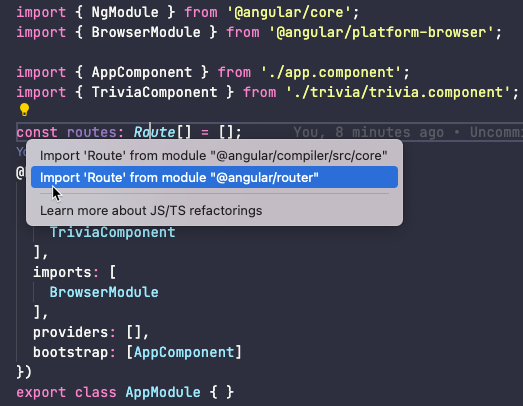

# Add a component and a route to your Single Page Application

We will create a web application using a SPA framework with interactive elements and dynamic content that looks like this:


Tonight we will add on to the code by adding a new component and setting up routing.

>[!WARNING]
>Before starting the worksheet, please take a moment to review the [Setup instructions](../setup/?id=setup) to ensure you have all the tools and workspace setup you need for tonight's work.

>[!TIP]
>Couldn't make it to last session? Follow [the instructions from the last session](../1scaffold/) to scaffold your web app.

# Prepare your workspace

Open the "trivia" project in your IDE. We recommend using Visual Studio Code. Open VS Code and navigate to your project directory.

>[!TIP]
>If you are a terminal poweruser, you can navigate to your "trivia" project folder in your terminal and open the current working directory in VS Code by running
>```sh
>  code .
>  ```

In VS Code, open a terminal window. It should automatically open to your project directory. Verify the working directory of the terminal window matches your project directory just in case.

>[!TIP]
>We recommend using VS Code's terminal window for this session to help keep your focus on as few applications as possible.
>
>Open a terminal window in VS Code by navigating to **View** :fas fa-long-arrow-alt-right: **Terminal**.
>Read more about [VS Code's Integrated Terminal](https://code.visualstudio.com/docs/editor/integrated-terminal).

Let's run the application. We use Angular CLI to serve the webpage so we can view it locally. Run the following code in VS Code's terminal to serve the app:

terminal
```sh
ng serve
```

In Google Chrome, navigate to [http://localhost:4200](http://localhost:4200) to see your working (basic) app. Angular scaffolds a basic webpage with links to their documentation and help to continue building the app that looks something like this except you'll see the title of your app in the top banner next to the rocket icon:


# From a scaffold app to a trivia app

Now that we've got our app running so we can watch our changes live, let's make some code changes to create the shell for our trivia app!

## Set global styles

Before we jump in to components, let's set the global styles for the app. Good practices encourage keeping global styles both minimal and applicable to the entire app. For our app, we only need to reset some default browser styles and set default font styles.

Open _src/styles.css_ and paste the following CSS code into the file and save:

styles.css
```css
html,
body {
  height: 100%;
}

body {
  margin: 0;
  font-family: sans-serif;
  font-size: 16px;
}
```

>[!TIP]
>Enable auto save in VS Code to avoid manually saving after each change by selecting **File** :fas fa-long-arrow-alt-right: **Auto Save**.

## All about the App component

Now on to the component! Open the folder "src/app" to see all the files of the `AppComponent`.

The `AppComponent` is the first component the user sees and is the main component for the application. This means anything you want to see on all pages of the application belongs here. For our app, we want to display the header and footer in the `AppComponent`.

The HTML template for the `AppComponent` resides in the _app.component.html_. The declaration of the component `AppComponent` resides in the _app.component.ts_.

>[!INFO]
>The _app.component.ts_ file has 2 sections, a decorator `@Component` and the `class AppComponent`.
>
>The `@Component` decorator contains metadata about the component, such as
>
>1. `selector` - what name to use when referring to the component from another component's HTML template
>
>2. `templateUrl` - the name of the external HTML template file (HTML can be internal to the component file.)
>
>3. `styleUrls` - the name of the external stylesheets for this component (Styles can be internal to the component file.)
>
>The `class AppComponent` contains behaviors and business-logic for the component. We'll add business logic in a later session.
>
>The _app.component.spec.ts_ file is for writing tests, which is outside the scope of our sessions.
>
>Angular CLI generates 4 files for a component, but we only need 1 file, the _app.component.ts_ file.

>[!EXTRACREDIT]
>Read more about Angular components - [https://angular.io/guide/component-overview](https://angular.io/guide/component-overview)

### Set up the HTML

Open the _app.component.html_ file. Delete everything from the file. We're going to start fresh.

>[!TIP]  
>Highlight all code in the file by using a keyboard shortcut. On macOS use `cmd` + `a` and on Windows use `ctrl` + `a` to highlight everything in a file. Then press `delete`.

Let's add the HTML for our header and footer. Copy the following HTML and paste it into _app.component.html_.

app.component.html
```html
<div class="app-container">
  <header>
    <h1>My Trivia App</h1>
  </header>

  <main>
  </main>
  
  <footer>
    &copy; 2021 LadyDev Apps
  </footer>
</div>
```

>[!INFO]
>What's going on with copying and pasting all the HTML & CSS?!
>
>In an effort to keep the project focused on Single Page Applications concepts, we're providing the bare bones HTML & CSS code for you to copy and paste. Take a moment to examine the code HTML and CSS you added to understand what we're building. You'll be adding on to the HTML yourself soon and pep up the CSS to your own tastes between sessions.

Yay! No more scaffolded code! In Chrome we now see a header with the name of our app and a footer. We're starting the see the beginings of a trivia app.

### Add some styles

We want to see the header at the top of view and the footer at the bottom of view. To do so, we can add some styles to the component. Copy the following CSS code and paste it into _app.component.css_.

app.component.css
```css
.app-container {
  height: 100vh;
  margin: auto;
  display: flex;
  flex-direction: column;
}

header,
footer {
  display: flex;
  justify-content: center;
  background: #666b8f;
  color: white;
}

main {
  flex-grow: 1;
}

footer {
  padding: 0.75rem 0;
}
```

>[!EXTRACREDIT]
>We're using Flexbox to help position the content. Take a moment to understand the CSS.
>
>**M**ozilla **D**eveloper **N**etwork (**MDN**) is a great resource to learn or review in their [CSS Flexible Box Layout documentation](https://developer.mozilla.org/en-US/docs/Web/CSS/CSS_Flexible_Box_Layout). Feel free to talk through the CSS with your mentor too!

Take a look at the app in Chrome. Do you see a header and footer with blank space between? It's now time to fill that blank space with a new component!

# Create a trivia component

Before we get into the instructions, let's talk about what our goals are for the trivia component. We want to display our trivia questions within the trivia component so that we can keep our components small and focused.

We could put the trivia questions directly in the App component, but what happens when we want to add an "About" page or add a new feature to the app, such as very important quizzes that try to match your personality to questions about tacos?

It sounds like there's lots of good reasons to create a trivia component. Let's get going!

Open a new terminal in VS Code. We want to continue serving the app while creating the new component.

>[!TIP]
>To open a new terminal in VS Code, follow [the instructions on their documentation page](https://code.visualstudio.com/docs/editor/integrated-terminal#_managing-multiple-terminals).

In the new terminal, we'll use Angular CLI to create the component. Run the following command:

app.component.html
```sh
ng generate component trivia
```

>[!INFO]
>This creates a "src/app/trivia" directory with 4 files in it: _trivia.component.html_, _trivia.component.css_, _trivia.component.ts_ & _trivia.component.spec.ts_.  The _*.spec.ts_ files are for testing your code (to make sure your code works), but we won't be adding tests as part of the SPA sessions.

>[!TIP]
>That's too much typing for a commandline operation! Angular CLI supports shortcuts to generate components too. You can use single character shortcuts to **g**enerate a **c**omponent, so we could also run `ng g c trivia`.

## Set up the Trivia component HTML

Let's add a little to the HTML template. Open the _trivia.component.html_ file.

The Angular CLI generated a small bit of HTML for us that says "trivia works!", but we want to start building out the structure to display trivia questions. Delete all the HTML and replace it with:

trivia.component.html
```html
<div>

  <section>
    <p class="question-tracker">Trivia</p>
  </section>

</div>
```

## Add some styles to the Trivia component

Now let's add some styles for the trivia component. Open _trivia.component.css_ and add the following styles

trivia.component.css
```css
div {
  margin: 2rem;
}

.question-tracker {
  font-size: 1.5rem;
  color: #484e78;
  margin-bottom: 2rem;
}
```

>[!EXTRACREDIT]
>Won't adding a style to a HTML element like `div` conflict with other `divs` in the app?
>
>Angular's components are isolated from each other. Component styles are **encapsulated** into the component's view and don't affect other components. So when we create another component, the `div` styles we added in `TriviaComponent` won't apply to the new component. 
>
>To follow best practices for maintainability and code legibility, we _should_ use a class on the `div`, such as `class="trivia"`, and style the class. This makes it much easier to read the CSS without having to understand HTML element positioning from the template. We are styling `div` to demonstrate view encapsulation, but feel free to change it to use a class. We'll cover more about view encapsulation with child components next session.
>
>To learn more about Angular's view encapsulation, [read their documentation page](https://angular.io/guide/view-encapsulation).

We'll skip looking at _trivia.component.ts_ for now as we have no changes to make this session.

# Add routing

Right now the app has one route, and one view. When we add routing, we can change the view when we change the route. This is helpful when you have an "About" page or another page not dedicated to showing trivia questions, such as that taco-based personality quiz.

Let's take a look at a diagram that shows the final setup for our app that we'll create by the end of this session.
* `<app-root>`-the first component to load and a container for other components. This is the App component.
* `<router-outlet>`-where the router displays the view for the route. We'll build this next.
* `<app-trivia>`-the component that displays and handles trivia questions and scoring results.


## All about modules

Let's add "trivia" as our first route and make it our default route.

Open _app.module.ts_. We have a lot to do this in this file. We need to

1. Define our routes
2. Pass our defined routes to a module available through the Angular framework called `RouterModule`
3. Add `RouterModule` to the `imports` array

>[!INFO]
>Angular organizes related functionality into separate modules. Developers import modules they need to use into their application. `RouterModule` contains the needed Angular components, directives, and services to support routing. Some other examples of Angular provided modules include `HttpClientModule` to make server requests, and `FormsModule` to integrate forms into the application.

>[!TIP]
>When you generate an Angular app, you can select the option to add routing to the app for you. Selecting this option generates a separate module named `AppRoutingModule` that contains an empty routes array and adds it to the `AppModule` for you. If you have a lot of routes, using a separate routing module is a best practice. For this worksheet, we want to step through the process and learn about each step.

>[!EXTRACREDIT]
>Want to learn more about modules, modularity, and why we import modules into our root module, `AppModule`?
>
>Read more about [`NgModules` on Angular's documentation](https://angular.io/guide/ngmodules).

## Prepare routes

We want to set up a routes constant named `routes` where we'll define our routes. Before the `@NgModule` decorator, add the following code:

app.module.ts
```ts
const routes: Route[] = [];
```

>[!INFO]
>Let's talk about what we did here. This looks a little different from JavaScript.
>
>1. We declare a variable named `routes`. We add the `const` declaration because the variable `routes` will not be reassigned to another type. 
>2. Then we declare the **type** of the variable `routes` - it is of type `Route[]`, which is an array of `Route`. `Route` is an interface from Angular's `RouterModule`. 
>3. Lastly, we set the variable `route` to the value of an empty array. We'll populate it in the next step.
> 
> Why did we add the type `Route[]`? This is so that we can take advantage of type safety in TypeScript. This means the compiler now knows what `routes` is and can help verify that we're creating objects using the `Route` interface properly. The IDE helps us out by providing syntax checking and hints for code completion.

## Import `RouterModule`

You might now see a red squiggly line under the type `Route`. This is your IDE and Angular Language Service extension (part of Angular Essentials extension) helping us out by letting us know the application code doesn't know what `Route` is. We need to import the package for `Route`.

At the top of the _app.module.ts_ file there is a list of import statements. We need to add `Route` to this. You can manually add the import or let the IDE take care of it for you. Let's have the IDE take care of it for us.

Place your cursor in `Route` and a small yellow lightbulb appears in the IDE. Select **Import 'Route' from module "@angular/router"**.  



>[!TIP]
>You can also hover over `Route` to see a small context menu. Select **Quick Fix...** and import 'Route'.

Let's add `RouterModule` to the import array and pass in the `routes` variable. 

In the `imports` array, add `RouterModule` after `BrowserModule`.

We can add optional configuration parameters to a module. In this case, we need to pass in our array of `routes`. Amend your `RouteModule` import by calling the method `forRoot` and passing in `routes` as the parameter.

Your App module declaration now looks like this:

app.module.ts
```ts
@NgModule({
  imports: [
    BrowserModule,
    RouterModule.forRoot(routes)
  ],
  declarations: [AppComponent, TriviaComponent],
  bootstrap: [AppComponent],
})
export class AppModule {}
```

>[!TIP]
>Don't forget to add the `RouterModule` package to the list of imports at the top of the file.

## Add the 'trivia' route

Let's add a `Route` to the `routes` array.

We want to add a `Route` object to the array. Your IDE should help you out with the syntax. The `Route` interface properties we need to populate are `path` and `component`, and we'll use the path `"trivia"` and display the `TriviaComponent` component. Your `Route` object will look like this

```ts
{ path: 'trivia', component: TriviaComponent }
```

>[!INFO]
>Let's talk through the route definition.
>
>We're saying when the path matchs "trivia", display the `TriviaComponent`.

>[!TIP]
>As you start typing `path`, your IDE presents auto-complete options of `path` and `pathMatch`. These are properties defined on the `Route` interface. Since we declared `routes` as an array of type `Route`, the IDE helps auto-complete code for us.

Our first route is complete!

## Add default and fallback routes

We want to display the trivia component when the app first loads, without having to specify `/trivia` in the URL. We can set the default route to display `TriviaComponent` too. 

Create another entry in the `routes` array after the first where the path is an empty string `''`, and the component is `TriviaComponent`.

>[!HINT]
>Add the following route object to your array: `{ path: '', component: TriviaComponent}`.
>
>Your `routes` array now looks like this:
>
>```ts
>const routes: Routes[] = [
>  { path: 'trivia', component: TriviaComponent },
>  { path: '', component: TriviaComponent }  
>];
>```

Lastly, we want to handle the case where the user accidentally mistypes a url to a route that doesn't exist in the application. This time we'll set up a redirect to a defined path. 

Add a final entry to the `routes` array, using `path: '**'` and a new property, `redirectTo: ''`.

>[!INFO]
>What's going on?
>
>Angular's routing matches URL strings to the paths we defined. The `'**'` syntax is a **wildcard**, meaning it matches any string. When the wildcard path matches, Angular router will redirect the user back to the `''` path and display the `TriviaComponent`.
>
>This is our fallback in case someone mistypes 'trivia' or tries to navigate to a route that doesn't exist.

>[!EXTRACREDIT]
>We added the routes in a specific order because order matters in the matching strategy.
>
>Read more about defining routes and route order on [Angular's documentation page](https://angular.io/guide/router#route-order).

## Add the `router-outlet`

We've defined the routes and added the routes to the `RouterModule` configuration, but we don't see the trivia component in Chrome yet. That's because we now need to define where in the template the router should display.

Open _app.component.html_.

Remember the big space between the header and footer? This is where we want to project, or display, the contents of a route. This means if we have another view, such as an "About" page, we'll display the Trivia component or the About component depending on the path in the same place within the HTML template.

Between the opening and closing tags of `<main></main>`, add `<router-outlet></router-outlet>`. This is where the router displays the component associated with the route.

Check out the app in Chrome. Do you see your Trivia component?

# Check your code in to GitHub

We covered a lot today and added a bit on to our app! Let's get the code into GitHub so we don't lose our work for upcoming sessions.

Stage your changes using `git add .` and commit with a message of your chosing. Push your changes to your `main` branch.
# Next sessions

In the upcoming sessions we'll use component data communication patterns to help keep our trivia app modular, use data binding to calculate scores, and call to load trivia questions from an API.

>[!EXTRACREDIT]
>Do you want to keep working on your app between sessions? We have some ideas for you to try. Feel free to message us in #codingandcocktails Slack channel if you need help between sessions!
>
>1. Add more flair to your app by picking out fonts and applying the font to your app. We recommend using [Google Fonts](https://fonts.google.com/).
>2. Feel free to change up the colors of the app!
>3. Ready for a challenge? How about generating a new component for your "About" page, and adding a new route named 'about'. Add the new route to the route array. Read more from Angular's [route order documentation](https://angular.io/guide/router#route-order) to understand where to add the new route definition in the array.

# Answer key

>[!CODECHECK]
>Check your code by [viewing the completed code in StackBlitz cloud IDE](https://stackblitz.com/github/KansasCityWomeninTechnology/trivia/tree/component).
