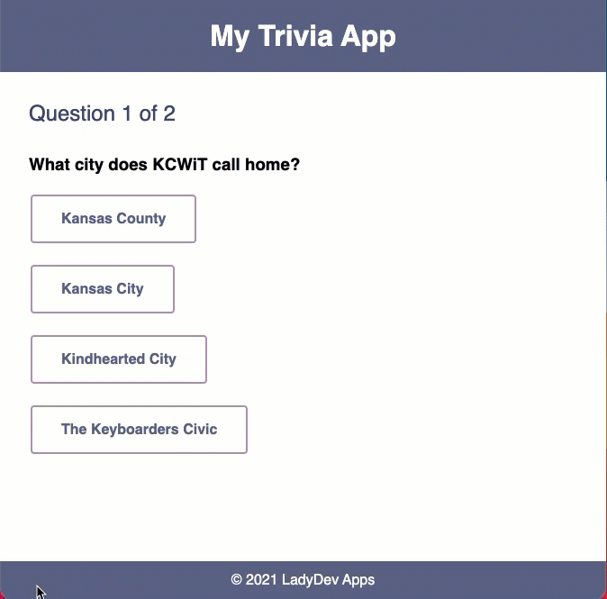

    
    <h2 style="display:inline-block;margin-top:1em;">Coding &amp; Cocktails: The Glass</h2>
    <h3 style="margin-top:0;margin-bottom:2em;">Front-End Architecture And Introduction To HTML</h3>

### Overview

Over the next few sessions, we'll create a trivia app together. For this app, we'll use a web development technology called **SPA** (**S**ingle **P**age **A**pplication).

Single Page Applications provide a more native app-like experience to users, which means the application can feel less like a web page and more like an application installed on their computers or phones. They can also be a lot of fun to develop. There are a lot of frameworks available to make this process easier, but choosing one and learning how to use it can be overwhelming. Angular is very opinionated, which means you have less architecture decisions to make than some of the other frameworks. This also means there will be more consistency among Angular projects, so if you’ve worked on one, you can easily jump into a different team’s project.

We will create a web application using a SPA framework with interactive elements and dynamic content that looks like this:

>[!TIP]
>First time at Coding & Cocktails?   [Click here to Install the Tools!](/tools/ ':target=_blank')

>[!TIP]
>Don't know a term?   [Click here to check out our glossary!](http://bit.ly/CnCgloss)

>[!TIP]Want to be more efficient at working with your computer?
>
>[Click here to see our list of Helpful Keyboard Shortcuts!](/spa/references/README.md ':target=_blank')

