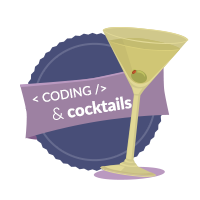

    
    <h2 style="display:inline-block;margin-top:1em;">Coding &amp; Cocktails:</h2>
    <h3 style="margin-top:0;margin-bottom:2em;">The Tools</h3>

### Overview

During the sessions, we’ll use some programs and accounts to help with our coding. These are the tools many developers use on a regular basis.

> [!TIP]
> Don't know a term?   [Click here to check out our glossary!](http://bit.ly/CnCgloss)
