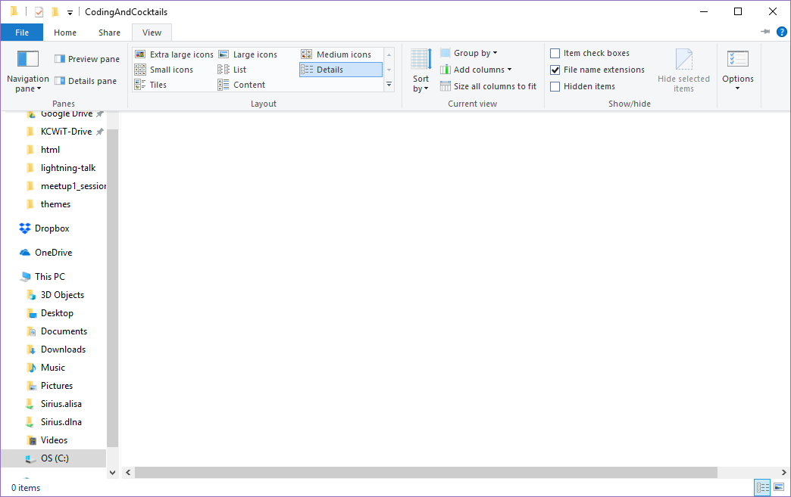

# Organization: Coding & Cocktails Work
We'll organize the code we write for each session by placing it all in a Coding & Cocktails folder.

# Create a folder
Create a folder in your home directory called "CodingAndCocktails". We’ll create folders here for our different projects throughout the year.
>[!INFO]
>We use the terms **"Folder"** and **"Directory"** interchangeably.  They mean the same thing.
>
>**macOS**- Your home directory is typically `/users/yourname`  
>**Windows OS**- Your home directory is typically `C:/Users/yourname`. You can use the shortcut `%userprofile%` by typing it into the file location bar in the File Explorer and pressing `Enter`.
>
>We're using the home directory because terminal applications usually open to home by default. 

### Windows Only - Enable viewing file extensions :id=enable-file-extensions
1. Navigate to the folder you created using **File Explorer**.

1. In the toolbar, select **View** and enable **File name extensions**

