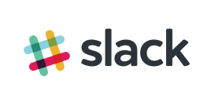

 

# User Accounts: Slack and Codecademy

Coding & Cocktails supports your own efforts to learn to code. Between sessions, you will want to continue to practice on your own. We refer to these sites often in the sessions as tools designed to help you learn to code. The accounts are free unless you elect to buy a premium subscription but that is not necessary for anything we do here.

# Highly Recommended Accounts
* **Slack**: [kcwit.slack.com](http://kcwit.slack.com) - our 24x7 chat room.  The \#codingandcocktails channel will help you keep in touch with your Coding & Cocktails girlfriends. Creating a Slack account is highly recommended.

    However, an administrator has to invite you so if you did not receive an invitation, please email us at [codingandcocktails@kcwomenintech.org](mailto:codingandcocktails@kcwomenintech.org) to request an invite.

    We also have non-development channels to share inspirational #ladybosses, #omnomnom for recipes, #diy to show off your latest project, #fitness and more! See the slack documentation to learn how to join more channels: [https://get.slack.help/hc/en-us/articles/205239967-Browse-and-join-channels](https://get.slack.help/hc/en-us/articles/205239967-Browse-and-join-channels)

# Optional Accounts
* **Codecademy**: [https://www.codecademy.com](https://www.codecademy.com) - provides easy to follow, hands-on lessons on the topics covered in class.
