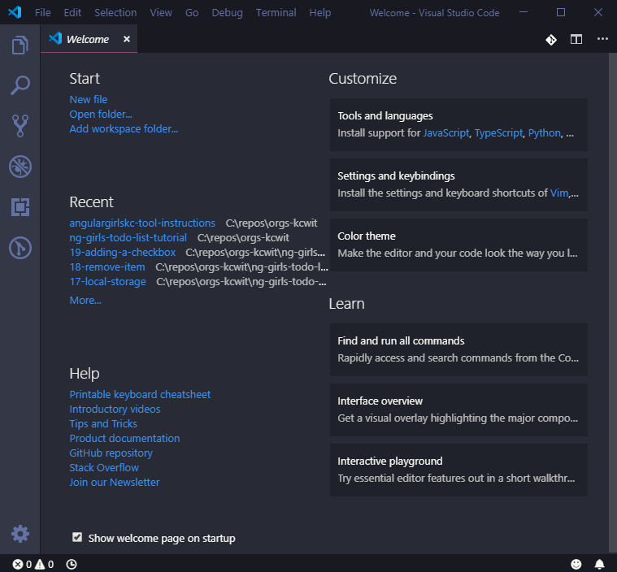
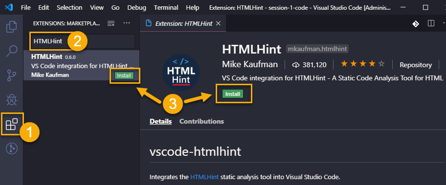

# Text Editor: Microsoft Visual Studio Code

Visual Studio Code is the **I**ntegrated **D**evelopment **E**nvironment \(**IDE**\) we use. It's software that helps you write the code. **IDE**s can do a lot of amazing things, such as:

- highlight the code so it's easier to identify expressions
- suggest completions to what you type
- help you navigate easily through the files in your project
- and a lot more...

After downloading we will configure it with extra tools called _extensions_ that will make your coding life easier.

> [!TIP]
> You'll often hear Visual Studio Code referred as VS Code.

# Download and install Visual Studio Code :id=download

Navigate to [Visual Studio Code download site](https://code.visualstudio.com/download) and click the download button for your Operating System. This will start downloading the VS Code installer. Run through the installation process.

When the installation is complete, launch Visual Studio Code if it didn't open automatically. You will see a welcome screen that looks something like this.

> [!TIP] >**macOS users** Add VS Code to your system path by following the [instructions on VS Code's install page](https://code.visualstudio.com/docs/setup/mac#_launching-from-the-command-line).

# Configuring Visual Studio Code :id=configure

Next, to get the most out of Visual Studio Code, we need to install extensions.

If you have ever downloaded and installed a custom font to use in your word processing program, installing extensions is similar. They are features that can be individually installed to enhance your experience.

We will install required extensions and list optional extensions you can install at the end of the page to add a little pizzazz to your coding experience.

# Required Extensions :id=required-extensions

Install the required extensions:

- [Angular Essentials](https://marketplace.visualstudio.com/items?itemName=johnpapa.angular-essentials) - An all in one extension covering the needs for Angular developers

- [Live Server](https://marketplace.visualstudio.com/items?itemName=ritwickdey.LiveServer)- Opens a tab in your default browser to view static webpages and automatically refreshes the webpage whenever you save changes in VS Code

To install extensions

1. Select the **Extensions** icon on the left toolbar.
2. Type the name of the extension in the input, such as, type "Angular Essentials".
3. Find "Angular Essentials" by John Papa and press the **Install** button to the install the extension. You can press the **Install** button directly in the search results or in the extension's information page.

<!--  -->

Repeat the 3 steps to install other extensions.

Visual Studio Code may prompt you to reload after installing an extension. Make sure you press the **Reload** button when prompted or restart Visual Studio Code after installing all the required extensions if you didn't restart for each extension.

# Optional - Review tips for using Visual Studio Code :id=tips

## Uninstall or Disable an Extension

To uninstall or disable an extension, open the Extensions menu like we did above. VS Code displays your enabled extensions. Select the extension you want to uninstall or disable to view the extensions information page. Press the **Uninstall** or **Disable** button.

## Splitting the Screen

Right click on the tab you want to view in split mode and select an option to **Split Up**, **Split Down**, **Split Left**, or **Split Right**. Once you split your view, you can drag tabs over to the other columns or rows.

# Optional - Customize Visual Studio Code :id=customize

There are optional plugins and themes you can install to help customize your IDE and make it your own. Open the **Extensions** menu, search for the extension name, and click install.

## Optional Extensions

Here's some recommended extensions to help make your coding life easier:

- [Bracket Pair Colorizer 2](https://marketplace.visualstudio.com/items?itemName=CoenraadS.bracket-pair-colorizer-2)- Changes colors of opening and closing pairs of brackets to make it easier to identify nested JavaScript code
- [Guides](https://marketplace.visualstudio.com/items?itemName=spywhere.guides)- Adds indention guide lines making it easier for you to match tags in HTML, class style definitions in CSS, and nested JavaScript code
- [HTMLHint](https://marketplace.visualstudio.com/items?itemName=mkaufman.HTMLHint)- Provides HTML hints and helps identify potential mistakes
<!-- * [Material Icon Theme](https://marketplace.visualstudio.com/items?itemName=PKief.material-icon-theme)- Adds icons to files in the **Explorer** view to make it easier to find files -->
- [Code Spell Checker](https://marketplace.visualstudio.com/items?itemName=streetsidesoftware.code-spell-checker)- Calls attention to misspellings in your code. This is particularly helpful to ensure variable names are spelled correctly.

## Themes

Make it look pretty with themes. You will install themes the same way you install extensions.

Visual Studio Code comes with a couple of themes built in, but you can find colors that speak to your personality by searching for themes in the **Extension** input. Type "@category:themes" to limit the extension search results to only show theme extensions.

> [!TIP]
> Click on the theme in the search results to view an example of the theme colors.

Some popular themes include

- [Winter is Coming Theme](https://marketplace.visualstudio.com/items?itemName=johnpapa.winteriscoming)- Has both dark and light variants built in
- [Dracula Official](https://marketplace.visualstudio.com/items?itemName=dracula-theme.theme-dracula)
- [Shades of Purple](https://marketplace.visualstudio.com/items?itemName=ahmadawais.shades-of-purple)
- [Night Owl](https://marketplace.visualstudio.com/items?itemName=sdras.night-owl)- Has both dark and light variants built in

Select the color theme you want to use in the **Color Theme** selector. To open the **Color Theme** selector, follow the instructions for your OS:

**For Windows & Linux users,** navigate to **File** :fas fa-long-arrow-alt-right: **Preferences** :fas fa-long-arrow-alt-right: **Color Theme**

**For Mac users,** navigate to **Code** :fas fa-long-arrow-alt-right: **Preferences** :fas fa-long-arrow-alt-right: **Color Theme**

In the **Color Theme** selector, select the theme you like out of the list.

## Keyboard Shortcuts :id=keyboard-shortcuts

**Open VS Code in a folder from command line:** `code .`

> [!INFO]
> Too many keyboard shortcuts?
>
> You can type what you're looking for in the **Command Palette**. Open the Command Palette by selecting **View** :fas fa-long-arrow-alt-right: **Command Palette...** and type the action you want to do.
>
> To open the Command Palette quickly, use the keyboard shortcut `ctrl` + `shift` + `p`.

**Helpful Keyboard Shortcuts**

| Command               | Mac Key Combination        | Windows Key Combination    |
| :-------------------- | :------------------------- | :------------------------- |
| Open Command Palette  | `ctrl` + `shift` + `p`     | `ctrl` + `shift` + `p`     |
| Select all            | `cmd` + `a`                | `ctrl` + `a`               |
| Cut                   | `cmd` + `x`                | `ctrl` + `x`               |
| Copy                  | `cmd` + `c`                | `ctrl` + `c`               |
| Paste                 | `cmd` + `v`                | `ctrl` + `v`               |
| Undo                  | `cmd` + `z`                | `ctrl` + `z`               |
| Save                  | `cmd` + `s`                | `ctrl` + `s`               |
| Toggle comment        | `cmd` + `f`                | `ctrl` + `f`               |
| Go to file            | `cmd` + `p`                | `ctrl` + `p`               |
| Open terminal pane    | `ctrl` + `` ` ``           | `ctrl` + `` ` ``           |
| Create new terminal   | `ctrl` + `shift` + `` ` `` | `ctrl` + `shift` + `` ` `` |
| Auto-format file      | `shift` + `option` + `f`   | `shift` + `alt` + `f`      |
| Auto-format selection | `cmd`+ `k` `cmd` + `f`     | `ctrl`+ `k` `ctrl` + `f`   |
| Indent                | `cmd` + `]`                | `ctrl` + `]`               |
| Outdent line          | `cmd` + `[`                | `ctrl` + `[`               |

**Need more info?** Refer to [VS Code's Documentation](https://code.visualstudio.com/docs/getstarted/tips-and-tricks).
